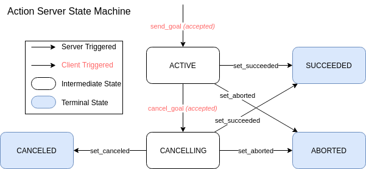

{:toc}

# {{ page.title }}

<div class="abstract" markdown="1">
{{ page.abstract }}
</div>

Original Author: {{ page.author }}

## Background

ROS services are useful for sending a request with some information and getting a response indicating if the request was successful along with any other information.
But, in robotics there are many instances where a response may take a significant length of time.
In addition, often the progress of a request needs to be tracked, and the request may need to be canceled or altered before it completes.
These requirements cannot be fulfilled by a ROS service mechanism, whether or not it is asynchronous.

To satisfy these use cases, ROS provides a third communication paradigm known as "actions".
An action is a goal-oriented request that occurs asynchronously to the requester, is typically (but not necessarily) longer-running than immediate, can be canceled or replaced during execution, and has a server that provides feedback on execution progress.

This document defines how actions are specified in the ROS Message IDL, how they will be created and used by ROS users (node developers and system integrators), and how they will be communicated by the middleware.


## Entities involved in actions

The following entities are involved in providing, using and executing an action.

- Action server

  The provider of the action.
  There is only one server for any unique action.
  The action server is responsible for:

  - advertising the action to other ROS entities;

  - for executing the action when a request is received, or rejecting that request, as appropriate;

  - for monitoring execution of the action and providing feedback as appropriate to the action design;

  - for sending the result of the action, including a mandatory success/failure value, to the client when the action completes, whether the action succeeded or not; and

  - for managing the execution of the action in response to additional requests by the client.

- Action client

  The entity making a request to execute an action.
  There may be more than one client for each action server.
  However, the semantics of multiple simultaneous clients is action-specific, i.e. it depends on what the action is and how it is implemented whether multiple simultaneous clients can be supported.
  The action client is responsible for:

  - making a request to the action, passing any needed data for the action execution;

  - optionally periodically checking for updated feedback from the action server;

  - optionally requesting that the action server cancel the action execution; and

  - optionally checking the result of the action received from the action server.


## Action specification

Actions are specified using a form of the ROS Message IDL.
The specification contains three sections, each of which is a message specification:

1. Goal

   The "request" part of the action.
   Contains the data passed to the server of the action from the client, along with the request to begin executing that action.

1. Result

   The final result part of the action.
   Contains the data passed to the client of the action from the action server once the action execution ends, whether successfully or not.
   This data is produced by the action server as appropriate to that action's implementation, and is used by the client to understand how the action turned out.

1. Feedback

   Contains data passed to the client of the action from the action server between commencing action execution and prior to the action completing.
   This data is used by the client to understand the progress of executing the action.

Any of these sections may be empty.

Between each of the three sections is a line containing three hyphens, `---`.

Action specifications are stored in a file ending in `.action`.
There is one action specification per `.action` file.

An example action specification is shown below.

```
# Define the goal
uint32 dishwasher_id  # Specify which dishwasher we want to use
---
# Define the result that will be published after the action execution ends.
uint32 total_dishes_cleaned
---
# Define a feedback message that will be published during action execution.
float32 percent_complete
uint32 number_dishes_cleaned
```

### Namespacing

Multiple message and service definitions are generated from a single action definition.
In ROS 1, the generated messages were prefixed with the name of the action to avoid conflicts with other messages and services.
In ROS 2, the generated service and message definitions should be namespaced so it is impossible to conflict.
In Python, the code from the generated definitions should be in the module `action` instead of `srv` and `msg`.
In C++, the generated code should be in the namespace and folder `action` instead of `srv` and `msg`.

## Goal States



The action server is responsible for accepting (or rejecting) goals requested by clients.
The action server is also responsible for maintaining a separate state for each accepted goal.

There are two active states:

- **EXECUTING** - The goal has been accepted and is currently being executed by the action server.
- **CANCELING** - The client has requested that the goal be canceled and the action server has accepted the cancel request.
This state is useful for any "clean up" that the action server may have to do.

And three terminal states:

- **SUCCEEDED** - The goal was achieved successfully by the action server.
- **ABORTED** - The goal was terminated by the action server without an external request.
- **CANCELED** - The goal was canceled after an external request from an action client.

State transitions triggered by the action server:

- **set_succeeded** - Notify that the goal completed successfully.
- **set_aborted** - Notify that an error was encountered during processing of the goal and it had to be aborted.
- **set_canceled** - Notify that canceling the goal completed successfully.

State transitions triggered by the action client:

- **send_goal** - A goal is sent to the action server.
The state machine is only started if the action server *accepts* the goal.
- **cancel_goal** - Request that the action server stop processing the goal.
A transition only occurs if the action server *accepts* the request to cancel the goal.
The goal may transition to CANCELING or CANCELED depending on the action server implementation.

## API

Proposed examples can be in the respository [examples (branch: actions_proposal)](https://github.com/ros2/examples/tree/actions_proposal).

C++:

- [examples/rclcpp/minimal_action_server](https://github.com/ros2/examples/tree/actions_proposal/rclcpp/minimal_action_server)
- [examples/rclcpp/minimal_action_client](https://github.com/ros2/examples/tree/actions_proposal/rclcpp/minimal_action_client)

Python:

- [examples/rclpy/actions](https://github.com/ros2/examples/tree/actions_proposal/rclpy/actions)

### Real-time actions

Actions may be used from or served by real-time nodes.
The action server and action client APIs should be real-time capable.


## Introspection tools

Actions, like topics and services, are introspectable from the command line.

In ROS 1, actions are visible in the output of the `rostopic` tool.

In ROS 2, actions will not be visible as a set of topics nor a set of services.
They will be visible using a separate `ros2 action` command line tool.

The command line tool will be similar to the `ros2 service` tool.
It will be able to:

- list known actions,

- display the arguments for an action's goal,

- display the type of an action's feedback and result,

- display information about the server of an action,

- display the underlying topics and/or services providing the action,

- find actions by action type, and

- call an action, display feedback as it is received, display the result when received, and cancel the action (when the tool is terminated prematurely).

Each action will be listed and treated as a single unit by this tool.
This is irrespective of the implementation, which may use several topics or services to provide a single action.


## Middleware implementation

### ROS 1 Background
In ROS 1, actions are implemented as a separate library using a set of topics under a namespace taken from the action name.
This implementation was chosen because ROS services are inherently synchronous, and so incompatible with the asynchronous nature of the action concept.
There is also a need for a status/feedback channel and a control channel.

### ROS 2

Actions will be implemented on top of topics and services.
However, they will be included in all client libraries in ROS 2 with a common implmentation in C.
This reduces the work to implement actions at the client library level since existing middlewares do not need to be updated.

It is possible actions could be implemented in the middlware layer in the future.
One option for DDS middlewares is Remote Procedure Call (DDS-RPC).
However, DDS-RPC does not provide facilities for interrupting service calls or receiving feedback on their progress.
It does provide for receiving a return value from a request and an indication of whether the request was successful.
Unsuccessful requests are returned with an exception.
A DDS based middlware would still need to separately provide status and feedback channels.

### Goal Identifiers

In ROS 1, Action clients are responsible for creating a goal ID when submitting a goal.
In ROS 2 the action server will be responsible for generating the goal ID and notifying the client.

One reason is the server is better equiped to generate a unique goal id than the client because there may be multiple clients.
Another is to avoid a race condition between goal creation and cancellation that exists in ROS 1.
In ROS 1 if a client submits a goal and immediatly tries to cancel it then the cancelation may or may not happen.
If the cancelation was received first then `actionlib` will ignore the cancellation request without notifying the action server.
Then when the goal creation request comes in the server will begin executing it.

### Topics and Services Used

In ROS 1, an action is defined entirely using topics.
In ROS 2, an action is the combination of the following services and topics.

#### Goal Submission Service

* **Direction**: Client calls Server
* **Request**: Description of goal
* **Response**: Whether goal was accepted or rejected, a unique identifier for the goal, and the time when the goal was accepted.

The purpose of this service is to submit a goal to the action server.
It is the first service called to begin an action, and is expected to return quickly.
A user-define description of the goal is sent as the request.
The response indicates whether or not the goal was accepted, and if so the identifier the server will use to describe the goal.

The QoS settings of this service should be set the so the client is guaranteed to receive a response or an action could be executed without a client being aware of it.

#### Cancel Request Service

* **Direction**: Client calls Server
* **Request**: Goal identifier, time stamp
* **Response**: Goals that will be attempted to be canceled

The purpose of this service is to request to cancel one or more goals on the action server.
A cancellation request may cancel multiple goals.
The result indicates which goals will be attempted to be canceled.
Whether or not a goal is actually canceled is indicated by the status topic and the result service.

The cancel request policy is the same as in ROS 1.

* If the goal ID is empty and time is zero, cancel all goals
* If the goal ID is empty and time is not zero, cancel all goals accepted at or before the time stamp
* If the goal ID is not empty and time is not zero, cancel the goal with the given id regardless of the time it was accepted
* If the goal ID is not empty and time is zero, cancel the goal with the given id and all goals accepted at or before the time stamp

#### Get Result Service

* **Direction**: Client calls Server
* **Request**: Goal ID
* **Response**: Status of goal and user defined result

The purpose of this service is to get the final result of a service.
After a goal has been accepted the client should call this service to receive the result.
The result will indicate the final status of the goal and any user defined data.

Once the server sends the result to the client it should free up any resources used by the action.
If the client never asks for the result then the server should discard the result after a timeout period.

#### Goal Status Topic

* **Direction**: Server publishes
* **Content**: Goal ID, time it was accepted, and an enum indicating the status of this goal.

This topic is published by the server to broadcast the status of goals it has accepted.
The purpose of the topic is for introspection; it is not used by the action client.
Messages are published when transitions from one status to another occur.

The possible statuses are:

* *Accepted*
  * The goal has been accepted by the action server and may now be executing
* *Cancelling*
  * The action server will try to cancel the indicated goal
* *Cancelled*
  * The action server successfully canceled the goal
* *Succeeded*
  * The action server successfully reached the goal
* *Aborted*
  * The action server failed reached the goal

#### Feedback Topic

* **Direction**: Server publishes
* **Content**: Goal id, user defined feedback message

This topic is published by the server to send application specific progress about the goal.
It is up to the author of the action server to decide how often to publish the feedback.

## Bridging between ROS 1 and ROS 2

### Detecting Action Servers and Clients

There will be an API for the bridge to get a list of all ROS 2 action servers and clients.

ROS 1 action servers and clients can be discovered by looking for topic ending in `/status` with message type `actionlib_msgs/GoalStatusArray`.
If a publisher exists then an action server exists.
If a subscriber exists then a client exists.

### Bridging ROS 1 Action Client and ROS 2 Action Server

If either a ROS 2 action server or a ROS 1 action client exists then the ROS 1 bridge will create the following:

1. a ROS 1 action server
2. a ROS 2 action client

#### Goal submission

When the ROS 1 action client submits a goal the bridge will check if a ROS 2 action server exists.
If no server exists then the goal is rejected, otherwise the bridge calls the ROS 2 goal submission service.
If the ROS 2 server accepts the goal then the bridge will call `setAccepted` on the ROS 1 bridge, otherwise it will call `setRejected`.

When a goal is accepted the bridge stores a map between the ROS 1 and ROS 2 goal IDs.
If a client submits a goal with the same ID then it will be rejected until the first goal is finished.

#### Goal Cancellation

When a ROS 1 client tries to cancel a goal the bridge must try to cancel it on the ROS 2 server.
First the bridge must look up the mapping of ROS 1 to ROS 2 goal IDs.
If a mapping exists then the bridge will call the cancellation service.

If the mapping does not exist because the server has not yet accepted or rejected the goal then the bridge will wait until the goal is accepted.
If it is rejected the bridge will call setRejected and ignore the cancellation request.
If it is accepted then it will call the cancellation service.

#### Feedback

The bridge will only publish feedback messages for goals that were sent through it.
Since the goal ID is generated by the server, the bridge can only know the mapping of ROS 1 to ROS 2 goal IDs if the bridge sent the goal.

#### Result

Once a goal has been accepted the bridge will wait for the result.
When it gets the result the bridge will call

If the bridge notices the ROS 2 action server disappears from the node graph then bridge will wait for the result indefinitely.
When the bridge reappears the bridge will try to get the result from the goal again.
If the ROS 2 server does not know of the goal, then the bridge will notify the ROS 1 client that the goal was canceled.

### Bridging ROS 1 Action Server and ROS 2 Action Client

If either a ROS 1 action server or a ROS 2 action client exist then the bridge will create:

1. a ROS 1 action client
2. a ROS 2 action server

#### Goal submission

When the ROS 2 action client submits a goal the bridge will check if a ROS 1 action server exists.
If it does not exist the bridge will reject the goal, otherwise it will submit the goal to the ROS 1 server.
The same goal ID is to be used for both ROS 1 and ROS 2.

Goals sent to the bridge from ROS 2 are always immediately accepted by the bridge.
The bridge will then submit the goal to the ROS 1 server.
The reason for instantly accepting the goal is that if the ROS 1 action server never responds to a goal request then the bridge cannot return a result.
Goals that are rejected by ROS 1 action servers will be reported as canceled to ROS 2 action clients.

#### Goal Cancellation

When a ROS 2 client tries to cancel a goal the bridge will immediately accept the cancellation request.
It will then try to cancel the request on the ROS 1 action server.
If the cancellation request is rejected by the ROS 1 server then the ROS 2 bridge will stay in the *CANCELING* state until the result of the goal is known.

#### Feedback

Since the goal ID is the same for both ROS 1 and ROS 2, the bridge will always publish feedback from ROS 1 servers to the ROS 2 feedback topic.

#### Result

When the ROS 1 action server publishes a result it will be set as the result on the ROS 1 bridge.
If the ROS 2 action client never calls the service to get the result then it is subject to the same timeout as if it were a normal ROS 2 action server.

