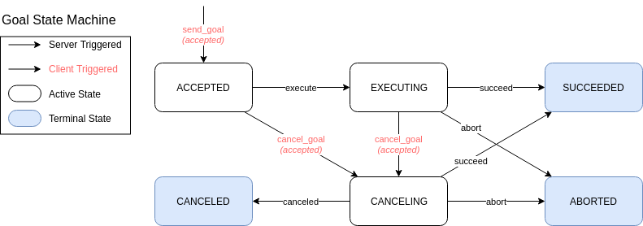

{:toc}

# {{ page.title }}

<div class="abstract" markdown="1">
{{ page.abstract }}
</div>

Original Author: {{ page.author }}

## Background

There are three forms of communication in ROS: topics, services, and actions.
Topic publishers broadcast to multiple subscribers, but communication is one-way.
Service clients send a request to a service server and get a response, but there is no information about the progress.
Similar to services, action clients send a request to an action server in order to achieve some goal and will get a result.
Unlike services, while the action is being peformed an action server sends progress feedback to the client.

Actions are useful when a response may take a significant length of time.
They allow a client to track the progress of a request, get the final outcome, and optionally cancel the request before it completes.

This document defines requirements for actions, how they are specified in the ROS Message IDL, and how they are communicated by the middleware.

## Entities Involved in Actions

There are two entities involved in actions: an **action server** and an **action client**.

### Action Server

An action server provides an action.
Like topics and services, an action server has a *name* and a *type*.
The name is allowed to be namespaced and must be unique across action servers.
This means there may be multiple action servers that have the same type running simultaneously (under different namespaces).

It is responsible for:

- advertising the action to other ROS entities
- accepting or rejecting goals from one or more action clients
- executing the action when a goal is received and accepted
- optionally providing feedback about the progress of all executing actions
- optionally handling requests to cancel one or more actions
- sending the result of a completed action, including whether it succeeded, failed, or was canceled, to a client that makes a result request.

### Action Client

An action client sends one or more goals (an action to be performed) and monitors their progress.
There may be multiple clients per server; however, it is up to the server to decide how goals from multiple clients will be handled simultaneously.

It is responsible for:

- sending goals to the action server
- optionally monitoring the user-defined feedback for goals from the action server
- optionally monitoring the current state of accepted goals from the action server (see [Goal States](#goal-states))
- optionally requesting that the action server cancel an active goal
- optionally checking the result for a goal received from the action server

## Differences between ROS 1 and ROS 2 actions

### First Class Support

In ROS 1, actions are implemented as a separate library, [actionlib](http://wiki.ros.org/actionlib) that is built on top of the client libraries.
This was done to avoid increasing the work required to create a client library in a new language, but actions turned out to be very important to packages like the [Navigation Stack](http://wiki.ros.org/navigation) and [MoveIt!](https://moveit.ros.org/)<sup>[1](#separatelib)</sup>.

In ROS 2, actions will be included in the client library implementations.
The work of writing a client library in a new language will be reduced by creating a common implementation in C.

### Services used for Actions

In ROS 1, actions were implemented using a set of topics under a namespace taken from the action name.
ROS 1 services were not used because they are inherently synchronous and actions need to be asynchronous.
Actions also needed to send status/feedback and be cancelable.

In ROS 2, services are asynchronous in the common C implementation, so actions will use a combination of services and topics.

### Goal Identifiers

In ROS 1, an action client can create a goal ID when submitting a goal.
This potentially leads to scenarios where mutliple clients independently generate the same goal ID.
If an empty goal ID is sent, the action server will create one instead, which is not very useful since the client has no way to know the goal ID.

In ROS 2, action clients will be the sole entities responsible for generating the goal ID.
This way clients always know the goal ID for an action.
Futhermore, a UUID will be used for each goal to mitigate the issue of goal ID collision across multiple clients.

### Namespacing of Generated Messages and Services

Multiple message and service definitions are generated from a single action definition.
In ROS 1, the generated messages were prefixed with the name of the action to avoid conflicts with other messages and services.
In ROS 2, the generated service and message definitions will exist in a different namespace to be impossible to conflict with non-action message and service definitions.
For example, in Python the code from the generated definitions should be in the module `action` instead of `srv` and `msg`.
In C++, the generated code should be in the namespace and folder `action` instead of `srv` and `msg`.

### Visibility of Action Services and Topics

In ROS 1, `rostopic list` would show all action topics in its output.
In ROS 2, `ros2 topic list` and `ros2 service list` will not show topics and services used by actions by default.
They can still be shown by passing an option to the commands to show hidden services and topics.
The tool `ros2 action list` will produce list of action names provided by action servers (see [Intropsection tools](#introspection-tools)).

## Action Interface Definition

Actions are specified using a form of the ROS Message IDL.
The specification contains three sections, each of which is a message specification:

1. Goal

   This describes what the action should achieve and how it should do it.
   It is sent to the action server when it is requested to execute an action.

1. Result

   This describes the outcome of an action.
   It is sent from the server to the client when the action execution ends, whether successfully or not.

1. Feedback

   This describes the progress towards completing an action.
   It is sent to the client of the action from the action server between commencing action execution and prior to the action completing.
   This data is used by the client to understand the progress of executing the action.

Any of these sections may be empty.
Between each of the three sections is a line containing three hyphens, `---`.
Action specifications are stored in a file ending in `.action`.
There is one action specification per `.action` file.

### Example

```
# Define a goal of washing all dishes
bool heavy_duty  # Spend extra time cleaning
---
# Define the result that will be published after the action execution ends.
uint32 total_dishes_cleaned
---
# Define a feedback message that will be published during action execution.
float32 percent_complete
uint32 number_dishes_cleaned
```

## Introspection tools

Actions, like topics and services, are introspectable from the command line.

The command line tool, `ros2 action`, will be able to:

- list action names associated with any running action servers or action clients
- list action servers and action clients
- display active goals on an action server
- display the arguments for an action goal
- display the type of an action's goal, feedback, and result
- find actions by action type
- echo feedback, status, and result for an action goal
- call an action, display feedback as it is received, display the result when received, and cancel the action (when the tool is terminated prematurely).

Each action will be listed and treated as a single unit by this tool.

## Goal States

The action server maintains a state machine for each goal it accepts from a client.
Rejected goals are not part of the state machine.



There are three active states:

- **ACCEPTED** - The goal has been accepted and is awaiting execution.
- **EXECUTING** - The goal is currently being executed by the action server.
- **CANCELING** - The client has requested that the goal be canceled and the action server has accepted the cancel request.
This state is useful for any user-defined "clean up" that the action server may have to do.

And three terminal states:

- **SUCCEEDED** - The goal was achieved successfully by the action server.
- **ABORTED** - The goal was terminated by the action server without an external request.
- **CANCELED** - The goal was canceled after an external request from an action client.

State transitions triggered by the action server according to its designed behavior:

- **execute** - Start execution of an accepted goal.
- **succeed** - Notify that the goal completed successfully.
- **abort** - Notify that an error was encountered during processing of the goal and it had to be aborted.
- **canceled** - Notify that canceling the goal completed successfully.

State transitions triggered by the action client:

- **send_goal** - A goal is sent to the action server.
The state machine is only started if the action server *accepts* the goal.
- **cancel_goal** - Request that the action server stop processing the goal.
A transition only occurs if the action server *accepts* the request to cancel the goal.

## API

Usage examples can be found in the [examples](https://github.com/ros2/examples) repository.

C++:

- [examples/rclcpp/minimal_action_server](https://github.com/ros2/examples/tree/master/rclcpp/minimal_action_server)
- [examples/rclcpp/minimal_action_client](https://github.com/ros2/examples/tree/master/rclcpp/minimal_action_client)

Python:

- [examples/rclpy/actions](https://github.com/ros2/examples/tree/master/rclpy/actions)

## Middleware implementation

Under the hood, an action is made up of three services and two topics.
In this section, they are descibed in detail.


### Send Goal Service

- **Direction**: client calls server
- **Request**: description of goal and a UUID for the goal ID
- **Response**: whether goal was accepted or rejected and the time when the goal was accepted

The purpose of this service is to send a goal to the action server.
It is the first service called to begin an action, and is expected to return quickly.
The description of the goal in the request is user-defined as part of the [Action Interface Definition](#action-interface-definition).

The QoS settings of this service should be set so the client is guaranteed to receive a response or an action could be executed without a client being aware of it.

### Cancel Goal Service

- **Direction**: client calls server
- **Request**: goal ID and timestamp
- **Response**: response code and a list of goals that have transitioned to the CANCELING state

The purpose of this service is to request the cancellation of one or more goals on the action server.
The response code indicates any failures in processing the request (e.g. `OK`, `REJECTED` or `INVALID_GOAL_ID`).
The list of goals in the response indicates which goals will be attempted to be canceled.
Whether or not a goal transitions to the CANCELED state is indicated by the status topic and the result service.

The cancel request policy is the same as in ROS 1.

- If the goal ID is empty and timestamp is zero, cancel all goals
- If the goal ID is empty and timestamp is not zero, cancel all goals accepted at or before the timestamp
- If the goal ID is not empty and timestamp is zero, cancel the goal with the given ID regardless of the time it was accepted
- If the goal ID is not empty and timestamp is not zero, cancel the goal with the given ID and all goals accepted at or before the timestamp

### Get Result Service

* **Direction**: client calls server
* **Request**: goal ID
* **Response**: status of goal and user defined result

The purpose of this service is to get the final result of a goal.
After a goal has been accepted the client should call this service to receive the result.
The result will indicate the final status of the goal and any user defined data as part of the [Action Interface Definition](#action-interface-definition).

#### Result caching

The server should cache the result once it is ready so multiple clients have to opportunity to get it.
This is also useful for debugging/introspection tools.

To free up resources, the server should discard the result after a configurable timeout period.
The timeout can be set as part of options to the action server.
If the timeout is configured to have value **-1**, then goal results will be "kept forever" (until the action server shuts down).
If the timeout is configured to have value **0**, then goal results are discarded immediately (after responding to any pending result requests).

### Goal Status Topic

* **Direction**: server publishes
* **Content**: list of in-progress goals with goal ID, time accepted, and an enum indicating the status

This topic is published by the server to broadcast the status of goals it has accepted.
The purpose of the topic is for introspection; it is not used by the action client.
Messages are published when transitions from one status to another occur.

The QoS settings for an action server can be configured by the user.
The default QoS settings for a DDS middleware should be TRANSIENT LOCAL with a history size of 1.
This allows new subscribers to always get the latest state.

The possible statuses are:

- *Accepted* - The goal has been accepted by the action server
- *Executing* - The goal is currently being executing by the action server
- *Canceling* - The action server will try to cancel the indicated goal
- *Succeeded* - The action server successfully reached the goal
- *Aborted* - The action server failed reached the goal
- *Canceled* - The action server successfully canceled the goal

### Feedback Topic

- **Direction**: server publishes
- **Content**: goal ID, user defined feedback message

This topic is published by the server to send progress feedback about the goal that is user-defined as part of the [Action Interface Definition](#action-interface-definition).
It is up to the author of the action server to decide how often to publish the feedback.

The QoS settings for feedback coming from an action server can be configured by the user.
It is up to the clients to use compatible QoS settings.

### Client/Server Interaction Examples

Here are a couple of sequence diagrams depicting typical interactions between an action client and action server.

#### Example 1

In this example, the action client requests a goal and gets a response from the server accepting the goal (synchronous).
Upon accepting the goal, the action server starts a user defined execution method for completing the goal.
Following the goal request, the client makes an asynchronous request for the result.
The user defined method publishes feedback to the action client as it executes the goal.
Ultimately, the user defined method populates a result message that is used as part of the result response.


#### Example 2

This example is almost identical to the first, but this time the action client requests for the goal to be canceled mid-execution.
Note that the user defined method is allowed to perform any shutdown operations after the cancel request before returning with the cancellation result.


#### Example 3

Here is a more complex example involving multiple goals.


### Topic and Service Name Examples

Topic and service names for actions will include a token `_action`.
The leading underscore makes the name hidden, and the combined text allows tools to identify topics and services used by actions.
Topic and Service names will be generated by prefixing the action name to one of `/_action/status`, `/_action/feedback`, `/_action/get_result`, `/_action/cancel_goal`, or `/_action/send_goal`.
The resulting topic or service name is expanded to a fully qualified name as usual.

#### Example: fully qualified action name
Given:
* Action name: `/action/name`
* Namespace: `/name/space`
* Node name: `nodename`

Topic Names:

* `/action/name/_action/status`
* `/action/name/_action/feedback`

Service Names:

* `/action/name/_action/send_goal`
* `/action/name/_action/cancel_goal`
* `/action/name/_action/get_result`

#### Example: relative action name
Given:
* Action name: `action/name`
* Namespace: `/name/space`
* Node name: `nodename`

Topic Names:

* `/name/space/action/name/_action/status`
* `/name/space/action/name/_action/feedback`

Service Names:

* `/name/space/action/name/_action/send_goal`
* `/name/space/action/name/_action/cancel_goal`
* `/name/space/action/name/_action/get_result`

#### Example: private action name
Given:
* Action name: `~/action/name`
* Namespace: `/name/space`
* Node name: `nodename`

Topic Names:

* `/name/space/nodename/action/name/_action/status`
* `/name/space/nodename/action/name/_action/feedback`

Service Names:

* `/name/space/nodename/action/name/_action/send_goal`
* `/name/space/nodename/action/name/_action/cancel_goal`
* `/name/space/nodename/action/name/_action/get_result`

## Bridging between ROS 1 and ROS 2

TODO

## Alternatives

These alternative approaches to actions in ROS 2 were considered.

### Actions in rmw

An alternative to using services and topics is to implement actions in the rmw layer.
This would enable using middleware specific features better suited to actions.
The default middleware in ROS 2 uses DDS, and there don't appear to be any DDS features better for actions than what are used for services and topics.
Additionally implementing actions in the rmw implementations increases the complexity of writing an rmw implementation.
For these reasons actions will be implemented at a higher level.

### Multiple topics for feedback and status

When there are many goals from many clients, the choice to have a single feedback (and status) topic per action server is suboptimal in terms of processing and bandwidth resource.
It is up to clients to filter out feedback/status messages that are not pertinent to them.
In this scenario, M goals are sent to N clients there is an unecessary use of bandwidth and processing; especially in extreme cases where M and N are large.

One approach is to use multiple topics (distinguished by goal IDs) or the "keyed data" feature in DDS that allows for "content filtered subscription".
This would allow clients to only subscribe to the feedback and status messages that they care about.

A second approach is to give clients the option to specify a custom feedback topic as part of the goal request.
This would be useful to alleviate extreme cases without the overhead of creating/destroying topics for every goal when the number of goals/clients is small.

Reasons against using separate topics for feedback and status:
- Most anticipated use cases will not involve many goals/clients (premature optimization)
- Topics dynamically namespaced (e.g. by goal ID) would complicate ROS security by not having deterministic topic names before runtime and outside user control.
- Added complexity in C implementation and client libraries

It seems reasonable in the future that the "keyed data" feature in DDS can be employed to reduce overhead in the "many goal/client" scenario.
This will require that the feature be exposed in the middleware, which it is not at the time of writing this proposal.

### Server-side goal ID generation

Since new goals are created by an action client making a service call to an action server, it is possible for the action server to generate the UUID for the goal and return it as part of the service response to the action client.
The action server can better ensure uniqueness of the goal ID with this approach, but should still handle the potential race of two goal requests arriving simulataneously.

On the other hand, it would be nice to expose the method for generating goal IDs and let the user correlate the goals with other libraries/systems.
Imagine an action client being used to request a robot to perform tasks from a database where each task already has a UUID associated with it.
In this case, it is still the action servers responsibility to ensure goal ID uniqueness and handle any potential races with concurrent goal requests, but we have the added benefit of the user being able to correlate goals to other existing entities.

## References

1. <a name="separatelib" href="https://discourse.ros.org/t/actions-in-ros-2/6254/5">https://discourse.ros.org/t/actions-in-ros-2/6254/5</a>
