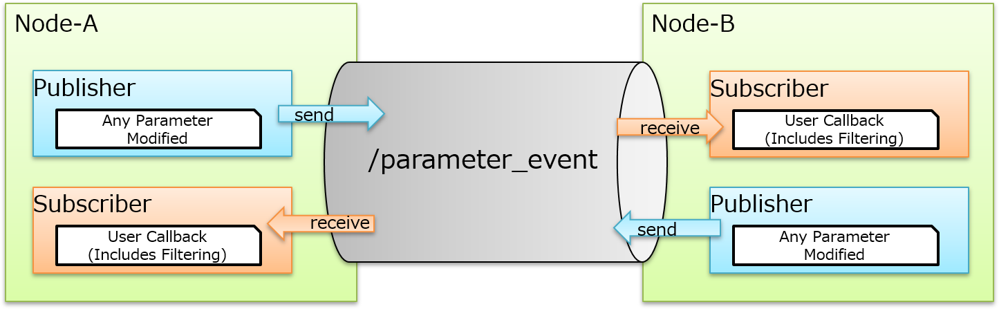
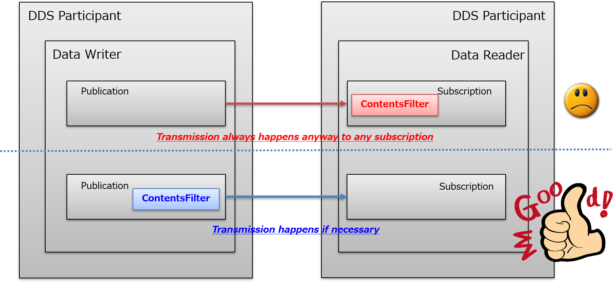
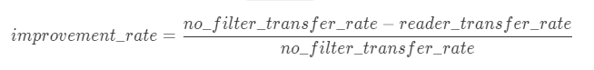
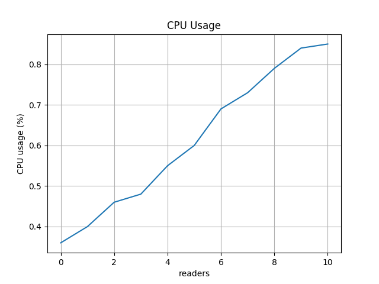
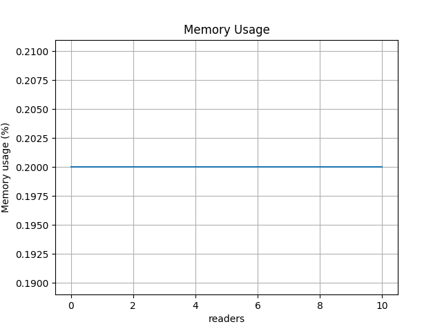
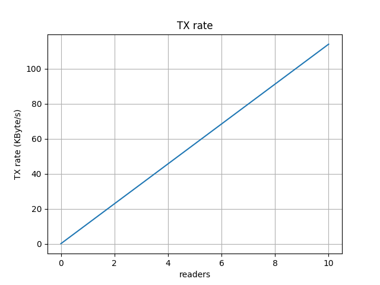
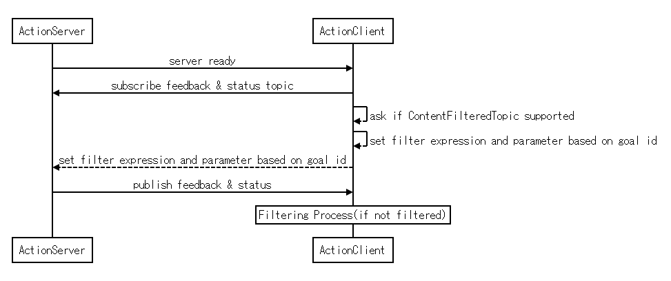

{:toc}

# {{ page.title }}

<div class="abstract" markdown="1">
{{ page.abstract }}
</div>

Original Author: {{ page.author }}

## Problems

Here describes the current problems that we have, these are already well-known issues related to efficiency for CPU consumption and network resource.
The efficiency is dependent on the platform capability, but once it comes to embedded devices and IoT platform such as microcontrollers, these problems could be a huge pain to consume resources.
Currently, at least there are following two main problems exist in ROS 2, the one is `/parameter_events` topic and the other is action topics `feedback` and `status`. the detail is described as following.

### Parameter Event Topic

Each node will publish (this is configurable via `NodeOptions`) and subscribe parameter events topic with `AsyncParametersClient` or `ParameterEventHandler`.
This topic is to support monitoring parameters for any parameter changes.
It is expected that client libraries will implement the ability to register a callback for specific parameter changes using this topic.
And there is an internal subscription for each node for `/parameter_events` topic to handle the TimeSource via "use_sim_time" parameter.
`rclcpp::ParameterEventsFilter` is used to filter the parameter with specific name "use_sim_time".
As user interface, `AsyncParametersClient::on_parameter_event` is provided to handle parameter events.



The problem can be broken into the following two parts,

- Network resource consumption on `/parameter_events` topic
  Since publisher does not know who needs to receive which messages, all of the parameter activity will be published and subscribed.
  That said everyone publishes and subscribes all of the events within this giant topic `/parameter_events`.
  This leads to a lot of unnecessary message transmission over the network.
- Subscriber needs to filter unnecessary (not interested) messages
  Subscriber does not know if the message is something it needs or not without checking the contents of the message via user callback.
  This filtering needs to be done every single time the message comes in.
  In expectation, it is likely that parameter event callback is interested on specific parameters only, so that there will be a lot of unnecessary message receives and filtering process needs to be done.

As described above, we could imagine that if the number of node are 10, 20 and 100 and so are the parameters for each nodes.
This will be a huge burden and pain for entire system, passing unnecessary messages via limited bandwidth network with edge devices and filtering messages to drop is not something user application wants to do.

Besides, this problem can be applied to user defined topics.

### Action Topics

Each action server will provide two topics named `feedback` and `status` as followings,


`feedback` and `status` are topics mapped with action name and published by action server, and action clients subscribe those topics to get feedback and status.
When there are many goals from multiple clients, the choice to have a single `feedback` and `status` topic per action server is suboptimal in terms of processing and bandwidth resource. 
It is up to clients to filter out feedback/status messages that are not pertinent to them.
In this scenario, M goals are sent to N clients there is an unnecessary use of bandwidth and processing.
Especially in extreme cases where M and N are large. (each goal is identified by goal ID based on uuid, filtering out the goal id is done by client library so user application does not need to care.)

## ContentFilteredTopic

ContentFilteredTopic describes a more sophisticated subscription that indicates the subscriber does not want to necessarily see all values of each instance published under the Topic.
Rather, it wants to see only the values whose contents satisfy certain criteria.
This class therefore can be used to request content-based subscriptions. 

### Specification

- Multiple ContentFilteredTopicDataReader exist and filtering is dependent on each ContentFilteredTopicDataReader's logical filtering expression and parameters.
- Subscription is responsible to create ContentFilteredTopic.
- ContentFilteredTopicDataWriter does filtering for each ContentFilteredTopicDataReader endpoint.
  Basically it is likely that ContentFilteredTopicDataWriter does filtering on writer side, so that it can provide the improvement and efficiency especially for network resource.
  But it is dependent on implementation if always ContentFilteredTopicDataWriter does filtering.
  This is because if there is a lot of ContentFilteredTopicDataReader with complicated filtering expression and parameter, it would be probably more efficient just to send the messages to all ContentFilteredTopicDataReader. (for example, if the message type includes sequence, DataWriter needs to recreate the message for each DataReader based on filtering expression and parameters.)
  And ContentFilteredTopicDataReader can filter out the message if not necessary based on filtering expression and parameter.
  This is also said that ContentFilteredTopicDataReader does need to do filtering always just in case ContentFilteredTopicDataWriter ends up sending w/o filtering.
  
- The filtering is done by means of evaluating a logical expression that involves the values some of the data-fields in the sample.
  The logical expression is derived from the filter_expression and expression_parameters arguments.
- Each ContentFilteredTopic has a single filter_expression and a sequence of expression_parameters.
  ```
  [parameter use cases]
  "node = %0 OR node = %1" spinal_node attention_node : subscribe all parameter events from spinal and attention nodes
  "node = %0 OR name = %1" audio_node attention_level : subscribe all parameter events from audio_node and parameter named attention_level of all nodes.
  "(node = %0 AND name = %1) OR (node = %2 AND name = %3)" eye_node brightness ear_node loudness : subscribe brightness parameter of eye_node and loudness parameter of ear_node only.
  [action use case]
  "uuid = %0 OR uuid = %1" DEADBEEF CAFEFEED : subscribe only interest goal ids which client handlers possess.
  ```
- A single filter_expression and a sequence of expression_parameters can be modified dynamically at runtime.
  This is because of use cases for `/parameter_events` and action `feedback` and `status` topics, parameter filtering expression is dependent on user application, and action client has multiple goal id to handle.

### Improvement Result

This result indicates if ContentFilteredTopic provides the improvement for CPU consumption and network traffic as we described above. Using single writer and multiple readers up to 10 with filtering expression and expression parameters.

#### Environment

- Intel(R) Core(TM) i7-7700 CPU @ 3.60GHz / 8GB memory
- Ubuntu 18.04.5 LTS
- docker 19.03.6
- ubuntu:20.04 container
- ros2:rolling, rti-connext-dds-5.3.1

#### IDL

```
struct cft {
    long count;
    string flag;
    string cmd;
    long data_size;
    string<8 * 1024 * 1024> data;
};
```

#### Result

`flag` means how many **readers** setup with filtering parameter `yes`. (means that receive will receive the message) `no filter` means in `normal topic` w/o content filtering. `improvement rate` means how much network traffic bytes to be saved compare to `no filter` mode, below is the formula:



- Publication Frequency: 10Hz, Data Size: 1KByte, Count: 3000 times

| flags | cpu | memory | tx (Network load) | improvement |
| --- | --- | --- | --- | --- |
| 1/10 'yes' | 0.40% | 0.2% | 11.49 KByte/s | 90% |
| 2/10 'yes' | 0.46% | 0.2% | 22.9 KByte/s | 80% |
| 3/10 'yes' | 0.48% | 0.2% | 34.28 KByte/s | 70% |
| 4/10 'yes' | 0.55% | 0.2% | 45.69 KByte/s | 60% |
| 5/10 'yes' | 0.60% | 0.2% | 57.09 KByte/s | 50% |
| 6/10 'yes' | 0.69% | 0.2% | 68.49 KByte/s | 40% |
| 7/10 'yes' | 0.73% | 0.2% | 79.89 KByte/s | 30% |
| 8/10 'yes' | 0.79% | 0.2% | 91.29 KByte/s | 20% |
| 9/10 'yes' | 0.84% | 0.2% | 102.69 KByte/s | 10% |
| 10/10 'yes' | 0.85% | 0.2% | 114.09 KByte/s | 0% |
| no filter | 0.85% | 0.2% | 114.05 KByte/s | Baseline |





**The bigger data it handles, the more improvement we can have.**

### Specification

#### DDS 

the following create/delete API's are defined,

- create_contentfilteredtopic()
- delete_contentfilteredtopic()

**According to the specification, filter_expression can be changed at runtime. [RTI v5.3.0](https://community.rti.com/static/documentation/connext-dds/5.3.0/doc/api/connext_dds/api_cpp2/classdds_1_1topic_1_1ContentFilteredTopic.html#a76310bf0b7123dd89afbacf43dbabf4a) can support this requirement.**

#### DDSI-RTPS

`ContentFilterProperty_t` field provides all the required information to enable content filtering on the Writer side.
DDS allows the user to modify the filter expression parameter at runtime.
Each time the parameters are modified, the updated information is exchanged using the endpoint discovery protocol.
This is identical to updating a mutable QoS value.

### Reference

[DDS v1.4 Specification](https://www.omg.org/spec/DDS/1.4/PDF)
[DDSI-RTPS v2.3 Specification](https://www.omg.org/spec/DDSI-RTPS/2.3/PDF)

## Design

### Requirement

- ContentFilteredTopic will be managed in rmw implementation internally.
- ContentFilteredTopic interfaces can be used only if rmw implementation supports.
- User can specify filtering expression and expression parameters for subscription.
  - Simply, application can set/get the filter expression and expression parameters for subscription.
- Filtering expression and expression parameters can be set and get at runtime.
  - As described above, according to DDS specification, it implies that filtering expression may not be able to be changed dynamically.
  But to support requirements in ROS 2, it should be able to support dynamic reconfiguration for filtering expression and parameter.
- Filtering based on goal id for action `feedback` and `status` topics will be done ROS 2 system.
- Filtering expression and parameter grammar will be compatible with DDS standard.
- ContentFilteredTopic should not show up to ROS 2 system. (for example, `ros2 topic list` does not include ContentFilteredTopics.)

### Proposal

#### Action

ContentFilteredTopic for each action client topic will be created in rmw implementation internally.
So that ROS 2 system only set the filtering expression and expression parameters for the subscription object for the topic.
And filtering expression and parameters are constructed by UUID then ActionClient always get feedback events related to goal handler.
Filtering based on UUID is mandatory for action feedback and status topic to have more transport efficiency.

`feedback` topic is user defined message type but it also includes goal id([GoalInfo](https://github.com/ros2/rcl_interfaces/blob/master/action_msgs/msg/GoalInfo.msg)).
Goal id will be internally handled and action client internally issues ContentFilteredTopic API to set the filtering expression and expression parameters.
Once new goal id is generated, that will be applied to filtering expression and expression parameters based on action client ID at runtime.
In expectation, in action use case, it does not need to change filtering expression at runtime.
Instead of that it can use `MATCH` syntax with goal ids in expression parameters.



`status` topic message type is [GoalStatusArray](https://github.com/ros2/rcl_interfaces/blob/master/action_msgs/msg/GoalStatusArray.msg) which includes goal ids([GoalInfo](https://github.com/ros2/rcl_interfaces/blob/master/action_msgs/msg/GoalInfo.msg)) as sequence.
ContentFilteredTopic for unbound array/sequence is not described in DDS Specification but nice to have as implementation extension.
So that ROS 2 cannot rely on it until it addresses in the spec for interoperability.
Besides, filtering and reconstructing array or sequence message for each subscription would be more cost for resource.
At this moment, because of all these reasons, we do not support ContentFilteredTopic on action `status` topic. (See discussion [here](https://github.com/ros2/rmw_connextdds/issues/11))

#### Parameter Events

There are two types of parameter events subscription, one is for system(TimeSource) which is controlled and taken care by rclcpp and rclpy internally.
And the other is user application to register user callback to be fired when parameter events come in.
ContentFilterTopic will be managed by rmw implementation internally.

- TimeSource
  **use_sim_time** event is subscribed internally to check if **use_sim_time** parameter is enabled or disabled.S
  So internally this **use_sim_time** AND self node name always must be in filter_expression and expression_parameters via ContentFilteredTopic if it is supported. see [here](https://github.com/ros2/rclcpp/blob/99286978f92c30fe171313bf0785d6b6272c3257/rclcpp/src/rclcpp/time_source.cpp#L123-L125).
  **use_sim_time** parameter event must be guaranteed by system to keep that in the filter and parameter expression when using ContentFilteredTopic.

- User frontend (rclcpp/rclpy)
  - User can use ContentFilteredTopic only if it is supported by implementaion.
    It could be compatible interface for user application even if rmw_implementation does not support ContentFilteredTopic.
    But providing compatible interface increases comlication in `rcl` such as adding callback before user callback and dealing with filtering expression / parameters.
    Which will increse the maintenance cost in system.
    Besides, there are already user friendly classes are ready for user application such as `ParameterEventHandler` and `ParameterEventsFilter`.
  - User API will be added to manage filtering configuration, so that user application can set its own filter_expression and expression_parameters for subscription.
  - using AsyncParametersClient::on_parameter_event, user can take care of the parameter event with user callback only for filtered parameter events.

- Filtering Expression and Parameters
  User can specify filtering expression and expression parameters.


### Interfaces

#### rcl

- `rcl_subscription_is_cft_enabled` to see if ContentFilteredTopic is enabled by rmw implementation.
- extend subscription option with filtering expression and parameter expressions.
- `rcl_subscription_set_content_filter` to set filtering expression and parameter expressions to subscription.
- `rcl_subscription_get_content_filter` to get filtering expression and parameter expressions from subscription.

#### rmw

- `rmw_subscription_set_content_filter` to set filtering expression and parameter expressions to subscription.
- `rmw_subscription_get_content_filter` to get filtering expression and parameter expressions from subscription.
- add new member `is_cft_enabled` into `rmw_subscription_t` which indicates if CTF is enabled by rmw_implementation or not.
  e.g) see `can_loan_masseges` member as reference.
  support status will be set when parent subscription is created. then support status can be read from upper layer to know if CFT is supported or not.

-  current support status

| Implementation | `is_cft_supported` |
| :--: | :--: |
| rmw_connextdds | true |
| rmw_fastrtps | false (W.I.P) |
| rmw_cyclonedds | false |

#### rclcpp

- `ContentFilterOptions` is added to `SubscriptionOptionsBase`.
  This option will be used during subscription construction.
  If `ContentFilterOptions` is specified with filtering expression and parameter expression parameters, it will create ContentFilteredTopic at the same with parent topic.
- `is_cft_enabled` method to `SubscriptionBase` to see if the subscription can support ContentFilteredTopic.
- `set_content_filter` method to `SubscriptionBase` to set filtering expression and parameter expressions to subscription.
- `get_content_filter` method to `SubscriptionBase` to get filtering expression and parameter expressions from subscription.

### Components

#### Action

- Action Server
  Nothing needs to be changed, even with ContentFilteredTopic it should not be aware of that, just publishes feedback and status message, the rest will be taken care by rmw_implementation. if rmw_implementation does not support ContentFilteredTopic, filtering process is done by subscriber side which is Action Client as it does now.

- Action Client
  User interface should not be changed, everything can be integrated into internal implementation. It will check if ContentFilter is supported by rmw_implementation internally. If ContentFilter is supported by rmw_implementation, create ContentFilteredTopic internally based on ActionClient ID (uuid) so that no need to filter goal id. (technically there will be no unknown goal id event.) But w/o ContentFilter [current filtering](https://github.com/ros2/rclcpp/blob/99286978f92c30fe171313bf0785d6b6272c3257/rclcpp_action/include/rclcpp_action/client.hpp#L536-L553) needs to stay just in case, there would be unnecessary message from publisher or different rmw_implementation which does not support ContentFilteredTopic is used on Action Server side. At [send_goal_request](https://github.com/ros2/rclcpp/blob/99286978f92c30fe171313bf0785d6b6272c3257/rclcpp_action/include/rclcpp_action/client.hpp#L352-L388), it will set the filter_expression and expression_parameters based on goal id. The goal handler might have multiple goal ids, so that get current filtering configuration, modify and set new filtering configuration. (the un-registration is also needed when goal id is being unregistered from goal handler.)

#### Parameter Event

- Publication
  Nothing will be required to change or modify on publication side.
  It will publish parameter events as it does, filtering should be done in rmw_implementation dds writer side transparently.

- Subscription
  It will check if ContentFilteredTopic is supported by rmw_implementation.
  If rmw_implementation supports ContentFilteredTopic, it will create ContentFilteredTopic internally and also set the filter expression and parameter expressions.
  User callback will be registered on ContentFilteredTopic.
  If user application wants to change filter expression and parameter expressions, it will need to get the current filter setting, then modify or append the expression, and set.

### Notes

- How much flexibility of filtering expression for /parameter_events?
  dds filter_expression and expression_parameters are really flexible, it is designed to  support arbitrary user filtering.

- Side effect for making bunch of ContentFilteredTopic
  There will be always trading-off, with user aspect, making ContentFilteredTopic is really good not to filter the event. But thinking about dds responsibility, this will increase the complexity and complication for ContentFilteredTopic writer to comprehend which reader needs to receive what events.

- Possible difference for expression parameters, depends on vendor implementation.
  see [encountered problem](https://issues.omg.org/issues/spec/DDS/1.4#issue-47484).

## Responsibility


## Slides / Talks

- [ROS WOrld 2021 ROS 2 Content Filtered Topics](https://vimeo.com/649654533/c8104829db)
- [ROS 2 Content Filtered Topic Slides](https://www.slideshare.net/FujitaTomoya/ros-2-content-filtered-topics)
