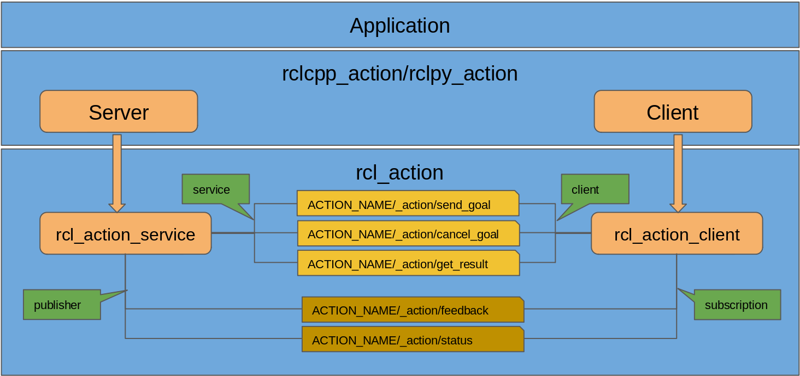
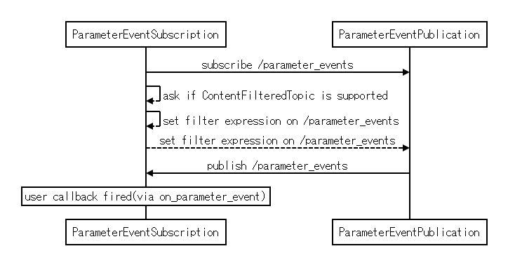

{:toc}

# {{ page.title }}

<div class="abstract" markdown="1">
{{ page.abstract }}
</div>

Original Author: {{ page.author }}

# ContentFilteredTopic Feasibility for ROS2

This is a note to consider DDS ContentFilteredTopic optimization for ros2 parameter event topic and action topics. The goal of this note is to see if it is suitable and feasible to use DDS ContentFilteredTopic against the problems that we have ros2 as described below. And describe the consideration in detail and basic design how actually we could integrate ContentFilteredTopic in ros2 core system such as rmw, rcl and rclcpp.

<!-- @import "[TOC]" {cmd="toc" depthFrom=1 depthTo=6 orderedList=false} -->

<!-- code_chunk_output -->

- [{{ page.title }}](#pagetitle)
- [ContentFilteredTopic Feasibility for ROS2](#contentfilteredtopic-feasibility-for-ros2)
  - [Author](#author)
  - [Problems](#problems)
    - [Parameter Event Topic](#parameter-event-topic)
    - [Action Topics](#action-topics)
  - [ContentFilteredTopic](#contentfilteredtopic)
    - [Requirement](#requirement)
    - [Spec Description](#spec-description)
      - [DDS](#dds)
      - [DDSI-RTPS](#ddsi-rtps)
    - [Reference](#reference)
  - [ROS2 Consideration](#ros2-consideration)
    - [Requirement](#requirement-1)
    - [Design](#design)
      - [Namespace](#namespace)
      - [Action](#action)
      - [Parameter Events](#parameter-events)
    - [Interfaces](#interfaces)
      - [rcl](#rcl)
      - [rmw](#rmw)
      - [rclcpp(rclpy)](#rclcpprclpy)
    - [Implementation](#implementation)
      - [Action](#action-1)
      - [Parameter Event](#parameter-event)
    - [Questions](#questions)
  - [Responsibility](#responsibility)
  - [Related Works](#related-works)

<!-- /code_chunk_output -->

## Author

- <Tomoya.Fujita@sony.com>

## Problems

Here describes the current problems that we have in ros2 system, they are already well-known issues. issues are not related to functionalities but efficiency like cpu consumption and network transmission. These efficiency is dependent on the platform capability, but once it comes to embedded devices and IoT platform, these problems could be a huge pain to consume resources.
Currently, at least there are following two main problems exist in ros2, the one is /parameter_events topic transmission and the other is action topics feedback and status message transmission. the detail is described as following.

### Parameter Event Topic

Each node will publish and subscribe parameter events topic (this is configurable via node option). This topic is to support monitoring parameters for change. It is expected that client libraries will implement the ability to register a callback for specific parameter changes using this topic. there will be an internal subscription for each node for /parameter_evetns topic to handle the TimeSource via "use_sim_time" parameter. rclcpp::ParameterEventsFilter is used to filter the parameter with specific names such as "use_sim_time". As user interface, AsyncParametersClient::on_parameter_event is provided to handle parameter events.


The problem can be broken down into the following two parts,

- Network activity on /parameter_events topic
  Since nobody cares who needs to receive which messages, there will be all of the parameter activity, everyone publishes and subscribes all of the events with this giant topic /parameter_events. This leads to a lot of unnecessary message transmission over the network.
- Subscriber needs to filter unnecessary (not interesting) messages
  Subscriber does not know if the message is something interesting or not without checking the contents of the message via user callback. This filtering needs to be done every single time the message comes in. In expectation, most likely parameter event callback is interested on specific parameter only, so that there will be a lot of unnecessary message receives and filtering process needs to be done.

as described above, we could imagine that if the number of node are 10, 20 and 100 and so are the parameters for each nodes. This will be a huge burden and pain for entire ros2 system, passing unnecessary messages via limited bandwidth network with edge devices and filtering messages to drop is not something user application wants to do.

### Action Topics

Each action server will provide two topics named feedback and status as followings,



feedback and status are single topic each mapped to action name and published by action server, and action clients subscribe those topics to get feedback and status. When there are many goals from many clients, the choice to have a single feedback (and status) topic per action server is suboptimal in terms of processing and bandwidth resource. It is up to clients to filter out feedback/status messages that are not pertinent to them. In this scenario, M goals are sent to N clients there is an unnecessary use of bandwidth and processing. especially in extreme cases where M and N are large. (each goal is identified by goal ID based on uuid, filtering out the goal id is done by client library so user application does not need to care.)

## ContentFilteredTopic

ContentFilteredTopic describes a more sophisticated subscription that indicates the subscriber does not want to necessarily see all values of each instance published under the Topic. Rather, it wants to see only the values whose contents satisfy certain criteria. This class therefore can be used to request content-based subscriptions. 

### Requirement

- ContentFilteredTopicDataWriter does filtering for each ContentFilteredTopicDataReader endpoint.
  OpenSplice community version supports reader side filtering, but with this, transmission does happen anyway to subscription. Filtering is integrated in the implementation but not well efficiency enough.
  
- Multiple ContentFilteredTopicDataReader exist and filtering is dependent on each ContentFilteredTopicDataReader's logical filtering expression and parameters.
- Subscriber is responsible to create ContentFilteredTopic.
- The filtering is done by means of evaluating a logical expression that involves the values f some of the data-fields in the sample. The logical expression is derived from the filter_expression and expression_parameters arguments.
- Multiple filter_expression and expression_parameters can be supported on single ContentFilteredTopic.
  ```
  [parameter use cases]
  "node = %0 OR node = %1" spinal_node attention_node : subscribe all parameter events from spinal and attention nodes
  "node = %0 OR name = %1" audio_node attention_level : subscribe all parameter events from audio_node and parameter named attention_level of all nodes.
  "(node = %0 AND name = %1) OR (node = %2 AND name = %3)" eye_node brightness ear_node loudness : subscribe brightness parameter of eye_node and loudness parameter of ear_node only.
  [action use case]
  "uuid = %0 OR uuid = %1" DEADBEEF CAFEFEED : subscribe only interest goal ids which client handlers possess.
  ```
- Multiple filter_expression and expression_parameters can be modified dynamically at runtime.
  This is because of use cases for ros2 parameter and action, parameter filtering expression is dependent on user application, and action client has multiple goal id to handle.

### Spec Description

#### DDS 

the following create/delete API's are defined,

- create_contentfilteredtopic()
- delete_contentfilteredtopic()

**[T.B.D] ContentFilteredTopic is also defined to do a more sophisticated subscription, but according to the specification, filter_expression can be only initialized at constructor and it is read_only. so not possible to change the filter_expression at runtime.**

#### DDSI-RTPS

The ContentFilterProperty_t field provides all the required information to enable content filtering on the Writer side. DDS allows the user to modify the filter expression parameters at run-time. Each time the parameters are modified, the updated information is exchanged using the Endpoint discovery protocol. This is identical to updating a mutable QoS value.

### Reference

[DDS v1.4 Specification](https://www.omg.org/spec/DDS/1.4/PDF)
[DDSI-RTPS v2.3 Specification](https://www.omg.org/spec/DDSI-RTPS/2.3/PDF)

## ROS2 Consideration

This part is ros2 related consideration how to integrate and port the ContentFilteredTopic into rclcpp, rcl and rmw layer along current implementation. at 1st step, requirement needs to be clarified and discussed very well. This is just a draft feasibility and design ideas so that this needs to be discussed with Open Robotics and ROS2 Community in public space.

### Requirement

- Do not break user space.
  Current application must be able to run without any change on ros2 supported rmw implementation such as rmw_cyclonedds, rmw_fastrtps, rmw_opensplice, rmw_connext and rmw_iceoryx. (But might require rebuilding since some built-in message needs to be modified.)
- Frontend interfaces are compatible. (parameter client)
  [T.B.D] If rmw implementation does not support ContentFilteredTopic interfaces, filtering should be done internally on subscriber side? or it can leave it for user application responsibility.
- Parameter subscription interface, method or class will be provided as frontend.
  This is to set/get the filter_expression and expression_parameters on each parameter client.
- Filtering expression and expression parameters can be set and get at runtime.
  - [T.B.D] According to DDS specification filtering expression may not be changed dynamically, in that case, recreating ContentFilteredTopic would be required to change filtering expression, or with specific filtering expression such as node name and parameter name for parameter events and goal id for action, there would be no need to reset filtering expression.
- Filtering goal id for action feedback and status will be perfectly concealed for user.
- User can specify node name and parameter name for parameter event.
  [T.B.D] This needs to be discussed more, if user should be able to filter arbitrary parameter or not.

### Design

#### Namespace

Since ContentFilteredTopic is based on related parent topic (more like base topic), it will create ContentFilteredTopic internally.

#### Action

There will be no need to expose ContentFilter concept for user. ContentFilteredTopic name would be action_name/_action/feedback_or_status_ActionClient_ID then ActionClient always get feedback events related to goal handler. This granularity is mandatory for action feedback and status topic to get more transport efficiency.

|  ContentFilterTopic Name  |  Description  |
| :--- | :--- |
|  action_name/_action/feedback_ActionClient_ID  |  feedback ContentFilteredTopic for ActionClient ID, ActionClient_ID would be uuid (consistent with status id for the same client)  |
|  action_name/_action/status_ActionClient_ID  |  status ContentFilteredTopic for ActionClient ID, ActionClient_ID would be uuid (consistent with feedback id for the same client)  |

(*) These ContentFilteredTopic should not show up to user. (e.g ros2 topic list)

feedback topic is user defined message type dependent on action name but it also includes goal id([GoalInfo](https://github.com/ros2/rcl_interfaces/blob/master/action_msgs/msg/GoalInfo.msg)). Goal id will be internally handled and client issues ContentFilteredTopic API to notify the publication(server) what subscription(client) is interested in. status topic is constructed with [GoalStatus](https://github.com/ros2/rcl_interfaces/blob/master/action_msgs/msg/GoalStatus.msg), this can be also taken care with feedback mostly same design.


#### Parameter Events

There are two types of parameter events subscription, one is for system(TimeSource) which is controlled and taken care by rclcpp and rclpy internally. And the other is user application to register user callback to be fired when parameter events come in.

It would be good to create ContentFilteredTopic for each of them. This can make responsibility clear and simple, can avoid the complication about filtering expression merge between user filtering and system filtering.

|  ContentFilterTopic  |  Description  |
| :--- | :--- |
|  /parameter_events_system_Node_ID  |  parameter events ContentFilteredTopic for system internal usage, Node ID would be uuid to identify this NodeBase. (same with user uuid)  |
|  /parameter_events_user_Node_ID  |  parameter events ContentFilteredTopic for user callback  usage, Node ID would be uuid to identify this NodeBase. (same with system uuid)  |

(*) These ContentFilteredTopic should not show up to user. (e.g ros2 topic list)

- TimeSource
  **use_sim_time** event on self-node_base is subscribed internally to check if **use_sim_time** parameter is changed or not. so internally this **use_sim_time** AND self node name always must be in filter_expression and expression_parameters via ContentFilteredTopic if it is supported. see [here](https://github.com/ros2/rclcpp/blob/99286978f92c30fe171313bf0785d6b6272c3257/rclcpp/src/rclcpp/time_source.cpp#L123-L125).
  **use_sim_time** parameter event must be guaranteed by system to keep that in the filter and parameter expression when using ContentFilteredTopic.

- User frontend (rclcpp/rclpy)
  User API will be added to manage filtering configuration, so that user application can set its own filter_expression and expression_parameters. Also using AsyncParametersClient::on_parameter_event, user can take care of the parameter event with user callback only for filtered parameter events.
  **[T.B.D] Filtering should be compatible for user even if rmw_implementation does not support ContentFilteredTopic, this can be done with using ParameterEventsFilter. But the problem here is ParameterEventsFilter only filters parameter name and event type such as NEW, DELETED, CHANGED. there is a huge gap of the flexibility that dds filtering expression and parameter expression possesses. This is what we need to discuss.**



### Interfaces

#### rcl

Since ContentFilteredTopic is dds specification and rmw_implementation, rcl will be basically just a bridge to connect interfaces between rclcpp/rclpy and rmw. So far, it is not expected to take care of specific implementation in rcl but interface glue.

#### rmw

- rmw_ret_t rmw_publisher_content_aware(const char *related_topic_name)
  Ask if rmw_implementation on the publisher supports ContentsFilteredTopic or not.
  return RMW_RET_OK if publication is contents aware, or
  return RMW_RET_UNSUPPORTED if publication is NOT contents aware.

  Or we should add the api negotiation interface for other extension to avoid redundant code?
  ```
  #define RMW_EXT_PUBLICATION_CONTENTS_AWARE 0x00000001

  rmw_ret_t rmw_ext_supported(uint64_t *flag)
  
  uint64_t flag;
  flag = flag | RMW_EXT_PUBLICATION_CONTENTS_AWARE;
  rmw_ret_t rmw_ext_supported(&flag);
  if (flag & RMW_EXT_PUBLICATION_CONTENTS_AWARE) {
    // rmw_implementation supports RMW_EXT_PUBLICATION_CONTENTS_AWARE
  }
  ```

- rmw_ret_t rmw_set_contentfilter_expression(const char *topic_name, char *filter_expression, char **expression_parameters)
  IN: content filtered topic name that's been subscribed.
  IN: filter_expression attribute is a string that specifies the criteria to select the data samples of interest. It is similar to the WHERE part of an SQL clause.
  IN: expression_parameters attribute is a sequence of strings that give values to the ‘parameters’ (i.e., "%n" tokens) in the filter_expression. The number of supplied parameters must fit with the requested values in the filter_expression(i.e., the number of %n tokens).

- rmw_ret_t rmw_get_contentfilter_expression(const char *topic_name, char *filter_expression, char **expression_parameters)
  IN: content filtered topic name that's been subscribed.
  OUT: filter_expression attribute is a string that specifies the criteria to select the data samples of interest. It is similar to the WHERE part of an SQL clause.
  OUT: expression_parameters attribute is a sequence of strings that give values to the ‘parameters’ (i.e., "%n" tokens) in the filter_expression. The number of supplied parameters must fit with the requested values in the filter_expression(i.e., the number of %n tokens).

- rmw_ret_t rmw_create/delete_contentfilteredtopic(const char *name, const char *related_topic)
  According to dds specification, ContentFilteredTopic needs to be constructed based on related_topic which is parent topic.

#### rclcpp(rclpy)

The following methods will be provided as user interfaces, so that user application can filter the parameter events with their own filter_expression and expression_parameters. rclcpp and rclpy should have the compatible class and method.

User should be aware of parameter event filtering, but no need to aware of ContentFilteredTopic. So providing filtering setter and getter interfaces based on Parameter Client. (Also this should be discussed in community, but we do not see any requirement to expose ContentFilteredTopic to user application.)

- AsyncParametersClient::set_parameter_event_filter(string filter_expression, StringSeq expression_parameters)
  **[T.B.D] maybe node names and paramter names are good enough for user interface, this needs to be discussed in community.**
  IN: filter_expression attribute is a string that specifies the criteria to select the data samples of interest. It is similar to the WHERE part of an SQL clause.
  IN: expression_parameters attribute is a sequence of strings that give values to the ‘parameters’ (i.e., "%n" tokens) in the filter_expression. The number of supplied parameters must fit with the requested values in the filter_expression(i.e., the number of %n tokens).
- AsyncParametersClient::get_parameter_event_filter
  **[T.B.D] maybe node names and paramter names are good enough for user interface, this needs to be discussed in community.**
  OUT: filter_expression attribute is a string that specifies the criteria to select the data samples of interest. It is similar to the WHERE part of an SQL clause.
  OUT: expression_parameters attribute is a sequence of strings that give values to the ‘parameters’ (i.e., "%n" tokens) in the filter_expression. The number of supplied parameters must fit with the requested values in the filter_expression(i.e., the number of %n tokens).

### Implementation

#### Action

- Action Server
  Nothing needs to be changed, even with ContentFilteredTopic it should not be aware of that, just publishes feedback and status message, the rest will be taken care by rmw_implementation. if rmw_implementation does not support ContentFilteredTopic, filtering process is done by subscriber side which is Action Client.

- Action Client
  User interface(rclcpp and rclpy) should not be changed, everything can be integrated into internal implementation.
  - rclcpp/rclpy
    Needs to check if ContentFilter is done by rmw_implementation internally. If ContentFilter is supported by by rmw_implementation, it will create ContentFilteredTopic internally based on ActionClient ID (uuid) so that no need to filter goal id.(saying there will be no unknown goal id event.) But w/o ContentFilter [current filtering](https://github.com/ros2/rclcpp/blob/99286978f92c30fe171313bf0785d6b6272c3257/rclcpp_action/include/rclcpp_action/client.hpp#L536-L553) needs to stay put since there would be unnecessary message from publisher.
    at [send_goal_request](https://github.com/ros2/rclcpp/blob/99286978f92c30fe171313bf0785d6b6272c3257/rclcpp_action/include/rclcpp_action/client.hpp#L352-L388), it will set the filter_expression and expression_parameters based on goal id, again the goal handler might have multiple goal ids, so that get current filtering configuration, modify and set new filtering configuration. (the finalization is also needed when goal id is being unregistered from goal handler.)
  - rcl
    most likely, it will provide bridge interface between rclcpp/rclpy and rmw_implementation. one thing to consider is that rcl possibly calls create/delete_contentfilteredtopic internally because currently feedback/status subscription initialization will be done by rcl internally via rcl_action_client_init.

#### Parameter Event

- Publication

Nothing will be required to change or modify on publication side. It will publish parameter events always, filtering should be done in rmw_implementation dds writer side transparently.

- Subscription

At 1st call set_parameter_event_filter from user application, if rmw_implementation supports ContentFilteredTopic, it will make ContentFilteredTopic internally and also call rcl/rmw to set the filter expression and parameter expressions. user callback via on_parameter_event will be registered on ContentFilteredTopic if filtering is requested.
[T.B.D] on_parameter_event needs to be extended to call filter_callback internally, then call user callback after filtering is done. with this filter_callback, it can internally filter the parameter event even if ContentFilteredTopic is not supported. (if ContentFilteredTopic is supported, only filtered parameter events are delivered.)

If user application wants to change filter expression and parameter expressions, it will need to get them via get_parameter_event_filter, then modify or append the expression, and set via set_parameter_event_filter.

without setting filtering, it will subscribe related topic which is /parameter_events and user callback will be fired once any event comes in. Clearing filter is to call set_parameter_event_filter with both arguments NULL.

### Questions

- what if different rmw_implementation is used on remote node?
  As long as it is dds, this is responsibility for dds implementation and it has to be able to know if remote nodes support ContentFilteredTopic or not. DDS is sets of API and specification to support and include this requirement. Once it comes to the non-dds implementation, this is not only problem for ContentFilteredTopic but also message transport cannot be supported.

- how much flexibility of filtering expression for user?
  dds filter_expression and expression_parameters are really flexible, it is designed to  support arbitrary user filtering. but thinking of ros2 frontend interface rclcpp and rclpy, maybe node name and parameter name would be good enough?

- ParameterEventSubscription
  Kinda off topic, this should be integrated into rcl layer? so that all frontend rclpy can take advantage of that, also we can reduce the redundancy for maintenance. (I believe this is the main focus on rcl implementation.)

- Side effect for making bunch of ContentFilteredTopic
  There will be always trading-off, with user aspect, making ContentFilteredTopic is really good not to filter the event. But thinking about dds responsibility, this will increase the complexity and complication for ContentFilteredTopic writer to comprehend which reader needs to receive what events. this needs to be discussed with dds vendor, to try to get to the sweetest spot for ros2 use cases.

- User interface for ContentFilteredTopic
  It should provide ContentFilteredTopic in general interfaces for topic? not only for action and parameter events? this could be discussed in community. (this is not a focus on this task, but it can be extended if requested.)

## Responsibility


## Related Works

- [Parameter Subscription Class](https://github.com/ros2/rclcpp/pull/829)
  User friendly interfaces to handle parameters with node and parameter identification. PR is really old and suspended for monthes. This might be discarded.
