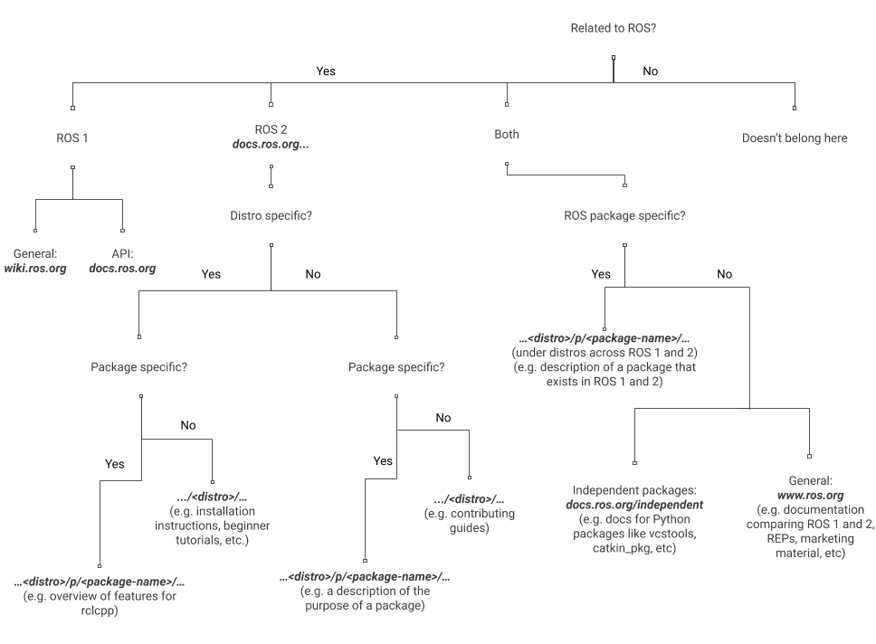
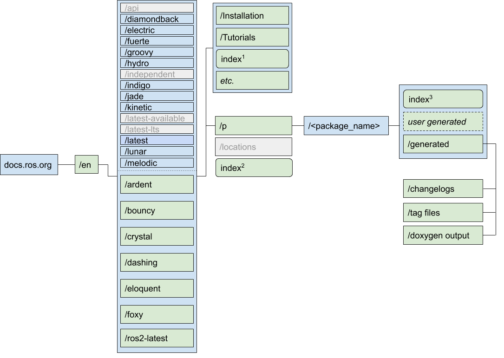

{:toc}

# {{ page.title }}

{{ page.abstract }}

Original Author: {{ page.author }}

## Background

ROS 2 is lacking a process for the conglomeration of package documentation.
Discoverability for package documentation (and documentation in general) is one of the most frequent user complaints.

The goal of this design is to make ROS 2 documentation as accessible as possible for all ROS users.
To achieve this we are seeking to standardize a documentation process for ROS 2 packages that will encourage maintainers to robustly document their packages, in turn making ROS 2 package documentation more available.
The results will be presented in a consistent way alongside the general ROS 2 documentation, making the documentation as a whole discoverable and predictable.

In general, the vision for the system is:

- Package maintainers document their packages in their repositories following some recommended guidelines or templates
- Package documentation (API documentation, other package related content) from the repositories is built on the ROS 2 infrastructure and deployed to the ROS 2 documentation site in an automatic process maintainers can opt in to by adding a `doc` block to the `distribution.yaml`
  - See [REP 141](https://www.ros.org/reps/rep-0141.html) for more context.
- Package documentation is indexed alongside ROS 2's generic content on the docs site

## Context

The per-package documentation plan is an extension of the general ROS 2 documentation project, which introduced some requirements that affect the context of the per-package documentation:

- All documentation will be hosted on `docs.ros.org`
- All documentation will be versioned by ROS 2 distribution names
- The URL structure will be `docs.ros.org/<lang>/<distro>/...` for generic documentation and `docs.ros.org/<lang>/<distro>/p/<package_name>/...` for package documentation
  - See the diagram below for more context on where documentation will fall under this URL structure:
  

## Requirements

The [Primary requirements](#1-primary-requirements) are those that must be in place for the system to be functional and achieve its purpose.
The [Secondary requirements](#2-secondary-requirements) are also absolute requirements, however they are not necessary to roll out the first stage of implementation.
They will be carried out following the initial roll out.

### 1. Primary requirements

**1.1 All package documentation must be available with the rest of the ROS 2 documentation under a single domain**

Package documentation will be treated the same as the generic ROS 2 documentation.
Its presence as part of the docs site should be made well-known from the site's overview as well as from any entry point into the docs site, and be intuitive from the organization and layout of the site.

**1.2 Package documentation must have an easily navigable and intuitive URL structure**

Every package's "home page" should be reachable with minimal effort by the scheme `docs.ros.org/<lang>/<distro>/p/<package_name>/`

**1.3 Package documentation must be maintainable in its repository without going through a third party**

Maintainers and contributors will only have to work on their package's documentation within its repository.
The details of building and hosting will not be a concern of package maintainers.

Despite being hosted alongside the generic documentation, working on a package's documentation will not require any work on the repositories of the generic documentation (currently `ros2/ros2_documentation`) or the site repository (currently `ros-infrastructure/rosindex`).

**1.4 The system must support C++ and Python API docs generation**

The system will automatically extract API docs for these languages from the source code in package repositories and build the output on the docs site.

**1.5 Package documentation must be written and formatted in rst (reStructuredText)**

Rst is the file format currently utilized by the ROS 2 documentation.
Package documentation should continue to utilize rst for consistency.

**1.6 The system must allow package documentation to be versioned per ROS 2 distribution**

The docs site and buildfarm will allow documentation for the latest version of a package corresponding to each ROS 2 distribution the docs site supports versioning for.
The package repository can still maintain its own docs for previous versions.

While multiple package versions per distribution will not initially be supported, the URL structure will support the addition of this feature in the future (mentioned under [Secondary requirements](#2-secondary-requirements) below).

**1.7 The buildfarm must automatically build package documentation**

Changes to the documentation in a package repository shouldn't require the maintainer to manually trigger a build.

**1.8 The system must automatically generate listing content for a package so it's listed on docs.ros.org even if the package maintainer does not explicitly set up anything in the package repository**

By default some package info will be listed for every package added to a rosdistro.

**1.9 The systems must support cross-referencing between packages**

A stable linking process will be in place to cross-reference between package docs despite their originating from separate repositories.

**1.10 The system must prevent the possibility of package file names (created by maintainers) colliding with auto-generated content (from the system's side)**

When writing package documentation, maintainers should not have to concern themselves with auto-generated content, like the current `/changelogs` and `/symbols` directories in the current `docs.ros.org` API docs structure for ROS 1.

### 2. Secondary requirements

**2.1 Package maintainers should have the ability to include free form documentation, like tutorials, design docs, etc., alongside generated API docs on docs.ros.org**

**2.2 The system should provide a standardized interface for generating an index page/landing page for packages, consistent across ROS 2**

**2.3 The system should provide a standardized method for generating package documentation locally, including build error alerts**

**2.4 The system should be extensible for more languages**

**2.5 Users should be able to switch between versions (distributions) while viewing a package's documentation**

**2.6 The system should support building documentation for more than one version of a package per ROS 2 distribution**

**2.7 Changes to documentation pushed in a package repository should be immediately deployed to the documentation site**

**2.8 The system should support bi-directional cross-referencing (“backwards” to dependents)**

## Design

The design covers the solution for satisfying the primary requirements.
Some secondary requirements are also satisfied inherently through the primary design decisions.

In summary, the design for the system is:

- Utilize [Sphinx][1], [Doxygen][2] and [Breathe][3] tools to satisfy both C++ and Python API documentation (1.4), cross-referencing across packages (1.9) and consistent use of RST (1.5)
- Develop a new doc tool integrated into the build system (1.7) for maintainers to run on their packages (1.3) that encompasses Sphinx, Doxygen and Breathe, and builds the docs locally (2.3).
- The output of the tool is uploaded to docs.ros.org (1.1) by the build farm, to the correct URL address (1.2, 1.10)
- A package’s inclusion in a rosdistro (as per normal release process*) will version its documentation to that distribution (1.6) and list the package under that distribution’s listing of packages on docs.ros.org (1.8)
    - Via the inclusion of a doc block in a distribution.yaml in [github.com/ros/rosdistro](https://github.com/ros/rosdistro)

The design description is laid out in the following subsections:

- The [Documentation System](#documentation-system) section, which describes, at a high level, the functionality of the doc tool for both the user side of package documentation as well as how it interacts with the buildfarm.
- The [URL Structure](#url-structure) section, which shows how directories under `docs.ros.org` will be organized in the new system.
- The [Considerations](#considerations) section, which addresses some other options that were considered for various aspects of the design, and why they were decided against.

### Documentation System

#### User process

The doc tool will invoke everything necessary to document a work space according to our requirements and vision for the new documentation site.
It can be run on any ROS 2 package.

The tool may be developed to run standalone, or it may be necessary for maintainers to add a one liner to their package.xml, rosdoc.yaml, etc. telling the tool whether it should be building C++ docs, Python docs, or both.

The tool works by first building the package to ensure all the generated code is accounted for and able to be documented.
Then, the tool checks for a `doxyfile` or C++ code.
If either are present, the tool will run Doxygen.

If the package maintainer wants their C++ code documented, they should include a `doxyfile`.
We can provide a standard template for the `doxyfile`, which maintainers can then customize the contents of, to the specifications of their package’s needs.

Maintainers can also choose to not include a `doxyfile`, in which case the tool will substitute a default doxyfile if it finds C++ code, providing standard configuration for the package.

Doxygen will produce API docs for any C++ code it is run on, and the maintainer has the option to further elaborate on their API docs by including Doxygen comment blocks within their source code.

Once Doxygen is completed, or if it never ran because the tool did not find any `doxyfile` or C++ code, the tool will proceed to running Breathe and Sphinx.

Breathe imports the symbols from Doxygen’s output to Sphinx.
It will allow C++ API docs to be built by Sphinx to maintain consistency across ROS 2 API docs and allow cross-referencing between all packages.

If there is no Doxygen output (no C++ documentation), Sphinx will run without Breathe.
All packages will need a Sphinx configuration file.
If a package doesn’t have one, the tool can use a default one.
Python packages will need Sphinx directives explicitly integrated into the source code to produce API documentation (standard for Sphinx API documentation).

Once complete, the tool will output the package documentation build locally.
Users will be able to see any build errors as well as how their documentation will look once built to `docs.ros.org`.

##### Support for other languages

This section addresses how the system will potentially satisfy requirement 2.4 in the future.
In general, the goal is to treat additional languages the same as the system treats Python and Doxygen.
That is, a library in any additional language should be able to utilize its native/standard documentation tool.
There should then be a bridge between the output of that tool and Sphinx, like how Breathe bridges Doxygen and Sphinx.
This will most likely not be an out-of-box solution for most languages, but the assumption is that extension will be possible.

Bridging with Sphinx allows the assumption that cross-referencing will be possible.
It also maintains the standard landing page requirement; the top level entry point will be Sphinx regardless of a package’s language.
The landing page will provide access to the other generated documentation.

For packages with documentation for multiple languages, the landing pages will provide access to each generator (e.g. “Click here for Doxygen content, Click here for Javadoc content”).
Supporting multiple documentation engines will require that each generator outputs into its own designated directory (see [URL Structure - /generated](#generated)).

#### Buildfarm process

To opt in to having documentation built on docs.ros.org, maintainers will have to add a `doc` block to their `distribution.yaml` file that indicates the rosdistro branch and a path to the repository.
Opting-in this way will cause the tool to automatically generate an index landing page for the package.

The buildfarm will invoke the same tool used in the user process, run on ***n*** packages, to generate the documentation for `docs.ros.org`.
It will require some additional settings, for example the URL where content should generate into.

A webhook between GitHub and the buildfarm will indicate when there is a new commit to a repository (for the branches being tracked for documentation) so the documentation can be automatically regenerated and immediately deployed.

Some files will be auto-generated during this process (changelogs, tag files, etc.).
The auto-generated content won’t be saved to the upstream repositories, but it will be built to `docs.ros.org`.

There is a possibility of collision occurring between maintainer created files and generated files.
To prevent this to the best of the system's ability, the system will place auto-generated content in a restricted directory (see [URL Structure - /generated](#generated)).

##### Cross-referencing between sibling packages

This section addresses requirement 2.8, cross-referencing between sibling packages.
As packages integrate their documentation into the system, cross-referencing between packages will be inconsistent.
It may require multiple builds of all the packages in the system to eventually reach a consistent state for cross-references.
How exactly this will be executed will be determined.

### URL structure

#### `index` pages

The index pages indicate the default page that is rendered when the directory level immediately before is visited without any specific `.html` page following.

For example, visiting docs.ros.org/en/foxy would render `index1`, docs.ros.org/en/foxy/p would render `index2`, and docs.ros.org/en/foxy/p/<package_name> would render `index3`.

`index1` is the general ROS 2 documentation overview page, what is currently seen when visiting index.ros.org/doc/ros2/

`index2` will be the package listing page for each ROS 2 distribution.

`index3` will be each specific package’s homepage.
This will be generated by the tool, but a user-generated index page should also be able to be merged or augmented with the auto-generated page to prevent collision.

#### Versioning at the `<package_name>` level

To support the goal of being able to support multiple versions of packages documented within the context of one distro (2.6) we plan to reserve URL space and have a plan to migrate forward but not to implement it at first.

When functionality is added to the documentation system for more than one version of package documentation per rosdistro, those versions will be appended to the package name in the URL.
For example, `/p/rclcpp` can have versioned content added to `/p/rclcpp-2.1.0` and `/p/rclcpp-3.0.0`.
After enabling versioning, the unversioned URL will be a link to the version currently indexed in the rosdistro.

See [Considerations - Package version directory](#package-version-directory) for an explanation of the naming convention.

#### `/generated`

The purpose of this directory is to allocate a place where automatically generated content can be placed without risk of collision with user-created content.
The tool will throw warnings to ensure users do not write any manual content into `/generated`; it is ultimately up to maintainers to prevent collision.
Manually created content will override auto-generated content it collides with.

The index page for each package will link to the generated API docs, changelogs, etc.

#### `user generated`

Within a package’s repo, the tool will generate a `/docs` directory where maintainers can place any manually created rst files they would like, like tutorials, architecture articles, etc.

The tool will direct Sphinx to generate the content in the `/docs` directory, which will output to the top level when deployed (sibling to `/generated` and `index3`).

However, it may become evident during development of the system that it is necessary to add an additional subdirectory/subdirectories at this level to contain the manually created content.
This decision will be confirmed before deployment of the new site.
For now, the URL structure uses `user generated` as a placeholder for either case.

#### ROS 1 documentation

Besides the addition of `/en`, the structure and functionality of ROS 1’s API documentation will remain the same.
Necessary redirects will be implemented.

### Considerations

#### Other doc tools

There are many documentation tools available, but ultimately Sphinx, Doxygen and Breathe were the best choices to satisfy our requirements.

Sphinx and Doxygen are well-established and ubiquitous for documenting their respective languages
This ensures the robustness of the system more so than any of the non-standard tools, and also that our users will have easy access to resources to aid them in documenting their packages with these tools.

With Breathe, it is simple to satisfy the requirement of coordinating C++ and Python documentation, and basing the system off of Sphinx allows simple customization with Python modules.

Another tool, [Exhale][4] has been considered for future addition to the system.
Exhale adds some extra features available in pure Doxygen that Breathe alone doesn’t import into Sphinx.

#### Allowing pure Doxygen use

If a package maintainer insists on using Doxygen alone, they are of course welcome to.
However, this is not a use case we plan to support.

The standard entry point should be utilizing our tool, which will run Doxygen but then also run Breathe and Sphinx over it so the output can be uniform with the rest of our documentation.
Using Doxygen by itself will sacrifice that consistency and also the ability to cross-reference to and from that package, both major driving points for this project.
The tool should mostly mask the complexities of the Sphinx/Breathe/Doxygen system, making the difference between using “pure” Doxygen and using the new tool negligible for maintainers.

#### Package version directory

To satisfy secondary requirement 2.6, the first obvious consideration for the structure was `.../p/<package_name>/<version>`, but, as indicated in the URL structure section above, the decision is to use `.../p/<package_name-version.number.n>`.

The chosen structure doesn’t force another directory, which allows versioned package documentation to be added later on in the development of the system without leaving an unused directory level in the meantime.
Adding package versions in the future will not disrupt the meaning of the URL structure, because `/<package_name>/` without any appended `-version.number.n` will always implicitly indicate the latest version.

<!-- ## Reference -->

[1]: https://www.sphinx-doc.org/en/master/
[2]: https://www.doxygen.nl/index.html
[3]: https://breathe.readthedocs.io/en/latest/
[4]: https://exhale.readthedocs.io/en/latest/
