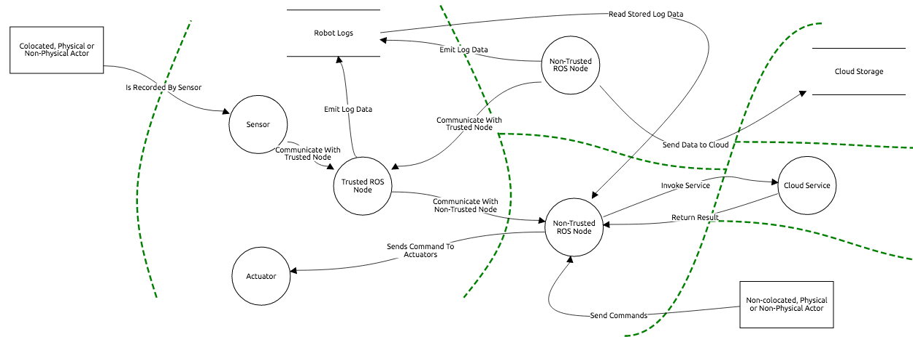

{:toc}

{::options parse_block_html="true" /}

# {{ page.title }}

**DRAFT DOCUMENT**

**Disclaimer**:

* This document is not exhaustive. Mitigating all attacks in this document does
  not ensure any robotic product is secure.
* This document is a live document. It will continue to evolve as we implement
  and mitigate attacks against reference platforms.

## Document Scope

This document describes potential threats for ROS 2 robotic systems. The
document is divided into two parts:

1. Robotic Systems Threats Overview
1. Threat Analysis for the TurtleBot 3 Robotic Platform

The first section lists and describes threats from a theoretical point of view.
Explanations in this section should hold for any robot built using a
component-oriented architecture. The second section instantiates those threats
on a widely-available reference platform, the TurtleBot 3. Mitigating threats
on this platform enables us to demonstrate the viability of our recommendations.

## Robotic Systems Threats Overview

This section is intentionally independent from ROS as robotic systems
share common threats and potential vulnerabilities. For instance, this section
describes "robotic components" while the next section will mention "ROS 2 nodes".

### Defining Robotic Systems Threats

We will consider as a robotic system one or more general-purpose computers
connected to one or more actuators or sensors. An actuator is defined as any
device producing physical motion. A sensor is defined as any device capturing or
recording a physical property.

### Robot Application Actors, Assets, and Entry Points

This section defines actors, assets, and entry points for this threat model.

**Actors** are humans or external systems interacting with the robot. Considering
which actors interact with the robot is helpful to determine how the system
can be compromised. For instance, actors may be able to give commands to the
robot which may be abused to attack the system.

**Assets** represent any user, resource (e.g. disk space), or property (e.g. physical
safety of users) of the system that should be defended against attackers. 
Properties of assets can be related to acheiving the business goals of the robot.
For example, sensor data is a resource/asset of the system and the privacy of that
data is a system property and a business goal.

**Entry points** represent how the system is interacting with the world (communication
channels, API, sensors, etc.).

#### Robot Application Actors

Actors are divided into multiple categories based on whether or not they are
physically present next to the robot (could the robot harm them?), are they
human or not and are they a "power user" or not. A power user
is defined as someone who is knowledgeable and execute tasks which are normally
not done by end-users (build and debug new software, deploy code, etc.).

<table class="table">
  <thead>
    <th style="width: 7em">Actor</th>
    <th style="width: 3.3em">Co-Located?</th>
    <th style="width: 2.5em">Human?</th>
    <th style="width: 3.3em">Power User?</th>
    <th style="width: 10em">Notes</th>
  </thead>
  <tr>
    <td>Robot User</td>
    <td class="success">Y</td>
    <td class="success">Y</td>
    <td class="danger">N</td>
    <td>Human interacting physically with the robot.</td>
  </tr>
  <tr>
    <td>Robot Developer / Power User</td>
    <td class="success">Y</td>
    <td class="success">Y</td>
    <td class="success">Y</td>
    <td>User with robot administrative access or developer.</td>
  </tr>
  <tr>
    <td>Third-Party Robotic System</td>
    <td class="success">Y</td>
    <td class="danger">N</td>
    <td class="warning">-</td>
    <td>Another robot or system capable of physical interaction with the robot.
    </td>
  </tr>
  <tr>
    <td> Teleoperator / Remote User </td>
    <td class="danger">N</td>
    <td class="success">Y</td>
    <td class="danger">N</td>
    <td>A human tele-operating the robot or sending commands to it through a
        client application (e.g. smartphone app) </td>
  </tr>
  <tr>
    <td>Cloud Developer</td>
    <td class="danger">N</td>
    <td class="success">Y</td>
    <td class="success">Y</td>
    <td>A developer buildling a cloud service connected to the robot or an
        analyst who has been granted access to robot data.</td>
  </tr>
  <tr>
    <td> Cloud Service </td>
    <td class="danger">N</td>
    <td class="danger">N</td>
    <td class="warning">-</td>
    <td>A service sending commands to the robot automatically (e.g. cloud
        motion planning service)</td>
  </tr>
</table>

#### Assets

Assets are categorized in privacy (robot private data should not
be accessible by attackers), integrity (robot behavior should not be modified
by attacks) and availability (robot should continue to operate even under
attack).

<table class="table">
  <thead>
    <th>Asset</th>
    <th>Description</th>
  </thead>

  <tr><th colspan="2">Privacy</th></tr>
  <tr>
    <td>Sensor Data Privacy</td>
    <td>Sensor data must not be accessed by unauthorized actors.</td>
  </tr>
  <tr>
    <td>Robot Data Stores Privacy</td>
    <td>Robot persistant data (logs, software, etc.) must not be accessible by
        unauthorized actors.</td>
  </tr>

  <tr><th colspan="2">Integrity</th></tr>
  <tr>
    <td>Physical Safety</td>
    <td>The robotic system must not harm its users or environment.</td>
  </tr>
  <tr>
    <td>Robot Actuators Command Integrity</td>
    <td>Unallowed actors should not be able to control the robot actuators.</td>
  </tr>
  <tr>
    <td>Robot Behavior Integrity</td>
    <td>The robotic system must not allow attackers to disrupt its tasks.</td>
  </tr>
  <tr>
    <td>Robot Data Stores Integrity</td>
    <td>No attacker should be able to alter robot data.</td>
  </tr>

  <tr><th colspan="2">Availability</th></tr>
  <tr>
    <td>Compute Capabilities</td>
    <td>Robot embedded and distributed (e.g. cloud) compute resources.
    Starving a robot from its compute resources can prevent it from operating
    correctly.
    </td>
  </tr>
  <tr>
    <td>Robot Availability</td>
    <td>The robotic system must answer commands in a reasonable time.</td>
  </tr>
  <tr>
    <td>Sensor Availability</td>
    <td>Sensor data must be available to allowed actors shortly after being
    produced.</td>
  </tr>
</table>

#### Entry Points

Entry points describe the system attack surface area (how do actors interact
with the system?).

<table class="table">
  <thead>
    <th>Name</th>
    <th>Description</th>
  </thead>
  <tr>
    <td>Robot Components Communication Channels</td>
    <td>Robotic applications are generally composed of multiple components
    talking over a shared bus. This bus may be accessible over the robot
    WAN link.</td>
  </tr>
  <tr>
    <td>Robot Administration Tools</td>
    <td>Tools allowing local or remote users to connect to the robot
    computers directly (e.g. SSH, VNC).</td>
  </tr>
  <tr>
    <td>Remote Application Interface</td>
    <td>Remote applications (cloud, smartphone application, etc.) can be
    used to read robot data or send robot commands (e.g. cloud REST API,
    desktop GUI, smartphone application).</td>
  </tr>
  <tr>
    <td>Robot Code Deployment Infrastructure</td>
    <td>Deployment infrastructure for binaries or configuration files are
    granted read/write access to the robot computers filesystems.</td>
  </tr>
  <tr>
    <td>Sensors</td>
    <td>Sensors are capturing data which usually end up being injected into
    the robot middleware communication channels.</td>
  </tr>
  <tr>
    <td>Embedded Computer Physical Access</td>
    <td>External (HDMI, USB...) and internal (PCI Express, SATA...) ports.</td>
  </tr>
</table>

### Robot Application Components and Trust Boundaries

The system is divided into hardware (embedded general-purpose computer, sensors, actuators), multiple components
(usually processes) running on multiple computers (trusted or non-trusted
components) and data stores (embedded or in the cloud).

While the computers may run well-controlled, trusted software (trusted
components), other off-the-shelf robotics components (non-trusted) nodes may be
included in the application. Third-party components may be malicious (extract
private data, install a root-kit, etc.) or their QA validation process may
not be as extensive as in-house software. Third-party components releasing
process create additional security threats (third-party component may be
compromised during their distribution).

A trusted robotic component is defined as a node developed, built, tested and
deployed by the robotic application owner or vetted partners. As the process is
owned end-to-end by a single organization, we can assume that the node will
respect its specifications and will not, for instance, try to extract and leak
private information. While carefully controlled engineering processes can
reduce the risk of malicious behavior (accidentally or voluntarily), it cannot
completely eliminate it. Trusted nodes can still leak private data, etc.

Trusted nodes should not trust non-trusted nodes. It is likely that more than one
non-trusted component is embedded in any given robotic application. It is
important for non-trusted components to not trust each other as one malicious
non-trusted node may try to compromise another non-trusted node.

An example of a trusted component could be an in-house (or carefully vetted) IMU
driver node. This component may communicate through unsafe channels with other
driver nodes to reduce sensor data fusion latency. Trusting components is never
ideal but it may be acceptable if the software is well-controlled.

On the opposite, an non-trusted node can be a third-party object tracker.
Deploying this node without adequate sandboxing could impact:

* User privacy: the node is streaming back user video without their consent
* User safety: the robot is following the object detected by the tracker and its
  speed is proportional to the object distance. The malicious tracker estimates
  the object position very far away on purpose to trick the robot into suddenly
  accelerating and hurting the user.
* System availability: the node may try to consume all available computing
  resources (CPU, memory, disk) and prevent the robot from performing correctly.
* System Integrity: the robot is following the object detected by the tracker.
  The attacker can tele-operate the robot by controlling the estimated position
  of the tracked object (detect an object on the left to make the robot move to
  the left, etc.).

Nodes may also communicate with the local filesystem, cloud services or data
stores. Those services or data stores can be compromised and should not be
automatically trusted. For instance, URDF robot models are usually stored in the
robot file system. This model stores robot joint limits. If the robot file
system is compromised, those limits could be removed which would enable an
attacker to destroy the robot.

Finally, users may try to rely on sensors to inject malicious data into the
system ([Akhtar, Naveed, and Ajmal Mian. “Threat of Adversarial Attacks on
Deep Learning in Computer Vision: A Survey.”][akhtar_threat_2018]).

The diagram below illustrates an example application with different trust zones
(trust boundaries showed with dashed green lines). The number and scope of trust
zones is depending on the application.

[Diagram Source](ros2_threat_model/RobotSystemThreatModel.json)
(edited with [Threat Dragon][threat_dragon])

### Threat Analysis and Modeling

The table below lists all *generic* threats which may impact a
robotic application.

Threat categorization is based on the [STRIDE][wikipedia_stride]
 (Spoofing / Tampering / Repudiation / Integrity / Denial of service
 / Elevation of privileges) model.
Risk assessment relies on [DREAD][wikipedia_dread] (Damage / Reproducibility /
 Exploitability / Affected users / Discoverability).

In the following table, the "Threat Category (STRIDE)" columns indicate
the categories to which a threat belongs. If the "Spoofing" column is marked with
a check sign (✓), it means that this threat can be used to spoof a component
of the system. If it cannot be used to spoof a component, a cross sign will
be present instead (✘).

The "Threat Risk Assessment (DREAD)" columns contain a score indicating how
easy or likely it is for a particular threat to be exploited. The allowed
score values are 1 (not at risk), 2 (may be at risk) or 3 (at risk, needs to
be mitigated).  For instance, in the damage column a 1 would mean
"exploitation of the threat would cause minimum damages", 2 "exploitation of
the threat would cause significant damages" and 3 "exploitation of the threat
would cause massive damages". The "total score" is computed by adding the
score of each column. The higher the score, the more critical the
threat.

Impacted assets, entry points and business goals columns indicate whether
an asset, entry point or business goal is impacted by a given threat.
A check sign (✓) means impacted, a cross sign (✘) means not impacted.
A triangle (▲) means "impacted indirectly or under certain conditions".
For instance, compromising the robot kernel may not be enough to steal
user data but it makes stealing data much easier.

  <table class="table">
    <tr>
      <th rowspan="2" style="width: 20em">Threat Description</th>
      <th colspan="6">Threat Category (STRIDE)</th>
      <th colspan="6">Threat Risk Assessment (DREAD)</th>
      <th colspan="7">Impacted Assets</th>
      <th colspan="5">Impacted Entry Points</th>
      <th rowspan="2" style="width: 30em">Mitigation Strategies</th>
      <th rowspan="2" style="width: 30em">Similar Attacks in the Litterature</th>
    </tr>
    <tr style="height: 13em; white-space: nowrap;">
      <th style="transform: rotate(-90deg) translateX(-5em) translateY(5em)">Spoofing</th>
      <th style="transform: rotate(-90deg) translateX(-5em) translateY(5em)">Tampering</th>
      <th style="transform: rotate(-90deg) translateX(-5em) translateY(5em)">Repudiation</th>
      <th style="transform: rotate(-90deg) translateX(-5em) translateY(5em)">Info. Disclosure</th>
      <th style="transform: rotate(-90deg) translateX(-5em) translateY(5em)">Denial of Service</th>
      <th style="transform: rotate(-90deg) translateX(-5em) translateY(5em)">Elev. of Privileges</th>
      <th style="transform: rotate(-90deg) translateX(-5em) translateY(5em)">Damage</th>
      <th style="transform: rotate(-90deg) translateX(-5em) translateY(5em)">Reproducibility</th>
      <th style="transform: rotate(-90deg) translateX(-5em) translateY(5em)">Exploitability</th>
      <th style="transform: rotate(-90deg) translateX(-5em) translateY(5em)">Affected Users</th>
      <th style="transform: rotate(-90deg) translateX(-5em) translateY(5em)">Discoverability</th>
      <th style="transform: rotate(-90deg) translateX(-5em) translateY(5em)">DREAD Score</th>
      <th style="transform: rotate(-90deg) translateX(-5em) translateY(5em)">Robot Compute Rsc.</th>
      <th style="transform: rotate(-90deg) translateX(-5em) translateY(5em)">Physical Safety</th>
      <th style="transform: rotate(-90deg) translateX(-5em) translateY(5em)">Robot Avail.</th>
      <th style="transform: rotate(-90deg) translateX(-5em) translateY(5em)">Robot Integrity</th>
      <th style="transform: rotate(-90deg) translateX(-5em) translateY(5em)">Data
Integrity</th>
      <th style="transform: rotate(-90deg) translateX(-5em) translateY(5em)">Data
Avail.</th>
      <th style="transform: rotate(-90deg) translateX(-5em) translateY(5em)">Data
Privacy</th>
      <th style="transform: rotate(-90deg) translateX(-5em) translateY(5em)">Embedded H/W</th>
      <th style="transform: rotate(-90deg) translateX(-5em) translateY(5em)">Robot Comm. Channels</th>
      <th style="transform: rotate(-90deg) translateX(-5em) translateY(5em)">Robot Admin. Tools</th>
      <th style="transform: rotate(-90deg) translateX(-5em) translateY(5em)">Remote App. Interface</th>
      <th style="transform: rotate(-90deg) translateX(-5em) translateY(5em)">Deployment Infra.</th>
      <th></th>
    </tr>
    <tr>
      <th colspan="29">Embedded / Software / Communication / Inter-Component
Communication</th>
    </tr>
    <tr>
      <td>An attacker spoofs a component identity.</td>
      <td class="success">✓</td>
      <td class="success">✓</td>
      <td class="danger">✘</td>
      <td class="success">✓</td>
      <td class="danger">✘</td>
      <td class="success">✓</td>
      <td class="danger">3</td>
      <td class="success">1</td>
      <td class="success">1</td>
      <td class="warning">2</td>
      <td class="danger">3</td>
      <td>10</td>
      <td class="success">✓</td>
      <td class="success">✓</td>
      <td class="success">✓</td>
      <td class="success">✓</td>
      <td class="success">✓</td>
      <td class="success">✓</td>
      <td class="success">✓</td>
      <td class="success">✓</td>
      <td class="success">✓</td>
      <td class="danger">✘</td>
      <td class="danger">✘</td>
      <td class="danger">✘</td>
      <td>
        <ul>
          <li>Components should authenticate themselves.</li>
          <li>Components should not be attributed similar identifiers.</li>
          <li>Component identifiers should be chosen carefully.</li>
        </ul>
      </td>
      <td>
        <a href="http://arxiv.org/abs/1504.04339">Bonaci, Tamara, Jeffrey
    Herron, Tariq Yusuf, Junjie Yan, Tadayoshi Kohno, and Howard Jay Chizeck. “To
    Make a Robot Secure: An Experimental Analysis of Cyber Security Threats Against
    Teleoperated Surgical Robots.” ArXiv:1504.04339 [Cs], April 16, 2015.</a>
      </td>
    </tr>
    <tr>
      <td>An attacker intercepts and alters a message.</td>
      <td class="danger">✘</td>
      <td class="success">✓</td>
      <td class="danger">✘</td>
      <td class="danger">✘</td>
      <td class="danger">✘</td>
      <td class="danger">✘</td>
      <td class="danger">3</td>
      <td class="danger">3</td>
      <td class="danger">3</td>
      <td class="danger">3</td>
      <td class="danger">3</td>
      <td>15</td>
      <td class="danger">✘</td>
      <td class="success">✓</td>
      <td class="success">✓</td>
      <td class="success">✓</td>
      <td class="success">✓</td>
      <td class="success">✓</td>
      <td class="warning">▲</td>
      <td class="danger">✘</td>
      <td class="success">✓</td>
      <td class="danger">✘</td>
      <td class="danger">✘</td>
      <td class="danger">✘</td>
      <td>
        <ul>
          <li>Messages should be signed and/or encrypted.</li>
        </ul>
      </td>
      <td>
        <a href="http://arxiv.org/abs/1504.04339">Bonaci, Tamara, Jeffrey
    Herron, Tariq Yusuf, Junjie Yan, Tadayoshi Kohno, and Howard Jay Chizeck. “To
    Make a Robot Secure: An Experimental Analysis of Cyber Security Threats Against
    Teleoperated Surgical Robots.” ArXiv:1504.04339 [Cs], April 16, 2015.</a>
      </td>
    </tr>
    <tr>
      <td>An attacker writes to a communication channel without
    authorization.</td>
      <td class="danger">✘</td>
      <td class="success">✓</td>
      <td class="danger">✘</td>
      <td class="danger">✘</td>
      <td class="danger">✘</td>
      <td class="danger">✘</td>
      <td class="danger">3</td>
      <td class="danger">3</td>
      <td class="danger">3</td>
      <td class="danger">3</td>
      <td class="danger">3</td>
      <td>15</td>
      <td class="danger">✘</td>
      <td class="success">✓</td>
      <td class="success">✓</td>
      <td class="success">✓</td>
      <td class="danger">✘</td>
      <td class="danger">✘</td>
      <td class="success">✓</td>
      <td class="danger">✘</td>
      <td class="success">✓</td>
      <td class="danger">✘</td>
      <td class="danger">✘</td>
      <td class="danger">✘</td>
      <td>
        <ul>
          <li>Components should only communicate on encrypted channels.</li>
          <li>Sensitive inter-process communication should be done through shared
        memory whenever possible.</li>
        </ul>
      </td>
      <td>
        <a href="http://arxiv.org/abs/1504.04339">Bonaci, Tamara, Jeffrey
    Herron, Tariq Yusuf, Junjie Yan, Tadayoshi Kohno, and Howard Jay Chizeck. “To
    Make a Robot Secure: An Experimental Analysis of Cyber Security Threats Against
    Teleoperated Surgical Robots.” ArXiv:1504.04339 [Cs], April 16, 2015.</a>
      </td>
    </tr>
    <tr>
      <td>An attacker listens to a communication channel without
authorization.</td>
      <td class="danger">✘</td>
      <td class="danger">✘</td>
      <td class="danger">✘</td>
      <td class="success">✓</td>
      <td class="danger">✘</td>
      <td class="danger">✘</td>
      <td class="warning">2</td>
      <td class="danger">3</td>
      <td class="danger">3</td>
      <td class="danger">3</td>
      <td class="danger">3</td>
      <td>14</td>
      <td class="danger">✘</td>
      <td class="danger">✘</td>
      <td class="success">✓</td>
      <td class="success">✓</td>
      <td class="success">✓</td>
      <td class="success">✓</td>
      <td class="success">✓</td>
      <td class="danger">✘</td>
      <td class="success">✓</td>
      <td class="danger">✘</td>
      <td class="danger">✘</td>
      <td class="danger">✘</td>
      <td>
        <ul>
          <li>Components should only communicate on encrypted channels.</li>
          <li>Sensitive inter-process communication should be done through shared
memory whenever possible.</li>
        </ul>
      </td>
      <td>
        <a href="http://arxiv.org/abs/1504.04339">Bonaci, Tamara, Jeffrey
    Herron, Tariq Yusuf, Junjie Yan, Tadayoshi Kohno, and Howard Jay Chizeck. “To
    Make a Robot Secure: An Experimental Analysis of Cyber Security Threats Against
    Teleoperated Surgical Robots.” ArXiv:1504.04339 [Cs], April 16, 2015.</a>
      </td>
    </tr>
    <tr>
      <td>An attacker prevents a communication channel from being usable.</td>
      <td class="danger">✘</td>
      <td class="danger">✘</td>
      <td class="danger">✘</td>
      <td class="danger">✘</td>
      <td class="success">✓</td>
      <td class="danger">✘</td>
      <td class="danger">3</td>
      <td class="danger">3</td>
      <td class="danger">3</td>
      <td class="danger">3</td>
      <td class="danger">3</td>
      <td>15</td>
      <td class="success">✓</td>
      <td class="warning">▲</td>
      <td class="success">✓</td>
      <td class="success">✓</td>
      <td class="success">✓</td>
      <td class="success">✓</td>
      <td class="danger">✘</td>
      <td class="danger">✘</td>
      <td class="success">✓</td>
      <td class="danger">✘</td>
      <td class="danger">✘</td>
      <td class="danger">✘</td>
      <td>
        <ul>
          <li>Components should only be allowed to access channels they
require.</li>
          <li>Internet-facing channels and robot-only channels should be
isolated.</li>
          <li>Components behaviors should be tolerant of a loss of communication
(e.g. go to x,y vs set velocity to vx, vy).</li>
        </ul>
      </td>
      <td>
        <a href="http://arxiv.org/abs/1504.04339">Bonaci, Tamara, Jeffrey
Herron, Tariq Yusuf, Junjie Yan, Tadayoshi Kohno, and Howard Jay Chizeck. “To
Make a Robot Secure: An Experimental Analysis of Cyber Security Threats Against
Teleoperated Surgical Robots.” ArXiv:1504.04339 [Cs], April 16, 2015.</a>
      </td>
    </tr>
    <tr>
      <th colspan="29">Embedded / Software / Communication / Long-Range
Communication (e.g. WiFi, Cellular Connection)</th>
    </tr>
    <tr>
      <td>An attacker hijacks robot long-range communication</td>
      <td class="danger">✘</td>
      <td class="success">✓</td>
      <td class="danger">✘</td>
      <td class="danger">✘</td>
      <td class="danger">✘</td>
      <td class="danger">✘</td>
      <td class="danger">3</td>
      <td class="warning">2</td>
      <td class="success">1</td>
      <td class="danger">3</td>
      <td class="success">1</td>
      <td>10</td>
      <td class="danger">✘</td>
      <td class="success">✓</td>
      <td class="warning">▲</td>
      <td class="success">✓</td>
      <td class="success">✓</td>
      <td class="danger">✘</td>
      <td class="success">✓</td>
      <td class="danger">✘</td>
      <td class="success">✓</td>
      <td class="success">✓</td>
      <td class="success">✓</td>
      <td class="success">✓</td>
      <td>
        <ul>
          <li>Long-range communication should always use a secure transport layer
(WPA2 for WiFi for instance)</li>
        </ul>
      </td>
      <td>
        <a href="http://arxiv.org/abs/1504.04339">Bonaci, Tamara, Jeffrey
Herron, Tariq Yusuf, Junjie Yan, Tadayoshi Kohno, and Howard Jay Chizeck. “To
Make a Robot Secure: An Experimental Analysis of Cyber Security Threats Against
Teleoperated Surgical Robots.” ArXiv:1504.04339 [Cs], April 16, 2015.</a>
      </td>
    </tr>
    <tr>
      <td>An attacker intercepts robot long-range communications (e.g. MitM)</td>
      <td class="danger">✘</td>
      <td class="danger">✘</td>
      <td class="danger">✘</td>
      <td class="success">✓</td>
      <td class="danger">✘</td>
      <td class="danger">✘</td>
      <td class="success">1</td>
      <td class="warning">2</td>
      <td class="success">1</td>
      <td class="danger">3</td>
      <td class="success">1</td>
      <td>8</td>
      <td class="danger">✘</td>
      <td class="success">✓</td>
      <td class="success">✓</td>
      <td class="success">✓</td>
      <td class="success">✓</td>
      <td class="success">✓</td>
      <td class="success">✓</td>
      <td class="danger">✘</td>
      <td class="success">✓</td>
      <td class="success">✓</td>
      <td class="success">✓</td>
      <td class="success">✓</td>
      <td>
        <ul>
          <li>Long-range communication should always use a secure transport layer
(WPA2 for WiFi for instance)</li>
        </ul>
      </td>
      <td>
        <a href="http://arxiv.org/abs/1504.04339">Bonaci, Tamara, Jeffrey
Herron, Tariq Yusuf, Junjie Yan, Tadayoshi Kohno, and Howard Jay Chizeck. “To
Make a Robot Secure: An Experimental Analysis of Cyber Security Threats Against
Teleoperated Surgical Robots.” ArXiv:1504.04339 [Cs], April 16, 2015.</a>
      </td>
    </tr>
    <tr>
      <td>An attacker disrupts (e.g. jams) robot long-range communication
channels.</td>
      <td class="danger">✘</td>
      <td class="danger">✘</td>
      <td class="danger">✘</td>
      <td class="danger">✘</td>
      <td class="success">✓</td>
      <td class="danger">✘</td>
      <td class="warning">2</td>
      <td class="warning">2</td>
      <td class="success">1</td>
      <td class="success">1</td>
      <td class="danger">3</td>
      <td>9</td>
      <td class="danger">✘</td>
      <td class="warning">▲</td>
      <td class="success">✓</td>
      <td class="danger">✘</td>
      <td class="danger">✘</td>
      <td class="success">✓</td>
      <td class="danger">✘</td>
      <td class="danger">✘</td>
      <td class="success">✓</td>
      <td class="success">✓</td>
      <td class="success">✓</td>
      <td class="success">✓</td>
      <td>
        <ul>
          <li>Multiple long-range communication transport layers should be used
when possible (e.g. cellular and WiFi)</li>
        </ul>
      </td>
      <td>
        <a href="http://arxiv.org/abs/1504.04339">Bonaci, Tamara, Jeffrey
Herron, Tariq Yusuf, Junjie Yan, Tadayoshi Kohno, and Howard Jay Chizeck. “To
Make a Robot Secure: An Experimental Analysis of Cyber Security Threats Against
Teleoperated Surgical Robots.” ArXiv:1504.04339 [Cs], April 16, 2015.</a>
      </td>
    </tr>
    <tr>
      <th colspan="29">Embedded / Software / Communication / Short-Range
Communication (e.g. Bluetooth)</th>
    </tr>
    <tr>
      <td>An attacker executes arbitrary code using a short-range communication
      protocol vulnerability.</td>
      <td class="danger">✘</td>
      <td class="success">✓</td>
      <td class="success">✓</td>
      <td class="success">✓</td>
      <td class="success">✓</td>
      <td class="success">✓</td>
      <td class="danger">3</td>
      <td class="warning">2</td>
      <td class="success">1</td>
      <td class="success">1</td>
      <td class="danger">3</td>
      <td>10</td>
      <td class="success">✓</td>
      <td class="success">✓</td>
      <td class="success">✓</td>
      <td class="success">✓</td>
      <td class="success">✓</td>
      <td class="success">✓</td>
      <td class="success">✓</td>
      <td class="danger">✘</td>
      <td class="danger">✘</td>
      <td class="danger">✘</td>
      <td class="danger">✘</td>
      <td class="danger">✘</td>
      <td>
        <ul>
          <li>Communications protocols should be disabled if unused (by using e.g.
rfkill).</li>
          <li>Binaries and libraries required to support short-range communications
should be kept up-to-date.</li>
        </ul>
      </td>
      <td>
        <a href="http://dl.acm.org/citation.cfm?id=2028067.2028073">Checkoway,
Stephen, Damon McCoy, Brian Kantor, Danny Anderson, Hovav Shacham, Stefan
Savage, Karl Koscher, Alexei Czeskis, Franziska Roesner, and Tadayoshi Kohno.
“Comprehensive Experimental Analyses of Automotive Attack Surfaces.” In
Proceedings of the 20th USENIX Conference on Security, 6–6. SEC’11.
Berkeley, CA, USA: USENIX Association, 2011.</a>
      </td>
    </tr>
    <tr>
      <th colspan="29">Embedded / Software / OS &amp; Kernel</th>
    </tr>
    <tr>
      <td>An attacker compromises the real-time clock to disrupt the kernel RT
scheduling guarantees.</td>
      <td class="danger">✘</td>
      <td class="danger">✘</td>
      <td class="danger">✘</td>
      <td class="danger">✘</td>
      <td class="success">✓</td>
      <td class="danger">✘</td>
      <td class="danger">3</td>
      <td class="warning">2</td>
      <td class="success">1</td>
      <td class="danger">3</td>
      <td class="warning">2</td>
      <td>11</td>
      <td class="success">✓</td>
      <td class="success">✓</td>
      <td class="success">✓</td>
      <td class="success">✓</td>
      <td class="danger">✘</td>
      <td class="danger">✘</td>
      <td class="danger">✘</td>
      <td class="danger">✘</td>
      <td class="danger">✘</td>
      <td class="danger">✘</td>
      <td class="danger">✘</td>
      <td class="danger">✘</td>
      <td>
        <ul>
          <li>Hardened kernel (prevent dynamic loading of kernel modules)</li>
          <li>Ensure only trustable kernels are used (e.g. Secure Boot)</li>
          <li>/boot should not be accessible by robot processes</li>
        </ul>
      </td>
      <td>
        <a href="https://doi.org/10.1109/MSP.2012.104">Dessiatnikoff, Anthony,
Yves Deswarte, Eric Alata, and Vincent Nicomette. “Potential Attacks on
Onboard Aerospace Systems.” IEEE Security &amp; Privacy 10, no. 4 (July
2012): 71–74.</a>
      </td>
    </tr>
    <tr>
      <td>An attacker compromises the OS or kernel to alter robot data.</td>
      <td class="danger">✘</td>
      <td class="success">✓</td>
      <td class="danger">✘</td>
      <td class="danger">✘</td>
      <td class="danger">✘</td>
      <td class="danger">✘</td>
      <td class="danger">3</td>
      <td class="warning">2</td>
      <td class="success">1</td>
      <td class="danger">3</td>
      <td class="warning">2</td>
      <td>11</td>
      <td class="danger">✘</td>
      <td class="danger">✘</td>
      <td class="danger">✘</td>
      <td class="success">✓</td>
      <td class="success">✓</td>
      <td class="danger">✘</td>
      <td class="success">✓</td>
      <td class="danger">✘</td>
      <td class="danger">✘</td>
      <td class="danger">✘</td>
      <td class="danger">✘</td>
      <td class="danger">✘</td>
      <td>
        <ul>
          <li>OS user accounts should be properly secured (randomized password or
e.g. SSH keys)</li>
          <li>Hardened kernel (prevent dynamic loading of kernel modules)</li>
          <li>Ensure only trustable kernels are used (e.g. Secure Boot)</li>
          <li>/boot should not be accessible by robot processes</li>
        </ul>
      </td>
      <td>
        <a href="https://doi.org/10.1109/COGSIMA.2017.7929597">Clark, George
W., Michael V. Doran, and Todd R. Andel. “Cybersecurity Issues in
Robotics.” In 2017 IEEE Conference on Cognitive and Computational Aspects of
Situation Management (CogSIMA), 1–5. Savannah, GA, USA: IEEE, 2017.</a>
      </td>
    </tr>
    <tr>
      <td>An attacker compromises the OS or kernel to eavesdrop on robot
data.</td>
      <td class="danger">✘</td>
      <td class="danger">✘</td>
      <td class="success">✓</td>
      <td class="danger">✘</td>
      <td class="danger">✘</td>
      <td class="danger">✘</td>
      <td class="success">1</td>
      <td class="warning">2</td>
      <td class="success">1</td>
      <td class="danger">3</td>
      <td class="warning">2</td>
      <td>9</td>
      <td class="danger">✘</td>
      <td class="danger">✘</td>
      <td class="danger">✘</td>
      <td class="danger">✘</td>
      <td class="success">✓</td>
      <td class="danger">✘</td>
      <td class="success">✓</td>
      <td class="danger">✘</td>
      <td class="danger">✘</td>
      <td class="danger">✘</td>
      <td class="danger">✘</td>
      <td class="danger">✘</td>
      <td>
        <ul>
          <li>OS user accounts should be properly secured (randomized password or
e.g. SSH keys)</li>
          <li>Hardened kernel (prevent dynamic loading of kernel modules)</li>
          <li>Ensure only trustable kernels are used (e.g. Secure Boot)</li>
          <li>/boot should not be accessible by robot processes</li>
        </ul>
      </td>
      <td>
        <a href="https://doi.org/10.1109/COGSIMA.2017.7929597">Clark, George
W., Michael V. Doran, and Todd R. Andel. “Cybersecurity Issues in
Robotics.” In 2017 IEEE Conference on Cognitive and Computational Aspects of
Situation Management (CogSIMA), 1–5. Savannah, GA, USA: IEEE, 2017.</a>
      </td>
    </tr>
    <tr>
      <td>An attacker gains access to the robot OS though its administration
interface.</td>
      <td class="danger">✘</td>
      <td class="success">✓</td>
      <td class="success">✓</td>
      <td class="success">✓</td>
      <td class="danger">✘</td>
      <td class="danger">✘</td>
      <td class="danger">3</td>
      <td class="danger">3</td>
      <td class="warning">2</td>
      <td class="danger">3</td>
      <td class="danger">3</td>
      <td>14</td>
      <td class="success">✓</td>
      <td class="success">✓</td>
      <td class="success">✓</td>
      <td class="success">✓</td>
      <td class="success">✓</td>
      <td class="success">✓</td>
      <td class="success">✓</td>
      <td class="danger">✘</td>
      <td class="danger">✘</td>
      <td class="danger">✘</td>
      <td class="danger">✘</td>
      <td class="danger">✘</td>
      <td>
        <ul>
          <li>Administrative interface should be properly secured (e.g. no
default/static password).</li>
          <li>Administrative interface should be accessible by a limited number
of physical machines. For instance, one may require the user to be physically
co-located with the robot (see e.g. ADB for Android)</li>
        </ul>
      </td>
      <td></td>
    </tr>
    <tr>
      <th colspan="29">Embedded / Software / Component-Oriented
Architecture</th>
    </tr>
    <tr>
      <td>A node accidentally writes incorrect data to a communication
channel.</td>
      <td class="danger">✘</td>
      <td class="success">✓</td>
      <td class="danger">✘</td>
      <td class="danger">✘</td>
      <td class="danger">✘</td>
      <td class="danger">✘</td>
      <td class="warning">2</td>
      <td class="danger">3</td>
      <td class="warning">2</td>
      <td class="danger">3</td>
      <td class="danger">3</td>
      <td>13</td>
      <td class="danger">✘</td>
      <td class="warning">▲</td>
      <td class="danger">✘</td>
      <td class="success">✓</td>
      <td class="danger">✘</td>
      <td class="danger">✘</td>
      <td class="danger">✘</td>
      <td class="danger">✘</td>
      <td class="success">✓</td>
      <td class="danger">✘</td>
      <td class="danger">✘</td>
      <td class="danger">✘</td>
      <td>
        <ul>
          <li>Components should always validate received messages.</li>
          <li>Invalid message events should be logged and users should be
notified.</li>
        </ul>
      </td>
      <td>
        <a href="http://sunnyday.mit.edu/nasa-class/Ariane5-report.html">Jacques-Louis
Lions et al. "Ariane S Flight 501 Failure." ESA Press Release 33–96, Paris,
1996.</a>
      </td>
    </tr>
    <tr>
      <td>An attacker deploys a malicious component on the robot.</td>
      <td class="danger">✘</td>
      <td class="success">✓</td>
      <td class="danger">✘</td>
      <td class="success">✓</td>
      <td class="danger">✘</td>
      <td class="danger">✘</td>
      <td class="danger">3</td>
      <td class="danger">3</td>
      <td class="warning">2</td>
      <td class="danger">3</td>
      <td class="danger">3</td>
      <td>14</td>
      <td class="danger">✘</td>
      <td class="warning">▲</td>
      <td class="success">✓</td>
      <td class="success">✓</td>
      <td class="success">✓</td>
      <td class="success">✓</td>
      <td class="success">✓</td>
      <td class="danger">✘</td>
      <td class="success">✓</td>
      <td class="danger">✘</td>
      <td class="danger">✘</td>
      <td class="danger">✘</td>
      <td>
        <ul>
          <li>Components should not trust other components (received messages
needs to be validated, etc.).</li>
          <li>Users should not be able to deploy components directly.</li>
          <li>Components binary should be digitally signed.</li>
          <li>Components source code should be audited.</li>
          <li>Components should run with minimal privileges (CPU and memory
quota, minimal I/O and access to the filesystem)</li>
        </ul>
      </td>
      <td>
        <a href="http://dl.acm.org/citation.cfm?id=2028067.2028073">Checkoway,
Stephen, Damon McCoy, Brian Kantor, Danny Anderson, Hovav Shacham, Stefan
Savage, Karl Koscher, Alexei Czeskis, Franziska Roesner, and Tadayoshi Kohno.
“Comprehensive Experimental Analyses of Automotive Attack Surfaces.” In
Proceedings of the 20th USENIX Conference on Security, 6–6. SEC’11.
Berkeley, CA, USA: USENIX Association, 2011.</a>
      </td>
    </tr>
    <tr>
      <td>An attacker can prevent a component running on the robot from executing
normally.</td>
      <td class="danger">✘</td>
      <td class="danger">✘</td>
      <td class="danger">✘</td>
      <td class="danger">✘</td>
      <td class="success">✓</td>
      <td class="danger">✘</td>
      <td class="warning">2</td>
      <td class="danger">3</td>
      <td class="warning">2</td>
      <td class="danger">3</td>
      <td class="danger">3</td>
      <td>13</td>
      <td class="danger">✘</td>
      <td class="warning">▲</td>
      <td class="success">✓</td>
      <td class="danger">✘</td>
      <td class="danger">✘</td>
      <td class="success">✓</td>
      <td class="danger">✘</td>
      <td class="danger">✘</td>
      <td class="success">✓</td>
      <td class="danger">✘</td>
      <td class="danger">✘</td>
      <td class="danger">✘</td>
      <td>
        <ul>
          <li>Components should not be trusted and be properly isolated (e.g. run
as different users)</li>
          <li>When safe, components should attempt to restart automatically when
a fatal error occurs.</li>
        </ul>
      </td>
      <td>
        <a href="https://doi.org/10.1109/MSP.2012.104">Dessiatnikoff, Anthony,
Yves Deswarte, Eric Alata, and Vincent Nicomette. “Potential Attacks on
Onboard Aerospace Systems.” IEEE Security &amp; Privacy 10, no. 4 (July
2012): 71–74.</a>
      </td>
    </tr>
    <tr>
      <th colspan="29">Embedded / Software / Configuration Management</th>
    </tr>
    <tr>
      <td>An attacker modifies configuration values without authorization.</td>
      <td class="danger">✘</td>
      <td class="success">✓</td>
      <td class="danger">✘</td>
      <td class="danger">✘</td>
      <td class="danger">✘</td>
      <td class="danger">✘</td>
      <td class="danger">3</td>
      <td class="danger">3</td>
      <td class="danger">3</td>
      <td class="danger">3</td>
      <td class="danger">3</td>
      <td>15</td>
      <td class="danger">✘</td>
      <td class="warning">▲</td>
      <td class="success">✓</td>
      <td class="success">✓</td>
      <td class="success">✓</td>
      <td class="warning">▲</td>
      <td class="danger">✘</td>
      <td class="danger">✘</td>
      <td class="danger">✘</td>
      <td class="danger">✘</td>
      <td class="danger">✘</td>
      <td class="danger">✘</td>
      <td>
        <ul>
          <li>Configuration data access control list should be implemented.</li>
          <li>Configuration data modifications should be logged.</li>
          <li>Configuration write-access should be limited to the minimum set of
users and/or components.</li>
        </ul>
      </td>
      <td>
        <a href="https://doi.org/10.3390/s18051643">Ahmad Yousef, Khalil, Anas
AlMajali, Salah Ghalyon, Waleed Dweik, and Bassam Mohd. “Analyzing
Cyber-Physical Threats on Robotic Platforms.” Sensors 18, no. 5 (May 21,
2018): 1643.</a>
      </td>
    </tr>
    <tr>
      <td>An attacker accesses configuration values without authorization.</td>
      <td class="danger">✘</td>
      <td class="danger">✘</td>
      <td class="success">✓</td>
      <td class="danger">✘</td>
      <td class="danger">✘</td>
      <td class="danger">✘</td>
      <td class="success">1</td>
      <td class="danger">3</td>
      <td class="danger">3</td>
      <td class="danger">3</td>
      <td class="danger">3</td>
      <td>13</td>
      <td class="danger">✘</td>
      <td class="danger">✘</td>
      <td class="danger">✘</td>
      <td class="danger">✘</td>
      <td class="danger">✘</td>
      <td class="danger">✘</td>
      <td class="success">✓</td>
      <td class="danger">✘</td>
      <td class="danger">✘</td>
      <td class="danger">✘</td>
      <td class="danger">✘</td>
      <td class="danger">✘</td>
      <td>
        <ul>
          <li>Configuration data should be considered as private.</li>
          <li>Configuration data should acessible by the minimum set of users
and/or components.</li>
        </ul>
      </td>
      <td>
        <a href="https://doi.org/10.3390/s18051643">Ahmad Yousef, Khalil, Anas
AlMajali, Salah Ghalyon, Waleed Dweik, and Bassam Mohd. “Analyzing
Cyber-Physical Threats on Robotic Platforms.” Sensors 18, no. 5 (May 21,
2018): 1643.</a>
      </td>
    </tr>
    <tr>
      <td>A user accidentally misconfigures the robot.</td>
      <td class="danger">✘</td>
      <td class="danger">✘</td>
      <td class="danger">✘</td>
      <td class="danger">✘</td>
      <td class="danger">✘</td>
      <td class="danger">✘</td>
      <td class="danger">3</td>
      <td class="danger">3</td>
      <td class="danger">3</td>
      <td class="danger">3</td>
      <td class="danger">3</td>
      <td>15</td>
      <td class="danger">✘</td>
      <td class="warning">▲</td>
      <td class="success">✓</td>
      <td class="success">✓</td>
      <td class="success">✓</td>
      <td class="warning">▲</td>
      <td class="danger">✘</td>
      <td class="danger">✘</td>
      <td class="danger">✘</td>
      <td class="danger">✘</td>
      <td class="danger">✘</td>
      <td class="danger">✘</td>
      <td>
        <ul>
          <li>Configuration data changes should be reversible.</li>
          <li>Large change should be applied atomically.</li>
          <li>Fault monitoring should be able to automatically reset the
configuration to a safe state if the robot becomes unavailable.</li>
        </ul>
      </td>
      <td></td>
    </tr>
    <tr>
      <th colspan="29">Embedded / Software / Data Storage (File
System)</th>
    </tr>
    <tr>
      <td>An attacker modifies the robot file system by physically acessing
it.</td>
      <td class="danger">✘</td>
      <td class="success">✓</td>
      <td class="danger">✘</td>
      <td class="danger">✘</td>
      <td class="danger">✘</td>
      <td class="danger">✘</td>
      <td class="danger">3</td>
      <td class="danger">3</td>
      <td class="danger">3</td>
      <td class="danger">3</td>
      <td class="danger">3</td>
      <td>15</td>
      <td class="danger">✘</td>
      <td class="success">✓</td>
      <td class="success">✓</td>
      <td class="success">✓</td>
      <td class="success">✓</td>
      <td class="success">✓</td>
      <td class="success">✓</td>
      <td class="danger">✘</td>
      <td class="danger">✘</td>
      <td class="danger">✘</td>
      <td class="danger">✘</td>
      <td class="danger">✘</td>
      <td>
        <ul>
          <li>Robot filesystem must be encrypted. The key should be stored in a
            secure enclave (TPM).</li>
          <li>Robot filesystem should be wiped out if the robot is physically
            compromised.</li>
        </ul>
      </td>
      <td></td>
    </tr>
    <tr>
      <td>An attacker eavesdrops on the robot file system by physically acessing
it.</td>
      <td class="danger">✘</td>
      <td class="danger">✘</td>
      <td class="success">✓</td>
      <td class="danger">✘</td>
      <td class="danger">✘</td>
      <td class="danger">✘</td>
      <td class="success">1</td>
      <td class="danger">3</td>
      <td class="danger">3</td>
      <td class="danger">3</td>
      <td class="danger">3</td>
      <td>13</td>
      <td class="danger">✘</td>
      <td class="danger">✘</td>
      <td class="danger">✘</td>
      <td class="danger">✘</td>
      <td class="danger">✘</td>
      <td class="danger">✘</td>
      <td class="success">✓</td>
      <td class="danger">✘</td>
      <td class="danger">✘</td>
      <td class="danger">✘</td>
      <td class="danger">✘</td>
      <td class="danger">✘</td>
      <td>
        <ul>
          <li>Robot filesystem must be encrypted. Theykey should be stored in a
secure enclave (TPM).</li>
          <li>Robot filesystem should be wiped out if the robot perimeter is
breached.</li>
        </ul>
      </td>
      <td></td>
    </tr>
    <tr>
      <td>An attacker saturates the robot disk with data.</td>
      <td class="danger">✘</td>
      <td class="danger">✘</td>
      <td class="danger">✘</td>
      <td class="danger">✘</td>
      <td class="success">✓</td>
      <td class="danger">✘</td>
      <td class="danger">3</td>
      <td class="danger">3</td>
      <td class="success">1</td>
      <td class="danger">3</td>
      <td class="danger">3</td>
      <td>13</td>
      <td class="danger">✘</td>
      <td class="success">✓</td>
      <td class="success">✓</td>
      <td class="success">✓</td>
      <td class="success">✓</td>
      <td class="success">✓</td>
      <td class="danger">✘</td>
      <td class="danger">✘</td>
      <td class="danger">✘</td>
      <td class="danger">✘</td>
      <td class="danger">✘</td>
      <td class="success">✓</td>
      <td>
        <ul>
          <li>Robot components disk quota should be bounded.</li>
          <li>Disk usage should be properly monitored, logged and reported.</li>
          <li>Optionally, components may have the option to run w/o any file
system access. This should be prefered whenever possible.</li>
        </ul>
      </td>
      <td></td>
    </tr>
    <tr>
      <th colspan="29">Embedded / Software / Logs</th>
    </tr>
    <tr>
      <td>An attacker exfiltrates log data to a remote server.</td>
      <td class="danger">✘</td>
      <td class="danger">✘</td>
      <td class="danger">✘</td>
      <td class="success">✓</td>
      <td class="danger">✘</td>
      <td class="danger">✘</td>
      <td class="warning">2</td>
      <td class="warning">2</td>
      <td class="warning">2</td>
      <td class="danger">3</td>
      <td class="danger">3</td>
      <td>12</td>
      <td class="danger">✘</td>
      <td class="danger">✘</td>
      <td class="danger">✘</td>
      <td class="danger">✘</td>
      <td class="danger">✘</td>
      <td class="danger">✘</td>
      <td class="success">✓</td>
      <td class="danger">✘</td>
      <td class="danger">✘</td>
      <td class="danger">✘</td>
      <td class="danger">✘</td>
      <td class="danger">✘</td>
      <td>
        <ul>
          <li>Logs should never contain private data. Log data should be
anonymized when needed.</li>
          <li>Logs should be rotated and deleted after a pre-determined retention
period.</li>
          <li>Logs should be encrypted in-transit and at-rest.</li>
          <li>Logs access should be ACL protected.</li>
          <li>Logs access should be monitored to enable later audits.</li>
        </ul>
      </td>
      <td></td>
    </tr>
    <tr>
      <th colspan="29">Embedded / Hardware / Sensors</th>
    </tr>
    <tr>
      <td>An attacker spoofs a robot sensor (by e.g. replacing the sensor itself
or manipulating the bus).</td>
      <td class="success">✓</td>
      <td class="danger">✘</td>
      <td class="danger">✘</td>
      <td class="danger">✘</td>
      <td class="danger">✘</td>
      <td class="danger">✘</td>
      <td class="danger">3</td>
      <td class="warning">2</td>
      <td class="success">1</td>
      <td class="danger">3</td>
      <td class="danger">3</td>
      <td>12</td>
      <td class="danger">✘</td>
      <td class="danger">✘</td>
      <td class="danger">✘</td>
      <td class="success">✓</td>
      <td class="success">✓</td>
      <td class="danger">✘</td>
      <td class="success">✓</td>
      <td class="success">✓</td>
      <td class="success">✓</td>
      <td class="danger">✘</td>
      <td class="danger">✘</td>
      <td class="danger">✘</td>
      <td>
        <ul>
          <li>Sensors should embed an identifier to detect hardware
            tampering.</li>
          <li>Components should try to explicitly refer to which sensor ID they
            expect data from.</li>
          <li>Sensor data should be signed and ideally encrypted over the
            wire.</li>
        </ul>
      </td>
      <td></td>
    </tr>
    <tr>
      <th colspan="29">Embedded / Hardware / Actuators</th>
    </tr>
    <tr>
      <td>An attacker spoofs a robot actuator.</td>
      <td class="success">✓</td>
      <td class="danger">✘</td>
      <td class="danger">✘</td>
      <td class="danger">✘</td>
      <td class="danger">✘</td>
      <td class="danger">✘</td>
      <td class="success">1</td>
      <td class="warning">2</td>
      <td class="success">1</td>
      <td class="danger">3</td>
      <td class="danger">3</td>
      <td>10</td>
      <td class="danger">✘</td>
      <td class="danger">✘</td>
      <td class="danger">✘</td>
      <td class="danger">✘</td>
      <td class="success">✓</td>
      <td class="danger">✘</td>
      <td class="success">✓</td>
      <td class="success">✓</td>
      <td class="danger">✘</td>
      <td class="danger">✘</td>
      <td class="danger">✘</td>
      <td class="danger">✘</td>
      <td>
        <ul>
          <li>Actuators should embed an identifier.</li>
          <li>Command vector should be signed (ideally encrypted) to prevent
manipulation.</li>
        </ul>
      </td>
      <td></td>
    </tr>
    <tr>
      <td>An attacker modifies the command sent to the robot actuators.
(intercept &amp; retransmit)</td>
      <td class="danger">✘</td>
      <td class="success">✓</td>
      <td class="danger">✘</td>
      <td class="danger">✘</td>
      <td class="danger">✘</td>
      <td class="danger">✘</td>
      <td class="danger">3</td>
      <td class="warning">2</td>
      <td class="success">1</td>
      <td class="danger">3</td>
      <td class="danger">3</td>
      <td>12</td>
      <td class="danger">✘</td>
      <td class="success">✓</td>
      <td class="danger">✘</td>
      <td class="success">✓</td>
      <td class="danger">✘</td>
      <td class="danger">✘</td>
      <td class="danger">✘</td>
      <td class="success">✓</td>
      <td class="danger">✘</td>
      <td class="danger">✘</td>
      <td class="danger">✘</td>
      <td class="danger">✘</td>
      <td>
        <ul>
          <li>Actuators should embed an identifier.</li>
          <li>Command vector should be signed (ideally encryped) to prevent
manipulation.</li>
        </ul>
      </td>
      <td></td>
    </tr>
    <tr>
      <td>An attacker intercepts the robot actuators command. (can recompute
localization)</td>
      <td class="danger">✘</td>
      <td class="danger">✘</td>
      <td class="success">✓</td>
      <td class="danger">✘</td>
      <td class="danger">✘</td>
      <td class="danger">✘</td>
      <td class="success">1</td>
      <td class="warning">2</td>
      <td class="success">1</td>
      <td class="danger">3</td>
      <td class="danger">3</td>
      <td>10</td>
      <td class="danger">✘</td>
      <td class="danger">✘</td>
      <td class="danger">✘</td>
      <td class="danger">✘</td>
      <td class="danger">✘</td>
      <td class="danger">✘</td>
      <td class="success">✓</td>
      <td class="success">✓</td>
      <td class="danger">✘</td>
      <td class="danger">✘</td>
      <td class="danger">✘</td>
      <td class="danger">✘</td>
      <td>
        <ul>
          <li>Command vector should be encrypted.</li>
        </ul>
      </td>
      <td></td>
    </tr>
    <tr>
      <td>An attacker sends malicious command to actuators to trigger the
E-Stop</td>
      <td class="danger">✘</td>
      <td class="danger">✘</td>
      <td class="danger">✘</td>
      <td class="danger">✘</td>
      <td class="success">✓</td>
      <td class="danger">✘</td>
      <td class="warning">2</td>
      <td class="warning">2</td>
      <td class="danger">3</td>
      <td class="danger">3</td>
      <td class="success">1</td>
      <td>11</td>
      <td class="danger">✘</td>
      <td class="success">✓</td>
      <td class="success">✓</td>
      <td class="danger">✘</td>
      <td class="danger">✘</td>
      <td class="danger">✘</td>
      <td class="danger">✘</td>
      <td class="danger">✘</td>
      <td class="danger">✘</td>
      <td class="danger">✘</td>
      <td class="danger">✘</td>
      <td class="danger">✘</td>
      <td>
        <ul>
          <li>If a joint command is exceeding the joint limits, a specific code
path for handling out-of-bounds command should be executed instead of
triggering the E-Stop. Whenever safe, the command could be discarded and the
error reported to the user for instance.</li>
        </ul>
      </td>
      <td></td>
    </tr>
    <tr>
      <th colspan="29">Embedded / Hardware / Auxilliary Functions</th>
    </tr>
    <tr>
      <td>An attacker compromises the software or send malicious commands to
drain the robot battery.</td>
      <td class="danger">✘</td>
      <td class="danger">✘</td>
      <td class="danger">✘</td>
      <td class="danger">✘</td>
      <td class="success">✓</td>
      <td class="danger">✘</td>
      <td class="warning">2</td>
      <td class="danger">3</td>
      <td class="danger">3</td>
      <td class="danger">3</td>
      <td class="danger">3</td>
      <td>14</td>
      <td class="danger">✘</td>
      <td class="danger">✘</td>
      <td class="success">✓</td>
      <td class="danger">✘</td>
      <td class="danger">✘</td>
      <td class="success">✓</td>
      <td class="danger">✘</td>
      <td class="danger">✘</td>
      <td class="danger">✘</td>
      <td class="danger">✘</td>
      <td class="danger">✘</td>
      <td class="danger">✘</td>
      <td>
        <ul>
          <li>Per-node CPU quota should be enforced.</li>
          <li>Appropriate protection should be implemented to prevent actuators
from over-heating.</li>
          <li>If the battery level becomes critically low, the robot should be
able to bring itself to a stop.</li>
        </ul>
      </td>
      <td>
        <a href="https://doi.org/10.1109/MSP.2012.104">Dessiatnikoff, Anthony,
Yves Deswarte, Eric Alata, and Vincent Nicomette. “Potential Attacks on
Onboard Aerospace Systems.” IEEE Security &amp; Privacy 10, no. 4 (July
2012): 71–74.</a>
      </td>
    </tr>
    <tr>
      <th colspan="29">Remote / Client Application</th>
    </tr>
    <tr>
      <td>An attacker intercepts the user credentials on their desktop machine.</td>
      <td class="danger">✘</td>
      <td class="danger">✘</td>
      <td class="danger">✘</td>
      <td class="danger">✘</td>
      <td class="danger">✘</td>
      <td class="success">✓</td>
      <td class="warning">2</td>
      <td class="warning">2</td>
      <td class="warning">2</td>
      <td class="danger">3</td>
      <td class="success">1</td>
      <td>10</td>
      <td class="danger">✘</td>
      <td class="warning">▲</td>
      <td class="danger">✘</td>
      <td class="success">✓</td>
      <td class="danger">✘</td>
      <td class="warning">▲</td>
      <td class="success">✓</td>
      <td class="danger">✘</td>
      <td class="danger">✘</td>
      <td class="danger">✘</td>
      <td class="success">✓</td>
      <td class="danger">✘</td>
      <td>
        <ul>
          <li>Remote users should be granted minimum privileges</li>
          <li>Credentials on desktop machines should be stored securely
          (secure enclave, TPM, etc.)</li>
          <li>User credentials should be revokable or expire automatically</li>
          <li>User credentials should be tied to the user identity for audit
          purposes</li>
        </ul>
      </td>
      <td></td>
    </tr>
    <tr>
      <th colspan="29">Remote / Cloud Integration</th>
    </tr>
    <tr>
      <td>An attacker intercepts cloud service credentials deployed on the
robot.</td>
      <td class="danger">✘</td>
      <td class="danger">✘</td>
      <td class="danger">✘</td>
      <td class="danger">✘</td>
      <td class="danger">✘</td>
      <td class="success">✓</td>
      <td class="warning">2</td>
      <td class="warning">2</td>
      <td class="success">1</td>
      <td class="danger">3</td>
      <td class="success">1</td>
      <td>9</td>
      <td class="danger">✘</td>
      <td class="warning">▲</td>
      <td class="danger">✘</td>
      <td class="success">✓</td>
      <td class="danger">✘</td>
      <td class="warning">▲</td>
      <td class="success">✓</td>
      <td class="danger">✘</td>
      <td class="danger">✘</td>
      <td class="danger">✘</td>
      <td class="success">✓</td>
      <td class="danger">✘</td>
      <td>
        <ul>
          <li>Cloud services should be granted minimal privileges.</li>
          <li>Cloud services credentials should be revokable.</li>
          <li>Cloud services should be audited for abuse / unauthorized
access.</li>
        </ul>
      </td>
      <td></td>
    </tr>
    <tr>
      <td>An attacker gains read access to robot cloud data.</td>
      <td class="danger">✘</td>
      <td class="danger">✘</td>
      <td class="danger">✘</td>
      <td class="danger">✘</td>
      <td class="danger">✘</td>
      <td class="success">✓</td>
      <td class="warning">2</td>
      <td class="warning">2</td>
      <td class="success">1</td>
      <td class="danger">3</td>
      <td class="success">1</td>
      <td>9</td>
      <td class="danger">✘</td>
      <td class="danger">✘</td>
      <td class="danger">✘</td>
      <td class="success">✓</td>
      <td class="danger">✘</td>
      <td class="warning">▲</td>
      <td class="success">✓</td>
      <td class="danger">✘</td>
      <td class="danger">✘</td>
      <td class="danger">✘</td>
      <td class="success">✓</td>
      <td class="danger">✘</td>
      <td>
        <ul>
          <li>Cloud data stores should encrypt data at rest</li>
        </ul>
      </td>
      <td></td>
    </tr>
    <tr>
      <td>An attacker alters or delete robot cloud data.</td>
      <td class="danger">✘</td>
      <td class="success">✓</td>
      <td class="danger">✘</td>
      <td class="danger">✘</td>
      <td class="danger">✘</td>
      <td class="danger">✘</td>
      <td class="warning">2</td>
      <td class="warning">2</td>
      <td class="success">1</td>
      <td class="danger">3</td>
      <td class="success">1</td>
      <td>9</td>
      <td class="danger">✘</td>
      <td class="warning">▲</td>
      <td class="danger">✘</td>
      <td class="success">✓</td>
      <td class="danger">✘</td>
      <td class="warning">▲</td>
      <td class="success">✓</td>
      <td class="danger">✘</td>
      <td class="danger">✘</td>
      <td class="danger">✘</td>
      <td class="success">✓</td>
      <td class="danger">✘</td>
      <td>
        <ul>
          <li>Cloud data should be have propery backup mechanisms.</li>
          <li>Cloud data access should be audited. If an intrusion is detected, a
process to restore the system back to a previous "uncompromised" state should
be available.</li>
        </ul>
      </td>
      <td></td>
    </tr>
    <tr>
      <th colspan="29">Remote / Software Deployment</th>
    </tr>
    <tr>
      <td>An attacker spoofs the deployment service.</td>
      <td class="success">✓</td>
      <td class="danger">✘</td>
      <td class="danger">✘</td>
      <td class="danger">✘</td>
      <td class="danger">✘</td>
      <td class="danger">✘</td>
      <td class="danger">3</td>
      <td class="danger">3</td>
      <td class="warning">2</td>
      <td class="danger">3</td>
      <td class="danger">3</td>
      <td>14</td>
      <td class="danger">✘</td>
      <td class="success">✓</td>
      <td class="warning">▲</td>
      <td class="success">✓</td>
      <td class="success">✓</td>
      <td class="warning">▲</td>
      <td class="warning">▲</td>
      <td class="danger">✘</td>
      <td class="danger">✘</td>
      <td class="danger">✘</td>
      <td class="danger">✘</td>
      <td class="success">✓</td>
      <td>
        <ul>
          <li>Deployment service should be authenticated• Communication with
the deployment service should be done over a secure channel.</li>
        </ul>
      </td>
      <td></td>
    </tr>
    <tr>
      <td>An attacker modifies the binaries sent by the deployment service.</td>
      <td class="danger">✘</td>
      <td class="success">✓</td>
      <td class="danger">✘</td>
      <td class="danger">✘</td>
      <td class="danger">✘</td>
      <td class="danger">✘</td>
      <td class="danger">3</td>
      <td class="danger">3</td>
      <td class="warning">2</td>
      <td class="danger">3</td>
      <td class="danger">3</td>
      <td>14</td>
      <td class="danger">✘</td>
      <td class="success">✓</td>
      <td class="warning">▲</td>
      <td class="success">✓</td>
      <td class="success">✓</td>
      <td class="warning">▲</td>
      <td class="warning">▲</td>
      <td class="danger">✘</td>
      <td class="danger">✘</td>
      <td class="danger">✘</td>
      <td class="danger">✘</td>
      <td class="success">✓</td>
      <td>
        <ul>
          <li>Deployment service should be authenticated• Communication with
the deployment service should be done over a secure channel.</li>
        </ul>
      </td>
      <td></td>
    </tr>
    <tr>
      <td>An attacker intercepts the binaries sent by the depoyment service.</td>
      <td class="danger">✘</td>
      <td class="danger">✘</td>
      <td class="success">✓</td>
      <td class="danger">✘</td>
      <td class="danger">✘</td>
      <td class="danger">✘</td>
      <td class="success">1</td>
      <td class="danger">3</td>
      <td class="warning">2</td>
      <td class="danger">3</td>
      <td class="danger">3</td>
      <td>12</td>
      <td class="danger">✘</td>
      <td class="danger">✘</td>
      <td class="danger">✘</td>
      <td class="danger">✘</td>
      <td class="danger">✘</td>
      <td class="danger">✘</td>
      <td class="success">✓</td>
      <td class="danger">✘</td>
      <td class="danger">✘</td>
      <td class="danger">✘</td>
      <td class="danger">✘</td>
      <td class="success">✓</td>
      <td>
        <ul>
          <li>Deployment service should be authenticated• Communication with
the deployment service should be done over a secure channel.</li>
        </ul>
      </td>
      <td></td>
    </tr>
    <tr>
      <td>An attacker prevents the robot and the deployment service from
communicating.</td>
      <td class="danger">✘</td>
      <td class="danger">✘</td>
      <td class="danger">✘</td>
      <td class="danger">✘</td>
      <td class="success">✓</td>
      <td class="danger">✘</td>
      <td class="success">1</td>
      <td class="danger">3</td>
      <td class="warning">2</td>
      <td class="danger">3</td>
      <td class="danger">3</td>
      <td>12</td>
      <td class="danger">✘</td>
      <td class="danger">✘</td>
      <td class="danger">✘</td>
      <td class="danger">✘</td>
      <td class="danger">✘</td>
      <td class="danger">✘</td>
      <td class="danger">✘</td>
      <td class="danger">✘</td>
      <td class="danger">✘</td>
      <td class="danger">✘</td>
      <td class="danger">✘</td>
      <td class="success">✓</td>
      <td></td>
      <td></td>
    </tr>
    <tr>
      <th colspan="29">Cross-Cutting Concerns / Credentials, PKI and
Secrets</th>
    </tr>
    <tr>
      <td>An attacker compromises a Certificate Authority trusted by the
robot.</td>
      <td class="success">✓</td>
      <td class="success">✓</td>
      <td class="danger">✘</td>
      <td class="success">✓</td>
      <td class="danger">✘</td>
      <td class="success">✓</td>
      <td class="danger">3</td>
      <td class="success">1</td>
      <td class="success">1</td>
      <td class="warning">2</td>
      <td class="danger">3</td>
      <td>10</td>
      <td class="success">✓</td>
      <td class="success">✓</td>
      <td class="success">✓</td>
      <td class="success">✓</td>
      <td class="success">✓</td>
      <td class="success">✓</td>
      <td class="success">✓</td>
      <td class="success">✓</td>
      <td class="success">✓</td>
      <td class="danger">✘</td>
      <td class="danger">✘</td>
      <td class="danger">✘</td>
      <td></td>
      <td></td>
    </tr>
  </table>

## Threat Analysis for the TurtleBot 3 Robotic Platform

### System description

The application considered in this section is tele-operation of a Turtlebot 3
robot using an Xbox controller.

The robot considered in this section is a [TurtleBot 3 Burger][tb3_burger].
It is a small educational robot embedding an IMU and a Lidar, two motors /
wheels, and a chassis that hosts a battery, a Pi Raspberry Pi 3 Model B+  Single
Board Computer, and a OpenCR 1.0 Arduino compatible board that interacts with
the sensors. The robot computer runs two nodes:

* [`turtlebot3_node`][turtlebot3_node] forwarding sensor data and actuator
  control commands,
* [`raspicam2_node`][raspicam2_node] which is forwarding camera data

We also make the assumption that the robot is running a ROS 2 port of the AWS
[CloudWatch sample application][cw_sample_app]).
A ROS 2 version of this component is not yet available, but it will help us
demonstrate the threats related to connecting a robot to a cloud service.

For the purpose of demonstrating the threats associated with distributing a ROS
graph among multiple hosts, an Xbox controller is connected to a secondary
computer (“remote host”). The secondary computer runs two additional nodes:

* [`joy_node`][joy_node] is forwarding joystick input as ROS 2 messages,
* [`teleop_twist_joy`][teleop_twist_joy] is converting ROS 2 joystick messages
  to control commands.

Finally, the robot data is accessed by a test engineer through a “field
testing”
computer.

### Architecture Dataflow diagram

[Diagram Source (draw.io)](ros2_threat_model/ROS2_Application.xml)

#### Components

##### Hardware

* [TurtleBot 3 Burger][tb3_burger] is a small, [ROS-enabled][ros_wiki_tb]
  robot for education purposes.
  * Compute resources
    * Raspberry PI 3 host: OS Raspbian Stretch with ROS 2 Crystal running
      natively (without Docker), running as root.
    * OpenCR board: using ROS 2 firmware as described in the TurtleBot3 ROS
    2 setup instructions.
  * [Hardware components][tb3_burger]) include:
    * The Lidar is connected to the Raspberry PI through USB.
    * A Raspberry PI camera module is connected to the Raspberry PI 3
      through its Camera Serial Interface (CSI).
* Field testing host: conventional laptop running OS Ubuntu 18.04, no ROS
  installed. Running as a sudoer user.
* Remote Host: any conventional server running OS Ubuntu 18.04  with ROS 2
  Crystal.
* CI host: any conventional server running OS Ubuntu 18.04.

##### Networking

* WLAN: a wifi local area network without security enabled, open for anyone to
  connect
* Corporate private network: a secure corporate wide-area network, that spans
  multiple cities. Only authenticated user with suitable credentials can connect
  to the network, and good security practices like password rotation are in
  place.

##### Processes

* Onboard TurtleBot3 Raspberry Pi
  * `turtlebot3_node`
  * CloudWatch nodes (hypothetical as it has not been yet ported to ROS 2)
    * `cloudwatch_metrics_collector`: subscribes to a the /metrics topic where
      other nodes publish MetricList messages that specify CloudWatch
      metrics data, and sends the corresponding metric data to CloudWatch
      metrics using the PutMetricsData API.
    * `cloudwatch_logger`: subscribes to a configured list of topics, and
      publishes all messages found in that topic to a configured log group
      and log stream, using the CloudWatch metrics API.
  * Monitoring Nodes
    * `monitor_speed`: subscribes to the topic /odom, and for each received
      odometry message, extract the linear and angular speed, build a
      MetricList message with those values, and publishes that message to
      data to the /metrics topic.
    * `health_metric_collector`: collects system metrics (free RAM, total RAM,
      total CPU usage, per core CPU usage, uptime, number of processes) and
      publishes it as a MetricList message to the /metrics topic.
  * [`raspicam2_node`][raspicam2_node] a node publishing Raspberry Pi Camera
    Module data to ROS 2.
* An XRCE Agent runs on the Raspberry, and is used by a DDS-XRCE client running
  on the [OpenCR 1.0 board][opencr_1_0], that publishes  IMU sensor data to ROS
  topics, and controls the wheels of the TurtleBot based on the
  [teleoperation][tb3_teleop] messages published as ROS topics.
* A Lidar driver process running on the Raspberry interfaces with the Lidar, and
  uses a DDS-XRCE client to publish the sensor data to several ROS topics.
* An SSH client process is running in the field testing host, connecting to the
  Raspberry PI for diagnostic and debugging.
* A software update agent process is running on the Raspberry PI, OpenCR board,
  and navigation hosts. The agent polls for updates a code deployment service
  process running on the CI host, that responds with a list of packages and
  versions, and a new version of each package when an update is required.
* The CI pipeline process on the CI host is a Jenkins instance that is polling a
  code repository for new revisions of a number of ROS packages. Each time a new
  revision is detected it rebuilds all the affected packages, packs the binary
  artifacts into several deployment packages, and eventually sends the package
  updates to the update agent when polled.

##### Software Dependencies

* OS / Kernel
  * Ubuntu 18.04
* Software
  * ROS 2 Core Libraries
  * ROS 2 Nodes: [`joy_node`][joy_node], [`turtlebot3_node`][turtlebot3_node],
    [`rospicam2_node`][raspicam2_node], [`teleop_twist_joy`][teleop_twist_joy]
  * ROS 2 system dependencies as defined by rosdep:
    * RMW implementation: we assume the RMW implementation is
      [`rmw_fastrtps`][rmw_fastrtps].
    * The threat model describes attack with the security enabled or
      disabled. If the security is enabled, [the security
      plugins][fastrtps_security]
      are assumed to be configured and enabled.

See [TurtleBot3 ROS 2 setup][tb3_ros2_setup] instructions for details about
TurtleBot3 software dependencies.

##### External Actors

* A test engineer is testing the robot.
* A user operates the robot with the joystick.
* A business analysts periodically checks dashboards with performance
  information for the robot in the AWS Cloudwatch web console.

##### Robot Data Assets

* Topic Message
  * Private Data
    * Camera image messages
    * Logging messages (might describe camera data)
    * CloudWatch metrics and logs messages (could contain Intellectual
      Property such as which algorithms are implemented in a particular
      node).
      * Restricted Data
    * Robot Speed and Orientation. Some understanding of the current robot
      task may be reconstructed from those messages..
* AWS CloudWatch data
  * Metrics, logs, and aggregated dashboard are all private data, as they
    are different serializations of the corresponding topics.
* Raspberry Pi System and ROS logs on Raspberry PI
  * Private data just like CloudWatch logs.
* AWS credentials on all hosts
  * Secret data, provide access to APIs and other compute assets on the AWS
    cloud.
* SSH credentials on all hosts
  * Secret data, provide access to other hosts.
* Robot embedded algorithm (e.g. `teleop_twist_joy`)
  * Secret data. Intellectual Property (IP) theft is a critical issue for nodes
    which are either easy to decompile or written in an interpreted language.

##### Robot Compute Assets

* AWS CloudWatch APIs and all other AWS resources accessible from the AWS
  credentials present in all the hosts.
* Robot Topics
  * `/cmd_vel` could be abused to damage the robot or hurt users.

#### Entry points

* Communication Channels
  * DDS / ROS Topics
    * Topics can be listened or written to by any actor:
      1. Connected to a network where DDS packets are routed to,
      1. Have necessary permissions (read / write) if SROS is enabled.
    * When SROS is enabled, attackers may try to compromise the CA authority
      or the private keys to generate or intercept private keys as well as
      emitting malicious certificates to allow spoofing.
  * SSH
    * SSH access is possible to anyone on the same LAN or WAN (if
      port-forwarding is enabled). Many images are
      setup with a default username and password with administrative
      capabilities (e.g. sudoer).
    * SSH access can be compromised by modifying the robot
* Deployed Software
  * ROS nodes are compiled either by a third-party (OSRF build-farm) or by the
    application developer. It can be compiled directly on the robot or copied
    from a developer workstation using scp or rsync.
  * An attacker compromising the build-farm or the developer workstation could
    introduce a vulnerability in a binary which would then be deployed to the
    robot.
* Data Store (local filesystem)
  * Robot Data
    * System and ROS logs are stored on the Raspberry Pi filesystem.
    * Robot system is subject to physical attack (physically removing the
      disk from the robot to read its data).
  * Remote Host Data
    * Machines running additional ROS nodes will also contain log files.
    * Remote hosts is subject to physical attack. Additionally, this host
      may not be as secured as the robot host.
  * Cloud Data
    * AWS CloudWatch data is accessible from public AWS API endpoints, if
      credentials are available for the corresponding AWS account.
    * AWS CloudWatch can be credentials can allow attackers to access other
      cloud ressources depending on how the account has been configured.
  * Secret Management
    * DDS / ROS Topics
      * If SROS is enabled, private keys are stored on the local filesystem.
    * SSH
      * SSH credentials are stored on the robot filesystem.
      * Private SSH keys are stored in any computer allowed to log into the
        robot where public/private keys are relied on for authentication
        purposes.
    * AWS Credentials
      * AWS credentials are stored on the robot file system.

#### Use case scenarios

* Development, Testing and Validation
  * An engineer develops code or run tests on the robot. They may:
    * Restart the robot
    * Restart the ROS graph
    * Physically interact with the robot
    * Log into the robot using SSH
    * Check AWS console for metrics and log
* End-User
  * A user tele-operates the robot. They may:
    * Start the robot.
    * Control the joystick.
  * A business analyst may access AWS CloudWatch data on the console to assess
    the robot performance.

#### Threat model

Each generic threat described in the previous section can be instantiated on
the TurtleBot 3.

This table indicates which TurtleBot particular assets and entry points are
impacted by each threat.  threat. A check sign (✓) means impacted while a
cross sign (✘) means not impacted.
The "SROS Enabled?" column explicitly states out whether using SROS would
mitigate the threat or not. A check sign (✓) means that the threat could be
exploited while SROS is enabled while a cross sign (✘) means that the threat
requires SROS to be disabled to be applicable.

<table class="table">
  <tr>
    <th rowspan="2" style="width: 20em">Threat</th>
    <th colspan="2" style="width: 6em">TurtleBot Assets</th>
    <th colspan="3" style="width: 6em">Entry Points</th>
    <th rowspan="2" style="width: 3.25em; white-space: nowrap; transform:
rotate(-90deg) translateX(-2.5em) translateY(5.5em)">SROS Enabled?</th>
    <th rowspan="2" style="width: 30em">Attack</th>
    <th rowspan="2" style="width: 30em">Mitigation</th>
    <th rowspan="2" style="width: 30em">Mitigation Result (redesign / transfer
/ avoid / accept)</th>
    <th rowspan="2" style="width: 30em">Additional Notes / Open Questions</th>
  </tr>

  <tr style="height: 10em; white-space: nowrap;">
    <th style="transform: rotate(-90deg) translateX(-3.5em)
translateY(3em)">Human Assets</th>
    <th style="transform: rotate(-90deg) translateX(-3.5em)
translateY(3em)">Robot App.</th>
    <th style="transform: rotate(-90deg) translateX(-4em) translateY(4em)">DDS
Topic</th>
    <th style="transform: rotate(-90deg) translateX(-4em) translateY(4em)">OSRF
Build-farm</th>
    <th style="transform: rotate(-90deg) translateX(-4em)
translateY(4em)">SSH</th>
  </tr>

  <tr><th colspan="11">Embedded / Software / Communication / Inter-Component
Communication</th></tr>

  <tr>
    <td rowspan="3">An attacker spoofs a component identity.</td>
    <td class="danger">✓</td>
    <td class="danger">✓</td>
    <td class="danger">✓</td>
    <td class="success">✘</td>
    <td class="success">✘</td>
    <td class="success">✘</td>
    <td>Without SROS any node may have any name so spoofing is trivial.</td>
    <td><ul><li> Enable SROS / DDS Security Extension to authenticate and
encrypt DDS communications.</li></ul></td>
    <td class="success">Risk is reduced if SROS is used.</td>
    <td>Authentication codes need to be generated for every pair of
participants rather than every participant sharing a single authentication code
with all other participants. Refer to section 7.1.1.3 of the DDS Security
standard.</td>
  </tr>

  <tr>
    <td class="danger">✓</td>
    <td class="danger">✓</td>
    <td class="danger">✓</td>
    <td class="success">✘</td>
    <td class="success">✘</td>
    <td class="danger">✓</td>
    <td>An attacker deploys a malicious node which is not enabling DDS Security
Extension and spoofs the joy_node forcing the robot to stop.</td>
    <td>
      <ul>
        <li>DDS Security Governance document must set
allow_unauthenticated_participants to False to avoid non-authenticated
      participants to be allowed to communicate with authenticated nodes.</li>
        <li>DDS Security Governance document must set
enable_join_access_control to True to explicitly whitelist
            node-to-node-communication. permissions.xml should be as
restricted as possible."</li>
      </ul>
    </td>
    <td class="success">Risk is mitigated.</td>
    <td>
      <ul>
        <li>Which actions would still be possible even with restrictive
permission set? (e.g. does a node have the ability to fetch parameters from the
parameter server?</li>
        <li>How about set parameters? Query other node's lifecycle state?
Etc.).</li>
      </ul>
    </td>
  </tr>

  <tr>
    <td class="danger">✓</td>
    <td class="danger">✓</td>
    <td class="danger">✓</td>
    <td class="success">✘</td>
    <td class="success">✘</td>
    <td class="danger">✓</td>
    <td>An attacker steals node credentials and spoofs the
<code>joy_node</code> forcing the robot to stop.</td>
    <td>
      <ul>
        <li>Store node credentials in a secure location (secure enclave, RoT)
to reduce the probability of having a private key leaked.</li>
        <li>Run nodes in isolated sandboxes to ensure one node cannot access
another node data (including credentials)</li>
        <li>Permissions CA should digitally sign nodes binaries to prevent
running tampered binaries.</li>
        <li>Permissions CA should be able to revoke certificates in case
credentials get stolen.</li>
      </ul>
    </td>
    <td class="danger">Mitigation risk requires additional work.</td>
    <td>
      <ul>
        <li>AWS Robotics and Automation is currently evaluating the feasibility
        of storing DDS-Security credentials in a TPM.</li>
        <li>Complete mitigation would require isolation using e.g. Snap or
        Docker.</li>
        <li>Deploying an application with proper isolation
  would require us to revive discussions around
  [ROS 2 launch system][ros2_launch_design_pr]</li>
        <li>Yocto / OpenEmbedded / Snap support should be considered</li>
      </ul>
    </td>
  </tr>

  <tr>
    <td>An attacker intercepts and alters a message.</td>
    <td class="danger">✓</td>
    <td class="danger">✓</td>
    <td class="danger">✓</td>
    <td class="success">✘</td>
    <td class="success">✘</td>
    <td class="success">✘</td>
    <td>Without SROS an attacker can modify <code>/cmd_vel</code> messages sent
through a network connection to e.g. stop the robot.</td>
    <td>
      <ul>
        <li>Enable SROS / DDS Security Extension to authenticate and encrypt
        DDS communications. Message tampering is mitigated by DDS security as
	message authenticity is verified by default (with preshared
	HMACs / digital signatures)</li>
      </ul>
    </td>
    <td class="success">Risk is reduced if SROS is used.</td>
    <td>Additional hardening could be implemented by forcing part of the
TurtleBot topic to only be communicated over shared memory.</td>
  </tr>

  <tr>
    <td rowspan="2">An attacker writes to a communication channel without
authorization.</td>
    <td class="danger">✓</td>
    <td class="danger">✓</td>
    <td class="danger">✓</td>
    <td class="success">✘</td>
    <td class="success">✘</td>
    <td class="success">✘</td>
    <td>Without SROS, any node can publish to any topic.</td>
    <td>
      <ul>
        <li>Enable SROS / DDS Security Extension to authenticate and encrypt
DDS communications.</li>
      </ul>
    </td>
    <td class="success">Risk is mitigated.</td>
    <td> </td>
  </tr>

  <tr>
    <td class="danger">✓</td>
    <td class="danger">✓</td>
    <td class="danger">✓</td>
    <td class="success">✘</td>
    <td class="success">✘</td>
    <td class="danger">✓</td>
    <td>An attacker obtains credentials and publishes messages to
<code>/cmd_vel</code></td>
    <td>
      <ul>
        <li><code>permissions.xml</code> must be kept as closed as
possible.</li>
        <li>Publication to sensitive topics permission must only be granted to
a limited set of nodes the robot can trust.</li>
        <li>ROS nodes must run in sandboxes to prevent interferences"</li>
      </ul>
    </td>
    <td class="warning">Transfer risk to user configuring permissions.xml</td>
    <td><code>permissions.xml</code> should ideally be generated as writing it
manually is cumbersome and error-prone.</td>
  </tr>

  <tr>
    <td rowspan="3">An attacker listens to a communication channel without
authorization.</td>
    <td class="danger">✓</td>
    <td class="danger">✓</td>
    <td class="danger">✓</td>
    <td class="success">✘</td>
    <td class="success">✘</td>
    <td class="success">✘</td>
    <td>Without SROS: any node can listen to any topic.</td>
    <td><ul><li> Enable SROS / DDS Security Extension to authenticate and
encrypt DDS communications.</li></ul></td>
    <td class="success">Risk is mitigated if SROS is used.</td>
    <td> </td>
  </tr>

  <tr>
    <td class="danger">✓</td>
    <td class="danger">✓</td>
    <td class="danger">✓</td>
    <td class="success">✘</td>
    <td class="success">✘</td>
    <td class="danger">✓</td>
    <td>DDS participants are enumerated and fingerprinted to look for potential
vulnerabilities.</td>
    <td>
      <ul>
        <li>DDS Security Governance document must set metadata_protection_kind
to ENCRYPT to prevent malicious actors from observing communications.</li>
        <li>DDS Security Governance document mus set
enable_discovery_protection to True to prevent malicious actors from
enumerating and fingerprinting DDS participants.</li>
        <li>DDS Security Governance document must enable_liveliness_protection
to True</li>
      </ul>
    </td>
    <td class="warning">Risk is mitigated if DDS-Security is configured
appropriately.</td>
    <td> </td>
  </tr>

  <tr>
    <td class="danger">✓</td>
    <td class="danger">✓</td>
    <td class="danger">✓</td>
    <td class="success">✘</td>
    <td class="success">✘</td>
    <td class="danger">✓</td>
    <td>TurtleBot camera images are saved to a remote location controlled by
the attacker. </td>
    <td>
      <ul>
        <li>DDS Security Governance document must set metadata_protection_kind
to ENCRYPT to prevent malicious actors from observing communications.</li>
        <li>DDS Security Governance document mus set
enable_discovery_protection to True to prevent malicious actors from
enumerating and fingerprinting DDS participants.</li>
        <li>DDS Security Governance document must enable_liveliness_protection
to True</li>
      </ul>
    </td>
    <td class="warning">Risk is mitigated if DDS-Security is configured
appropriately.</td>
    <td> </td>
  </tr>

  <tr>
    <td rowspan="2">An attacker prevents a communication channel from being
usable.</td>
    <td class="danger">✓</td>
    <td class="danger">✓</td>
    <td class="danger">✓</td>
    <td class="success">✘</td>
    <td class="success">✘</td>
    <td class="success">✘</td>
    <td>Without SROS: any node can ""spam"" any other component.</td>
    <td>
      <ul>
        <li>Enable SROS to use the DDS Security Extension. This does not
prevent nodes from being flooded but it ensures that only communication from
allowed participants are processed.</li>
      </ul>
    </td>
    <td class="warning">Risk may be reduced when using SROS.</td>
    <td> </td>
  </tr>

  <tr>
    <td class="danger">✓</td>
    <td class="danger">✓</td>
    <td class="danger">✓</td>
    <td class="success">✘</td>
    <td class="success">✘</td>
    <td class="danger">✓</td>
    <td>A node can ""spam"" another node it is allowed to communicate with.</td>
    <td>
      <ul>
        <li>Implement rate limitation on topics</li>
        <li>Define a method for topics to declare their required bandwidth /
rate.</li>
      </ul>
    </td>
    <td class="danger">Mitigating risk requires additional work.</td>
    <td>How to enforce when nodes are malicious? Observe and kill?</td>
  </tr>

<tr><th colspan="11">Embedded / Software / Communication / Long-Range
Communication (e.g. WiFi, Cellular Connection)</th></tr>

  <tr>
    <td>An attacker hijacks robot long-range communication</td>
    <td class="danger">✓</td>
    <td class="danger">✓</td>
    <td class="success">✘</td>
    <td class="success">✘</td>
    <td class="success">✘</td>
    <td class="warning">✘/✓</td>
    <td>An attacker connects to the same unprotected WiFi network than a
TurtleBot.</td>
    <td>
      <ul>
        <li>Prevent TurtleBot from connecting to non-protected WiFi network</li>
        <li>SROS should always be used for long-range DDS communication.</li>
      </ul>
    </td>
    <td class="warning">Risk is reduced for DDS if SROS is used. Other
protocols may still be vulnerable.</td>
    <td>Enforcing communication though a VPN could be an idea (see PR2 manual
for a reference implementation) or only DDS communication could be allowed on
long-range links (SSH could be replaced by e.g. adbd and be only available
using a dedicated short-range link).</td>
  </tr>

  <tr>
    <td>An attacker intercepts robot long-range communications (e.g. MitM)</td>
    <td class="danger">✓</td>
    <td class="danger">✓</td>
    <td class="success">✘</td>
    <td class="success">✘</td>
    <td class="success">✘</td>
    <td class="warning">✘/✓</td>
    <td>An attacker connects to the same unprotected WiFi network than a
TurtleBot.</td>
    <td>
      <ul>
        <li>Prevent TurtleBot from connecting to non-protected WiFi network</li>
        <li>SROS should always be used for long-range DDS communication.</li>
      </ul>
    </td>
    <td class="warning">Risk is reduced for DDS if SROS is used. Other
protocols may still be vulnerable.</td>
    <td> </td>
  </tr>

  <tr>
    <td>An attacker disrupts (e.g. jams) robot long-range communication
channels.</td>
    <td class="danger">✓</td>
    <td class="danger">✓</td>
    <td class="success">✘</td>
    <td class="success">✘</td>
    <td class="success">✘</td>
    <td class="warning">✘/✓</td>
    <td>Jam the WiFi network a TurtleBot is connected to.</td>
    <td>If network connectivity is lost, switch to cellular network.</td>
    <td class="danger">Mitigating is impossible on TurtleBot (no secondary
long-range communication system).</td>
    <td> </td>
  </tr>

<tr><th colspan="11">Embedded / Software / Communication / Short-Range
Communication (e.g. Bluetooth)</th></tr>

  <tr>
    <td>An attacker executes arbitrary code using a short-range communication
        protocol vulnerability.</td>
    <td class="danger">✓</td>
    <td class="danger">✓</td>
    <td class="danger">✓</td>
    <td class="success">✘</td>
    <td class="danger">✓</td>
    <td class="warning">✘/✓</td>
    <td>Attacker runs a blueborne attack to execute arbitraty code on the
TurtleBot Raspberry Pi.</td>
    <td></td>
    <td></td>
    <td>A potential mitigation may be to build a minimal kernel with e.g. Yocto
which does not enable features the robot does not use. In this particular case,
the TurtleBot does not require Bluetooth but OS images enable it by
default.</td>
  </tr>

  <tr><th colspan="11">Embedded / Software / OS & Kernel</th></tr>

  <tr>
    <td>An attacker compromises the real-time clock to disrupt the kernel RT
scheduling guarantees.</td>
    <td class="danger">✓</td>
    <td class="danger">✓</td>
    <td class="success">✘</td>
    <td class="success">✘</td>
    <td class="success">✘</td>
    <td class="warning">✘/✓</td>
    <td>A malicious node attemps to write a compromised kernel to
        <code>/boot</code></td>
    <td> </td>
    <td class="warning">TurtleBot / Zymbit Key integration will mostly mitigate
this threat.</td>
    <td>Some level of mitigation will be possible through Turtlebot / Zymkey
        integration.
        SecureBoot support would probably be needed to completely mitigate this
        threat.</td>
  </tr>

  <tr>
    <td>An attacker compromises the OS or kernel to alter robot data.</td>
    <td class="danger">✓</td>
    <td class="danger">✓</td>
    <td class="success">✘</td>
    <td class="success">✘</td>
    <td class="success">✘</td>
    <td class="warning">✘/✓</td>
    <td>A malicious node attemps to write a compromised kernel to
        <code>/boot</code></td>
    <td></td>
    <td class="warning">TurtleBot / Zymbit Key integration will mostly mitigate
this threat.</td>
    <td> </td>
  </tr>

  <tr>
    <td>An attacker compromises the OS or kernel to eavesdrop on robot
data.</td>
    <td class="danger">✓</td>
    <td class="danger">✓</td>
    <td class="success">✘</td>
    <td class="success">✘</td>
    <td class="success">✘</td>
    <td class="warning">✘/✓</td>
    <td>A malicious node attemps to write a compromised kernel to
<code>/boot</code></td>
    <td> </td>
    <td class="warning">TurtleBot / Zymbit Key integration will mostly mitigate
this threat.</td>
    <td> </td>
  </tr>

  <tr>
    <td rowspan="2">An attacker gains access to the robot OS though its
administration interface.</td>
    <td class="danger">✓</td>
    <td class="danger">✓</td>
    <td class="success">✘</td>
    <td class="success">✘</td>
    <td class="danger">✓</td>
    <td class="warning">✘/✓</td>
    <td>An attacker connects to the TurtleBot using Raspbian default username
and password (pi / raspberry pi)</td>
    <td>
      <ul>
        <li>Default password should be changed and whenever possible password
based authentication should be replaced by SSH key based authentication</li>
      </ul>
    </td>
    <td class="danger">Demonstrating a mitigation would require significant
work. building out an image using Yocto w/o a default password could be a way
forward.</td>
    <td>SSH is significantly increasing the attack surface. Adbd may be a
better solution to handle administrative access.</td>
  </tr>

  <tr>
    <td class="danger">✓</td>
    <td class="danger">✓</td>
    <td class="success">✘</td>
    <td class="success">✘</td>
    <td class="danger">✓</td>
    <td class="warning">✘/✓</td>
    <td>An attacker intercepts SSH credentials.</td>
    <td>
      <ul>
        <li>Disable password-based auth for SSH. Rotate SSH keys periodically
            for all hosts.</li>
        <li>Set up a
            [bastion hosts][wikipedia_bastion_hosts] that are the only
            host that can connect to the navigation and Raspberry PI hosts.
            Distribute temporary credentials for
            accessing the bastion hosts through some well known secure
            [federated identity][wikipedia_federated_identity] system.
            </li>
        <li>Whenever possible administrative interfaces
            should only be accessible by users colocated with
            the robot. In this case, ssh can be replaced by e.g.
            [an adbd implementation for Linux][adbd_linux]</li>
      </ul>
    </td>
    <td class="danger">Demonstrating a mitigation based on replacing sshd by
adbd would require significant work.</td>
    <td> </td>
  </tr>

<tr><th colspan="11">Embedded / Software / Component-Oriented
Architecture</th></tr>

  <tr>
    <td>A node accidentally writes incorrect data to a communication
channel.</td>
    <td class="danger">✓</td>
    <td class="danger">✓</td>
    <td class="danger">✓</td>
    <td class="success">✘</td>
    <td class="success">✘</td>
    <td class="warning">✘/✓</td>
    <td>TurtleBot <code>joy_node</code> could accidentally publish large or
randomized joystick values.</td>
    <td>
      <ul>
        <li>Expand DDS IDL to allow users to embed validity criteria to
automate input sanitization (i.e. validate ranges, etc.)</li>
        <li>Expand RMW to define per-topic strategies for invalid messages
(drop, throw, abort, etc.)</li>
      </ul>
    </td>
    <td class="danger">Mitigation would require significant amount of
engineering.</td>
    <td>This task would require designing and implementing a new system from
scratch in ROS 2 to document node interactions.</td>
  </tr>

  <tr>
    <td rowspan="2">An attacker deploys a malicious node on the robot.</td>
    <td class="danger">✓</td>
    <td class="danger">✓</td>
    <td class="success">✘</td>
    <td class="danger">✓</td>
    <td class="danger">✓</td>
    <td class="warning">✘/✓</td>
    <td>TurtleBot is running a malicious <code>joy_node</code>. This node
steals robot credentials try to kill other processes fill the disk with random
data.</td>
    <td>
      <ul>
        <li>Modify TurtleBot launch scripts to run each node as a different
user (or using some kind of containerization?)</li>
        <li>Each ROS user should have very limited permissions and quota should
be configured.</li>
      </ul>
    </td>
    <td class="success">It is possible to mitigate this attack on the TurtleBot
by creating multiple user accounts.</td>
    <td>While the one-off solution involving creating user accounts manually is
interesting, it would be better to generalize this through some kind of
mechanism (e.g. AppArmor / SecComp support for roslaunch)</td>
  </tr>

  <tr>
    <td class="danger">✓</td>
    <td class="danger">✓</td>
    <td class="success">✘</td>
    <td class="danger">✓</td>
    <td class="danger">✓</td>
    <td class="warning">✘/✓</td>
    <td>TurtleBot <code>joy_node</code> repository is compromised by an
attacker and malicious code is added to the repository.
        <code>joy_node</code> is released again and the target TurtleBot is
compromised when the node gets updated.</td>
    <td>
      <ul>
        <li>For tampering a package on a third-party repository: set up a
third-party package validation process so packages are
            not consumed directly from a third party, but instead each package
version has to be approved and imported into a
            private trusted repository:
          <ul>
            <li>During import packages can be manually inspected and only
                downloaded from trusted official sources accessed through
                secure protocols.</li>
            <li>Prefer importing from source instead of in binary formats and
                periodically run automatic analysis tools on the source code.</li>
            <li>Track external version identifier for each imported package and
                flag an imported package version when a vulnerability is
                discovered on the same version of the original third party
                package.</li>
            <li>Review the third package license with your legal team as part
                of the import process to ensure compliance with your company's legal
                requirements.</li>
          </ul>
        </li>
        <li>For tampering a package on a private code repository or a package
            artifact on an artifact repository:
            use standard mitigations for data stores including encryption of
            data at rest (server side encryption)
            and in transit (HTTPS/TLS) implement authorization and use use
            least privilege permissions to access to
            the data store restrict network access to least privilege.</li>
        <li>For tampering a package artifact in flight
            during deployment: besides in transit encryption (HTTPS/TLS)
            use [code signing][wikipedia_code_signing] (e.g. with
            [AWS IoT code signing API][aws_code_signing])
            so hosts verify the package origin and integrity before installing
            them. This typically requires deploying a
            [public key][wikipedia_public_key] for the signing authority to
            the update agents on all hosts that receive software updates.</li>
      </ul>
    </td>
    <td class="warning">Risk is mitigated by enforcing processes around source
control but the end-to-end story w.r.t deployment is still unclear.</td>
    <td>Mitigation of this threat is also detailed in the diagram below this
table.</td>
  </tr>

  <tr>
    <td>An attacker can prevent a component running on the robot from executing
normally.</td>
    <td class="danger">✓</td>
    <td class="danger">✓</td>
    <td class="success">✘</td>
    <td class="success">✘</td>
    <td class="danger">✓</td>
    <td class="warning">✘/✓</td>
    <td>A malicious TurtleBot joy_node is randomly killing other nodes to
disrupt the robot behavior.</td>
    <td>
      <ul>
        <li>TurtleBot launch files should set the exit_handler to
restart_exit_handler.</li>
        <li>ros2 node kill is too successous for production use cases. There
should be mechanisms for safely asking a node to restart and/or forcing a
process to be killed as a last resort. Those topics should be protected using
DDS permissions to severely restrict the users able to run those operations (or
fully disable those features for some particular scenario).</li>
      </ul>
    </td>
    <td class="warning">Risk is mitigated for the TurtleBot platform. This
approach is unlikely to scale with robots whose nodes cannot be restarted at
any time safely though.</td>
    <td>Systemd should be investigated as another way to handle and/or run ROS
nodes.</td>
  </tr>

  <tr><th colspan="11">Embedded / Software / Configuration Management</th></tr>

  <tr>
    <td>An attacker modifies configuration values without authorization.</td>
    <td class="danger">✓</td>
    <td class="danger">✓</td>
    <td class="success">✘</td>
    <td class="danger">✓</td>
    <td class="success">✘</td>
    <td></td>
    <td>Node parameters are freely modifiable by any DDS domain
participant.</td>
    <td></td>
    <td></td>
    <td> </td>
  </tr>

  <tr>
    <td>An attacker access configuration values without authorization.</td>
    <td class="danger">✓</td>
    <td class="danger">✓</td>
    <td class="success">✘</td>
    <td class="danger">✓</td>
    <td class="success">✘</td>
    <td></td>
    <td>Node parameters values can be read by any DDS domain participant.</td>
    <td></td>
    <td></td>
    <td> </td>
  </tr>

  <tr>
    <td>A user accidentally misconfigures the robot.</td>
    <td class="danger">✓</td>
    <td class="danger">✓</td>
    <td class="success">✘</td>
    <td class="success">✘</td>
    <td class="success">✘</td>
    <td></td>
    <td>Node parameters values can be modified by anyone to any value.</td>
    <td></td>
    <td></td>
    <td> </td>
  </tr>

  <tr><th colspan="11">Embedded / Software / Data Storage (File
System)</th></tr>

  <tr>
    <td>An attacker modifies the robot file system by physically acessing
it.</td>
    <td class="danger">✓</td>
    <td class="danger">✓</td>
    <td class="success">✘</td>
    <td class="success">✘</td>
    <td class="success">✘</td>
    <td class="warning">✘/✓</td>
    <td>TurtleBot SD card is physically accessed and a malicious daemon in
installed.</td>
    <td>Use a TPM ZymKey to encrypt the filesystem (using dm-crypt / LUKS)</td>
    <td class="warning">TurtleBot / Zymbit Key integration will mitigate this
threat.</td>
    <td> </td>
  </tr>

  <tr>
    <td>An attacker eavesdrops on the robot file system by physically accessing
it.</td>
    <td class="danger">✓</td>
    <td class="danger">✓</td>
    <td class="success">✘</td>
    <td class="success">✘</td>
    <td class="success">✘</td>
    <td class="warning">✘/✓</td>
    <td>TurtleBot SD card is cloned to steal robot logs, credentials, etc.</td>
    <td>Use a TPM ZymKey to encrypt the filesystem (using dm-crypt / LUKS)</td>
    <td class="warning">TurtleBot / Zymbit Key integration will mitigate this
threat.</td>
    <td> </td>
  </tr>

  <tr>
    <td>An attacker saturates the robot disk with data.</td>
    <td class="danger">✓</td>
    <td class="danger">✓</td>
    <td class="success">✘</td>
    <td class="danger">✓</td>
    <td class="success">✘</td>
    <td class="warning">✘/✓</td>
    <td>TurtleBot is running a malicious <code>joy_node</code>. This node
steals robot credentials try to kill other processes fill the disk with random
data.</td>
    <td>
      <ul>
        <li>Modify TurtleBot launch scripts to run each node as a different
user (or using some kind of containerization?)</li>
        <li>Each ROS user should have very limited permissions and quota should
be configured.</li>
        <li><code>joy_node</code> should run w/o any file system access at
all</li>
      </ul>
    </td>
    <td></td>
    <td>A separate user account with disk quota enabled my be a solution but
this needs to be demonstrated.</td>
  </tr>

  <tr><th colspan="11">Embedded / Software / Logs</th></tr>

  <tr>
    <td>An attacker exfiltrates log data to a remote server.</td>
    <td class="success">✘</td>
    <td class="success">✘</td>
    <td class="success">✘</td>
    <td class="danger">✓</td>
    <td class="success">✘</td>
    <td class="warning">✘/✓</td>
    <td>TurtleBot logs are exfiltered by a malicious joy_node.</td>
    <td>
      <ul>
        <li>TurtleBot nodes should be properly isolated and log into files only
them can access.</li>
        <li> TurtleBot filesystem should be encrypted (dm-crypt / LUKS).</li>
      </ul>
    </td>
    <td class="warning">Risk is mitigated by limiting access to logs. However,
how to run handle logs once stored requires more work. Ensuring no sensitive
data is logged is also a challenge.</td>
    <td>Production nodes logs should be scanned to detect leakage of sensitive
information.</td>
  </tr>

  <tr><th colspan="11">Embedded / Hardware / Sensors</th></tr>

  <tr>
    <td>An attacker spoofs a robot sensor (by e.g. replacing the sensor itself
or manipulating the bus).</td>
    <td class="danger">✓</td>
    <td class="danger">✓</td>
    <td class="success">✘</td>
    <td class="success">✘</td>
    <td class="success">✘</td>
    <td class="warning">✘/✓</td>
    <td>The USB connection of the TurtleBot laser scanner is modified to be
turned off under some conditions.</td>
    <td></td>
    <td></td>
    <td> </td>
  </tr>

  <tr><th colspan="11">Embedded / Hardware / Actuators</th></tr>

  <tr>
    <td>An attacker spoofs a robot actuator.</td>
    <td class="danger">✓</td>
    <td class="danger">✓</td>
    <td class="success">✘</td>
    <td class="success">✘</td>
    <td class="success">✘</td>
    <td class="warning">✘/✓</td>
    <td>TurtleBot connection to the OpenCR board is intercepted motor control
commands are altered.</td>
    <td></td>
    <td></td>
    <td> </td>
  </tr>

  <tr>
    <td>An attacker modifies the command sent to the robot actuators.
(intercept & retransmit)</td>
    <td class="danger">✓</td>
    <td class="danger">✓</td>
    <td class="success">✘</td>
    <td class="success">✘</td>
    <td class="success">✘</td>
    <td class="warning">✘/✓</td>
    <td>TurtleBot connection to the OpenCR board is intercepted, motor control
commands are altered.</td>
    <td></td>
    <td></td>
    <td> </td>
  </tr>

  <tr>
    <td>An attacker intercepts the robot actuators command. (can recompute
localization)</td>
    <td class="danger">✓</td>
    <td class="danger">✓</td>
    <td class="success">✘</td>
    <td class="success">✘</td>
    <td class="success">✘</td>
    <td class="warning">✘/✓</td>
    <td>TurtleBot connection to the OpenCR board is intercepted motor control
commands are logged.</td>
    <td class="success">No mitigation - risk is acceptable for this particular
reference architecture.</td>
    <td>No mitigation needed.</td>
    <td> </td>
  </tr>

  <tr>
    <td>An attacker sends malicious command to actuators to trigger the
E-Stop</td>
    <td class="danger">✓</td>
    <td class="danger">✓</td>
    <td class="success">✘</td>
    <td class="success">✘</td>
    <td class="success">✘</td>
    <td class="warning">✘/✓</td>
    <td></td>
    <td></td>
    <td> </td>
    <td> </td>
  </tr>

  <tr><th colspan="11">Embedded / Hardware / Ancillary Functions</th></tr>

  <tr>
    <td>An attacker compromises the software or send malicious commands to
drain the robot battery.</td>
    <td class="danger">✓</td>
    <td class="danger">✓</td>
    <td class="success">✘</td>
    <td class="success">✘</td>
    <td class="success">✘</td>
    <td class="warning">✘/✓</td>
    <td></td>
    <td></td>
    <td> </td>
    <td> </td>
  </tr>

  <tr><th colspan="11">Remote / Client Application</th></tr>

  <tr>
    <td>An attacker intercepts the user credentials on their desktop
machine.</td>
    <td class="danger">✓</td>
    <td class="danger">✓</td>
    <td class="danger">✓</td>
    <td class="success">✘</td>
    <td class="danger">✓</td>
    <td class="danger">✓</td>
    <td>A roboticist connects to the robot with Rviz from their development
machine. Another user with root privileges steals the credentials.</td>
    <td>
      <ul>
        <li> On Mac: SROS credentials should be stored in OS X Secure
Enclave"</li>
      </ul>
    </td>
    <td> </td>
    <td> </td>
  </tr>

  <tr><th colspan="11">Remote / Cloud Integration</th></tr>

  <tr>
    <td>An attacker intercepts cloud service credentials deployed on the
robot.</td>
    <td class="danger">✓</td>
    <td class="danger">✓</td>
    <td class="danger">✓</td>
    <td class="success">✘</td>
    <td class="danger">✓</td>
    <td class="danger">✓</td>
    <td>TurtleBot CloudWatch node credentials are extracted from the filesystem
through physical access.</td>
    <td>
      <ul>
        <li>Reduce blast radius using IAM roles with minimal permissions and
expiring credentials following
            <a
href="https://aws.amazon.com/whitepapers/aws-security-best-practices/">AWS
security best practices</a>.</li>
        <li>Distribute temporary AWS credentials through some well known secure
            <a
href="https://en.wikipedia.org/wiki/Federated_identity">federated identity</a>
system.</li>
      </ul>
    </td>
    <td> </td>
    <td> </td>
  </tr>

  <tr>
    <td>An attacker alters or delete robot cloud data.</td>
    <td class="danger">✓</td>
    <td class="danger">✓</td>
    <td class="danger">✓</td>
    <td class="success">✘</td>
    <td class="danger">✓</td>
    <td class="danger">✓</td>
    <td>TurtleBot CloudWatch cloud data is accessed by an unauthorized
user.</td>
    <td>
      <ul>
        <li><a
href="https://docs.aws.amazon.com/AmazonCloudWatch/latest/logs/encrypt-log-data-
kms.html">Setup encryption in Cloud Watch logs</a>.</li>
      </ul>
    </td>
    <td></td>
    <td></td>
  </tr>

  <tr>
    <td>An attacker alters or delete robot cloud data.</td>
    <td class="danger">✓</td>
    <td class="danger">✓</td>
    <td class="success">✘</td>
    <td class="success">✘</td>
    <td class="success">✘</td>
    <td class="danger">✓</td>
    <td>TurtleBot CloudWatch data is deleted by an attacker.</td>
    <td><ul><li>Cloud data backup should be realized on a regular
basis.</li></ul></td>
    <td></td>
    <td></td>
  </tr>

  <tr><th colspan="11">Remote / Software Deployment</th></tr>

  <tr>
    <td>An attacker spoofs the deployment service.</td>
    <td class="danger">✓</td>
    <td class="danger">✓</td>
    <td class="danger">✓</td>
    <td class="danger">✓</td>
    <td class="danger">✓</td>
    <td class="danger">✓</td>
    <td></td>
    <td></td>
    <td></td>
    <td></td>
  </tr>

  <tr>
    <td>An attacker modifies the binaries sent by the deployment service.</td>
    <td class="danger">✓</td>
    <td class="danger">✓</td>
    <td class="danger">✓</td>
    <td class="danger">✓</td>
    <td class="danger">✓</td>
    <td class="danger">✓</td>
    <td></td>
    <td></td>
    <td></td>
    <td></td>
  </tr>

  <tr>
    <td>An attacker intercepts the binaries sent by the depoyment service.</td>
    <td class="danger">✓</td>
    <td class="danger">✓</td>
    <td class="danger">✓</td>
    <td class="danger">✓</td>
    <td class="danger">✓</td>
    <td class="danger">✓</td>
    <td></td>
    <td></td>
    <td></td>
    <td></td>
  </tr>

  <tr>
    <td>An attacker prevents the robot  and the deployment service from
communicating.</td>
    <td class="danger">✓</td>
    <td class="danger">✓</td>
    <td class="danger">✓</td>
    <td class="danger">✓</td>
    <td class="danger">✓</td>
    <td class="danger">✓</td>
    <td></td>
    <td></td>
    <td></td>
    <td></td>
  </tr>

</table>

#### TurtleBot Threat Diagram: An attacker deploys a malicious node on the robot

This diagram details how code is built and deployed for the “An attacker
deploys a malicious node on the robot” attack.

[Diagram Source (draw.io)](ros2_threat_model/signing_service_mitigation.xml)

#### TurtleBot3 Attack Tree

Threats can be organized in the following [attack tree][wikipedia_attack_tree].

[Diagram Source (draw.io)](ros2_threat_model/attack_tree.xml)

## Threat Model Validation Strategy

Validating this threat model end-to-end is a long-term effort meant to be
distributed among the whole ROS 2 community. The threats list is made to
evolve with this document and additional reference may be introduced in
the future.

1. Setup a TurtleBot with the exact software described in the TurtleBot3 section
   of this document.
1. Penetration Testing
  * Attacks described in the spreadsheet should be implemented. For instance,
    a malicious <code>joy_node</code> could be implemented to try to
    disrupt the robot operations.
  * Once the vulnerability has been exploited, the exploit should be released
    to the community so that the results can be reproduced.
  * Whether the attack has been successful or not, this document should be
    updated accordingly.
  * If the attack was successful, a mitigation strategy should be implemented.
    It can either be done through improving ROS 2 core packages or it can be
    a platform-specific solution. In the second case, the mitigation will serve
    as an example to publish best practices for the development of secure
    robotic applications.

Over time, new reference platforms may be introduced in addition to
the TurtleBot 3 to define new attacks and allow other types of mitigations
to be evaluated.

## References

1. Abera, Tigist, N. Asokan, Lucas Davi, Jan-Erik Ekberg, Thomas Nyman, Andrew
   Paverd, Ahmad-Reza Sadeghi, and Gene Tsudik. “C-FLAT: Control-FLow
   ATtestation for Embedded Systems Software.”
   ArXiv:1605.07763 [Cs], May 25, 2016. <http://arxiv.org/abs/1605.07763>.
1. Ahmad Yousef, Khalil, Anas AlMajali, Salah Ghalyon, Waleed Dweik, and Bassam
   Mohd. “Analyzing Cyber-Physical Threats on Robotic Platforms.” Sensors 18,
   no. 5 (May 21, 2018): 1643. <https://doi.org/10.3390/s18051643>.
1. Bonaci, Tamara, Jeffrey Herron, Tariq Yusuf, Junjie Yan, Tadayoshi Kohno, and
   Howard Jay Chizeck. “To Make a Robot Secure: An Experimental Analysis of
   Cyber Security Threats Against Teleoperated Surgical Robots.”
   ArXiv:1504.04339 [Cs], April 16, 2015. <http://arxiv.org/abs/1504.04339>.
1. Checkoway, Stephen, Damon McCoy, Brian Kantor, Danny Anderson, Hovav Shacham,
   Stefan Savage, Karl Koscher, Alexei Czeskis, Franziska Roesner, and Tadayoshi
   Kohno. “Comprehensive Experimental Analyses of Automotive Attack Surfaces.”
   In Proceedings of the 20th USENIX Conference on Security, 6–6. SEC’11.
   Berkeley, CA, USA: USENIX Association, 2011.
   <http://dl.acm.org/citation.cfm?id=2028067.2028073>.
1. Clark, George W., Michael V. Doran, and Todd R. Andel. “Cybersecurity Issues
   in Robotics.” In 2017 IEEE Conference on Cognitive and Computational Aspects
   of Situation Management (CogSIMA), 1–5. Savannah, GA, USA: IEEE, 2017.
   <https://doi.org/10.1109/COGSIMA.2017.7929597>.
1. Denning, Tamara, Cynthia Matuszek, Karl Koscher, Joshua R. Smith, and
   Tadayoshi Kohno. “A Spotlight on Security and Privacy Risks with Future
   Household Robots: Attacks and Lessons.” In Proceedings of the 11th
   International Conference on Ubiquitous Computing - Ubicomp ’09, 105. Orlando,
   Florida, USA: ACM Press, 2009. <https://doi.org/10.1145/1620545.1620564>.
1. Dessiatnikoff, Anthony, Yves Deswarte, Eric Alata, and Vincent Nicomette.
   “Potential Attacks on Onboard Aerospace Systems.” IEEE Security & Privacy 10,
   no. 4 (July 2012): 71–74. <https://doi.org/10.1109/MSP.2012.104>.
1. Dzung, D., M. Naedele, T.P. Von Hoff, and M. Crevatin. “Security for
   Industrial Communication Systems.” Proceedings of the IEEE 93, no. 6 (June
   2005): 1152–77. <https://doi.org/10.1109/JPROC.2005.849714>.
1. Elmiligi, Haytham, Fayez Gebali, and M. Watheq El-Kharashi.
   “Multi-Dimensional Analysis of Embedded Systems Security.” Microprocessors
   and Microsystems 41 (March 2016): 29–36.
   <https://doi.org/10.1016/j.micpro.2015.12.005>.
1. Groza, Bogdan, and Toma-Leonida Dragomir. “Using a Cryptographic
   Authentication Protocol for the Secure Control of a Robot over TCP/IP.” In
   2008 IEEE International Conference on Automation, Quality and Testing,
   Robotics, 184–89. Cluj-Napoca, Romania: IEEE, 2008.
   <https://doi.org/10.1109/AQTR.2008.4588731>.
1. Javaid, Ahmad Y., Weiqing Sun, Vijay K. Devabhaktuni, and Mansoor Alam.
   “Cyber Security Threat Analysis and Modeling of an Unmanned Aerial Vehicle
   System.” In 2012 IEEE Conference on Technologies for Homeland Security (HST),
   585–90. Waltham, MA, USA: IEEE, 2012.
   <https://doi.org/10.1109/THS.2012.6459914>.
1. Kleidermacher, David, and Mike Kleidermacher. Embedded Systems Security:
   Practical Methods for Safe and Secure Software and Systems Development.
   Amsterdam: Elsevier/Newnes, 2012.
1. Klein, Gerwin, June Andronick, Matthew Fernandez, Ihor Kuz, Toby Murray, and
   Gernot Heiser. “Formally Verified Software in the Real World.” Communications
   of the ACM 61, no. 10 (September 26, 2018): 68–77.
   <https://doi.org/10.1145/3230627>.
1. Lee, Gregory S., and Bhavani Thuraisingham. “Cyberphysical Systems Security
   Applied to Telesurgical Robotics.” Computer Standards & Interfaces 34, no. 1
   (January 2012): 225–29. <https://doi.org/10.1016/j.csi.2011.09.001>.
1. Lera, Francisco J. Rodríguez, Camino Fernández Llamas, Ángel Manuel Guerrero,
   and Vicente Matellán Olivera. “Cybersecurity of Robotics and Autonomous
   Systems: Privacy and Safety.” In Robotics - Legal, Ethical and Socioeconomic
   Impacts, edited by George Dekoulis. InTech, 2017.
   <https://doi.org/10.5772/intechopen.69796>.
1. McClean, Jarrod, Christopher Stull, Charles Farrar, and David Mascareñas. “A
   Preliminary Cyber-Physical Security Assessment of the Robot Operating System
   (ROS).” edited by Robert E. Karlsen, Douglas W. Gage, Charles M. Shoemaker,
   and Grant R. Gerhart, 874110. Baltimore, Maryland, USA, 2013.
   <https://doi.org/10.1117/12.2016189>.
1. Morante, Santiago, Juan G. Victores, and Carlos Balaguer. “Cryptobotics: Why
   Robots Need Cyber Safety.” Frontiers in Robotics and AI 2 (September 29,
   2015). <https://doi.org/10.3389/frobt.2015.00023>.
1. Papp, Dorottya, Zhendong Ma, and Levente Buttyan. “Embedded Systems Security:
   Threats, Vulnerabilities, and Attack Taxonomy.” In 2015 13th Annual
   Conference on Privacy, Security and Trust (PST), 145–52. Izmir,
   Turkey: IEEE, 2015. <https://doi.org/10.1109/PST.2015.7232966>.
1. Pike, Lee, Pat Hickey, Trevor Elliott, Eric Mertens, and Aaron Tomb.
   “TrackOS: A Security-Aware Real-Time Operating System.” In Runtime
   Verification, edited by Yliès Falcone and César Sánchez, 10012:302–17. Cham:
   Springer International Publishing, 2016.
   <https://doi.org/10.1007/978-3-319-46982-9_19>.
1. Ravi, Srivaths, Paul Kocher, Ruby Lee, Gary McGraw, and Anand Raghunathan.
   “Security as a New Dimension in Embedded System Design.” In Proceedings of
   the 41st Annual Conference on Design Automation  - DAC ’04, 753. San Diego,
   CA, USA: ACM Press, 2004. <https://doi.org/10.1145/996566.996771>.
1. Serpanos, Dimitrios N., and Artemios G. Voyiatzis. “Security Challenges in
   Embedded Systems.” ACM Transactions on Embedded Computing Systems 12, no. 1s
   (March 29, 2013): 1–10. <https://doi.org/10.1145/2435227.2435262>.
1. Vilches, Víctor Mayoral, Laura Alzola Kirschgens, Asier Bilbao Calvo,
   Alejandro Hernández Cordero, Rodrigo Izquierdo Pisón, David Mayoral Vilches,
   Aday Muñiz Rosas, et al. “Introducing the Robot Security Framework (RSF), a
   Standardized Methodology to Perform Security Assessments in Robotics.”
   ArXiv:1806.04042 [Cs], June 11, 2018. <http://arxiv.org/abs/1806.04042>.
1. Zubairi, Junaid Ahmed, and Athar Mahboob, eds. Cyber Security Standards,
   Practices and Industrial Applications: Systems and Methodologies.
   IGI Global, 2012. <https://doi.org/10.4018/978-1-60960-851-4>.
1. Akhtar, Naveed, and Ajmal Mian. “Threat of Adversarial Attacks on Deep
   Learning in Computer Vision: A Survey.” ArXiv:1801.00553 [Cs],
   January 2, 2018. <http://arxiv.org/abs/1801.00553>.

[adbd_linux]: https://github.com/tonyho/adbd-linux
[akhtar_threat_2018]: http://arxiv.org/abs/1801.00553
[aws_code_signing]: https://docs.aws.amazon.com/signer/latest/developerguide/Welcome.html
[cw_sample_app]: https://github.com/aws-robotics/aws-robomaker-sample-application-cloudwatch
[fastrtps_security]: https://eprosima-fast-rtps.readthedocs.io/en/latest/security.html
[joy_node]: https://github.com/ros2/joystick_drivers/blob/ros2/joy/src/joy_node_linux.cpp
[opencr_1_0]: https://github.com/ROBOTIS-GIT/OpenCR
[raspicam2_node]: https://github.com/christianrauch/raspicam2_node
[rmw_fastrtps]: https://github.com/ros2/rmw_fastrtps
[ros2_launch_design_pr]: https://github.com/ros2/design/pull/163
[ros_wiki_tb]: https://wiki.ros.org/Robots/TurtleBot
[tb3_burger]: http://emanual.robotis.com/docs/en/platform/turtlebot3/specifications/#hardware-specifications
[tb3_ros2_setup]:(http://emanual.robotis.com/docs/en/platform/turtlebot3/ros2/#setup
[tb3_teleop]: https://github.com/ROBOTIS-GIT/turtlebot3/tree/master/turtlebot3_teleop
[teleop_twist_joy]: https://github.com/ros2/teleop_twist_joy
[threat_dragon]: https://threatdragon.org/
[turtlebot3_node]: https://github.com/ROBOTIS-GIT/turtlebot3/tree/ros2/turtlebot3_node
[wikipedia_attack_tree]: https://en.wikipedia.org/wiki/Attack_tree
[wikipedia_bastion_hosts]: https://en.wikipedia.org/wiki/Bastion_host
[wikipedia_code_signing]: https://en.wikipedia.org/wiki/Code_signing
[wikipedia_dread]: https://en.wikipedia.org/wiki/DREAD_(risk_assessment_model)
[wikipedia_federated_identity]: https://en.wikipedia.org/wiki/Federated_identity
[wikipedia_public_key]: https://en.wikipedia.org/wiki/Public-key_cryptography
[wikipedia_stride]: https://en.wikipedia.org/wiki/STRIDE_(security)
