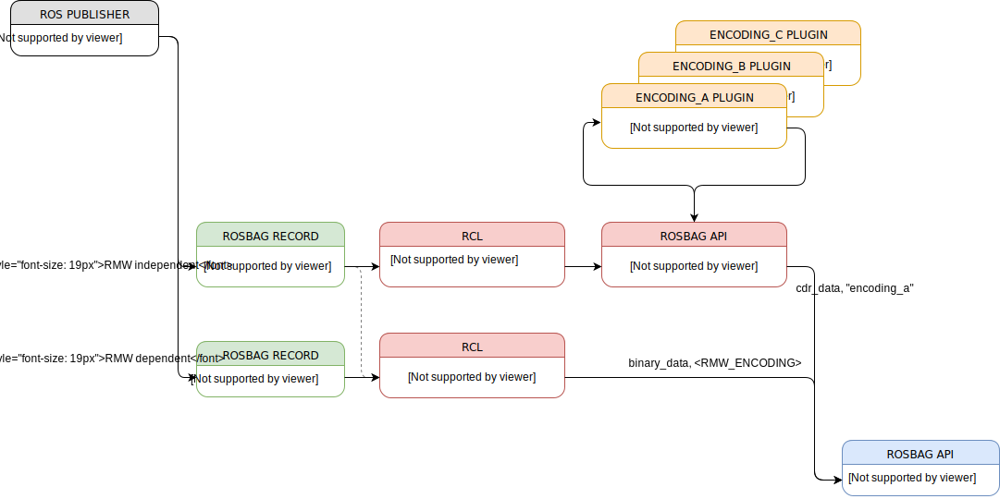

{:toc}

# {{ page.title }}

<div class="abstract" markdown="1">
{{ page.abstract }}
</div>

Original Author: {{ page.author }}


## Motivation

One of the most crucial and essential components of ROS 1 is its persistent data recording mechanism, called [rosbags](http://wiki.ros.org/rosbag).
It has been proven to be a core and essential component of ROS 1 as the capability to record and replay system data of all types has become crucial to data analysis and debugging purposes.
Given various use cases for this data logging, rosbags can contain either very simple data such as a trajectory of a robotics end effector up to highly complex data such as autonomous vehicle with multiple redundant high resolution sensors.
Their file size thus can range from only a few kilobytes with just a few messages up to multiple terabytes and millions of message instances stored.
In order to maintain high performance when logging, rosbags avoid the serialization and de-serialization of the recorded messages.

When designing ROS 2, this functionality of a high performance data recording has to be present as well.
As there are fundamental differences between ROS 1 and ROS 2, the technical challenges shall be examined within this article.

### Rosbags in ROS 1

The implementation of rosbags in ROS 1 are next to high level tools such as [rqt_bag](http://wiki.ros.org/rqt_bag), split in two fundamental packages.
The [rosbag_storage](http://wiki.ros.org/rosbag_storage) package abstracts the writing and reading of ROS messages from the ros client libraries and therefore decouples the storage from the ROS interface and implements its own storage format described in [here](http://wiki.ros.org/Bags/Format/2.0).
The current version 2.0 of this format has features such as compression and a second-level index for gathering information about the content of the bag file.

### Use cases in ROS 2

Within ROS 2, the implementation of rosbags brings in new use cases with it that shall be addressed.
The new ROS 2 API architecture introduces a [generic RMW interface](http://design.ros2.org/articles/ros_middleware_interface.html), which allows various data formats from different middlewares, such as CDR from DDS.

Even though DDS is the default middleware of ROS 2, the implementation of rosbags in ROS 2 requires to be flexible enough to record and replay other data formats than CDR, such as protobuf or ZeroMQ.

### Technical requirements for rosbags in ROS 2

#### Determinism
The playback of the bagfile has to be deterministic. That means when playing the bagfile sequentially n-times, the receiver side shall receive a deterministic sequence n-times.
This can be achieved by correctly timestamping each incoming message when recording.
The timestamps can be twofold: A first timestamp on when the actual message left the publisher and a second timestamp when the message was received and stored inside the bag file.

#### Adaptability
When thinking about having rosbag files as long term storage, it can happen that the message definition has changed from the time of recording towards the time of replay.
In order to cope with that, the replay functionality shall provide a mechanism to convert old messages into its newer definition.
This might be limited in functionality to field additions of the new message definition.
This means that all overlapping fields shall be transferred where as the newly added fields can be defaulted.
Obviously, performing this conversion step needs to deserialize the ROS 2 messages and can not be done when efficiently replaying the serialized data.

#### Scalability
Nowadays, robotic systems can comprise a large number of sensors publishing data in parallel.
This can easily lead to a significantly large amount of data over time.
The chosen format has thus be able to scale up to a huge file size (> 1 TB).

#### Random access
It must be possible to grant random read access to the file and extract specific individual messages.
Random access further means that it should be possible to extract the n-th message of one topic without having to scroll through all messages in the same chunk.

#### Range access
It further should be possible to only replay/read a section of the record, specified by a range of time.
It should be possible to access a range of messages in terms of timestamps from `tx` to `tx+n`.

#### Variable chunk sizes
The chunk sizes must be configurable to fit various large message types in order to guarantee best performance for various large message types.
It should further be possible to configure the condition on when to write such a chunk permanently to disk (e.g. in a given time interval or when chunk size is reached).

#### Backwards compatible with ROS 1
A general requirement is to be backwards compatible with existing ROS 1 bags.
This compatibility can either be via a conversion script, which permanently converts ROS 1 bags into ROS 2 bags or a bridge API which allows to manually open existing ROS 1 bags and publish them into the ROS 2 system.


## Implementation of rosbags in ROS 2

The next section describes the overall proposal for the implementation of rosbags in ROS 2.
Similar to how it is realized in ROS 1, the idea is to split the architecture into multiple independent packages.

From bottom-up, we define three layers of abstraction: rosbag storage API, rosbag API, rosbag command line interface.
The rosbag storage API is ROS 2 agnostic in a sense that it only reads and writes abstract binary messages, which are well defined given some meta information.
The second layer, the rosbag API, is responsible for fetching ROS 2 messages, serialize and sufficiently describe them for the storage API to write them.
Inversely, it receives the binary representation from the storage API and converts them into fully defined ROS 2 messages.
Finally, the command line tool gives a user friendly entry point for steering the recording and replaying of rosbags.

The following image depicts this architecture.


In the following, we are going to define these in detail and highlight their main purpose and technical requirements.

## rosbag storage API

We define data storage as the underlying package responsible of storing the incoming ROS messages in a binary format.
The data storage is responsible for persistently save ROS messages with enough meta information to restore its full context when loading.
While its main purpose will be to store ROS messages, the abstraction layer shall be ROS 2 agnostic and really only deal with binary data and generic meta information.
This allows to manually insert custom data such as [pcap](https://en.wikipedia.org/wiki/Pcap) recordings, if suitable meta information is available.

### Data encoding

We define the data encoding as the format in which ROS messages are represented in binary form.
The encoding has to be uniquely described and to be linked to the binary representation in the data storage.
That is, to be able to interpret its binary representation and thus restore the ROS message.
At this point, the content of this binary representation is not important for the storage API.
We specify though, that every topic has to have a single encoding and no messages with different encodings can be stored for one topic.

### Data storage

We introduce a separate layer of API for interfacing with the underlying data storage.
In order to write a message, an abstract representation of a message has to be given as input.
Such a representation comprises the binary blob for the actual messages and a key-value pair of meta data.
The data encoding description is part of this meta data.
While researching for "the best data storage", we came to the conclusion that there is no single best data storage which fits all needs.
We therefore want to be able to support multiple data storage solutions (e.g. SQLite or [rosbag format2](http://wiki.ros.org/Bags/Format/2.0)).
The main focus is thus to create a powerful enough API which a) supports multiple data storages and is b) able to transfer the data from one storage to another.
A typical use case for this is to have a very write efficient storage format running when recording highly performance critical data (e.g. on a car). Then, in a second step post-process the recorded data to be stored in another storage format which is better suited to introspect the data.
The API for accessing the underlying storage thus has to be generic enough to independently describe a message and being interpreted accordingly to correctly store the message for each solution.
Similarly, a query format shall be in place which allows to fetch/filter messages from the data storage into the binary blob and its meta data.

#### SQLite

We chose [SQLite](https://www.sqlite.org/about.html) as the default solution for this implementation.
Contrary to other relational database systems, it doesn't require any external SQL Server, but is self-contained.
It is also open source, [extensively tested](https://www.sqlite.org/testing.html) and known to have a large [community](https://www.sqlite.org/support.html).
The Gazebo team created a nicely composed [comparison](https://osrfoundation.atlassian.net/wiki/spaces/GAZ/pages/99844178/SQLite3+Proposal) between SQLite and the existing rosbag format.

In addition to the above mentioned reasons, we chose SQLite for the following:
- It is a very small dependency which is well tested on all major target platforms
- It is easy to use and works well with only one file (allows for easy development of initial API and storage)
- Benchmarks showed that writing speeds > 1GB/s are possible (large messages, this hit the limit of disk writing)
- Writing small messages with a high frequency yield nice results (> 100,000 messages/s)

The data mentioned is based on the evaluation study of SQLite done in this repository:
https://github.com/ros2/rosbag2/tree/master/rosbag2_storage_evaluation

##### Pros
- Table dimensions do not have to be known at startup and can be flexibly extended.
- Ability to query the tables with classical relational SQL syntax and tools.

##### Cons
- Might have a write performance drawback compared to a format which simply dumps incoming data to a file (i.e. ROS 1  rosbag).

#### Pluggable Data Storages

After looking into existing solutions, we decided to implement an extensible plugin architecture for this API layer, which enables to connect various data storage solutions and therefore gives the user a chance to optimize their data storage according to their use cases.

As explained above, we chose SQLite as default.
However, this plugin architecture becomes already a necessity when thinking about the integration or compatibility with existing ROS 1 rosbags.
As there is an immense amount of data stored in existing ROS 1 rosbags, the rosbag tool for ROS 2 has to be able to easily cope with legacy rosbags.
This can be done by having a ROS 1 data storage plugin, which can read existing ROS 1 messages from ROS 1 bags and bridge them into a ROS 2 message format, e.g. with the [static bridge](https://github.com/ros2/ros1_bridge).
Note that this plugin most likely will be implemented as read-only, meaning it is solely possible to read existing ROS 1 messages and populate them in the ROS 2 ecosystem, however the other way around will not be supported for now.
A possible plugin could however be the extension of a rosbag format 3.0, which is designed similar to the existing format 2.0, but allows for ROS 2 messages and connection information to be stored.

When being able to use multiple data storages, the user has to specify which one to use.
For this, we envision an option to the [ros2bag cli](#rosbag-cli), where the use can specify a non-default data storage.

### API

We envision the following interface to work with this storage API.
The complete API might be a C-only interface, being implemented in C++.
The background for this is to make it easy to wrap this API with other languages such as Python or Java.
(All code shown below is pseudo code and subject to changes.)

**open** is called once per process.
The idea is to do all specifics once in order to prepare the data format for reading and writing.
* `BagHandle open(string file_path, void * impl_data)`

**close** is called once per process when exiting.
* `bool close(BagHandle * handle)`

**create topic** is called once for every new topic to be recorded.
It receives the connection information, the unique identifier indicating the encoding for the respective binary data, the chunk size for the data and can take an optional pointer for implementation specific data.
The implicit contract here is that each topic has exactly one encoding.
Mixed encodings per message and topic are not supported.
* `TopicHandle create_topic(BagHandle * handle, ConnectionHeader connection_header, string encoding_id, int chunk_size, void * impl_data)`

**open topic** has to be called when reading a topic.
It returns a handle to the requested topic for reading.
* `TopicHandle open_topic(BagHandle * handle, string topic_name)`

**write** persists the data into the underlying storage format.
It receives a topic handle to identify where the binary data shall be placed, the time stamp when the message was received and an optional pointer for implementation specific data.
* `void write(BagHandle * handle, TopicHandle * topic, struct time_received, SerializedData * serialized_data, void * impl_data)`

**read** loads data from the underlying storage format.
We envision multiple ways of accessing the data.
The first is in the style of an iterator, which allows to iterate over all messages sequentially.
Optionally, a topic filter can be specified.
* `SerializedData read_next(IteratorHandle * iter, TopicHandle * topic, void * impl_data)`

The second way of accessing the data can be done by indexing specific parts of the data.
The query parameter can be used to either specify messages of a specific topic or by a time range.
Additionally, the order in which these messages are returned can be specified by a parameter.
// TODO(karsten1987): Should we allow queries only for a single topic or multiple topics?
* `SerializedData[] read(struct query, enum order_by, void * impl_data)`

**info** returns general information and statistics about the stored data.
Possible data here can be the list of topics, the overall duration of the data, etc, and is used to then further specify the `read` command.
* `BagInfo info(BagHandle * handle)`

**index** creates the index of the bag.
This function shall be called after a recording is finished.
The purpose of this file is to create an index over the recorded data and serves as the general info about the bag.
These meta information shall be stored next to the actual data in a separate file (yaml or similar).
* `void index(BagHandle * handle)`

We assume a similar definition of the following data types:

The connection header is derived from the [ROS 1 connection header](http://docs.ros.org/diamondback/api/rosbag/html/c++/structrosbag_1_1ConnectionInfo.html) and extended by ROS 2 quality of service parameters.
```
struct ConnectionHeader
{
  string topic_name,
  string topic_type,
  string message_definition,
  string message_md5_sum,
  struct quality_of_service_params
}
```
The actual payload is structured as:
```
struct SerializedData
{
  byte[] payload,
  int size,
}
```
The BagInfo is similar to [ROS 1 bag info](http://wiki.ros.org/rosbag/Commandline#rosbag_info).
Most of the fields are set as mandatory, with the addition of a generic key-value pair which can be specified depending on implementation details.
We envision the BagInfo struct to be as follows:
```
struct BagInfo
{
  string path,
  int file_size,
  time duration,
  time start,
  time end,
  int message_count,
  int topic_count,
  string[] topics,
  string[] types,
  map[string, string] key_value_data
}
```
We require only one encoding per topic.
The TopicHandle can thus encapsulate the encoding information as well.
```
struct TopicHandle
{
  string topic_name,
  string topic_type,
  string encoding_identifier
}
```

## rosbag API

The rosbag API describes the necessary interface to record and replay as well as read and write ros messages.
It is responsible for storing incoming messages with the correct data format in the data storage.
Similarly, the API must be restoring the ros message with its given data format from its binary representation in the data storage.

The rosbag API has a strong dependency on the rosidl typesupport packages of ROS 2, generically described [here](http://design.ros2.org/articles/interface_definition.html).
The main purpose of this package is to issue queries towards the storage API, receive binary data and the respective meta information and convert the message to its appropriate ROS 2 message type.

ROS 2 is by design independent from its underlying middleware.
That means, the incoming binary data can be encoded differently depending on the middleware.
In the case of DDS (which is the ROS 2 default), the encoding is [CDR](https://en.wikipedia.org/wiki/Common_Data_Representation).
Yet, every other middleware could use protocol buffers or similar to exchange data.
Since ROS 2 is independent from its middleware, the stored data within a ROS 2 rosbag shall be independent and interchangeable as well.
To achieve this, we utilize a plugin system which allows to convert ROS 2 messages to a specific encoding.
This rosbag API shall thus provide a generic function which can (de-)serialize any ROS 2 message form/to an available encoding.
By default, we provide such a plugin for CDR.
With that, every middleware can use this function to deserialize CDR to ROS 2 and then further serialize to its own encoding, if necessary.
We see this - introducing a pluggable serialization format - as the only way to provide generic rosbags. We also clearly see that this introduces a significant overhead.
We therefore make this generalization optional to ensure best writing/reading performance when using the same middleware for recording and replaying.
When no encoding is enforced, the middleware specific binary data will be stored as received without any further processing.
Without this common serialization, no bags can easily be exchanged between multiple middlewares, however the same functionality can be used to convert bags offline.
In that case, a non-generic bag can be processed offline and serialized to any encoding without hitting any performance constraints.



The picture above illustrates the use of the recording. If an option, e.g. `--encoding`, is given to `ros2 bag record` then each incoming ROS 2 message is getting serialized to the specified encoding format before it is stored in the bag.
In contrast, when nothing is specified, the rosbag API directly receives the incoming messages in a binary format and can thus forward it to the storage API without any further serialization.
Obviously, when the specified encoding happens to be the same as the underlying middleware, no further conversion is done and the incoming messages are stored directly.

The flow for reading a bag file is basically the same as above.
When reading, a plugin has to be available for each encoding stored in the bag.
If no plugin exists for the encoding of a topic, this topic will be ignored and not replayed or can only be accessed in binary form.

We try to separate the actual read and write API from the transport layer in order to keep the dependencies as small as possible.
In a first set of APIs, we see functions to read and write ROS 2 messages and convert them to a specified encoding.
Second, in another layer, we bring in the transport of the ROS 2 messages for publishing and subscribing.

### API 1 (Read and Write of ROS 2 messages)

We envision the following API:

**open** a bag file.
Similar to the storage API, the rosbag API has an entry point to open a bag file.
* `BagHandle * open(string file_path)`

**close** close an already opened bag file.
* `close(BagHandle *)`

**info** returns a set of meta data for a bag file.
* `BagInfo info(BagHandle *)`

**create topic** prepares a new topic for appending messages.
This call is similar to the storage API.
* `TopicHandle create_topic(BagHandle * handle, ConnectionHeader connection_header, string encoding_id, int chunk_size)`

**open topic** opens an existing topic in the storage API.
* `TopicHandle open_topic(BagHandle * handle, string topic_name)`

**read** allows to read a set of ROS 2 messages.
There shall be an option to obtain a fixed set of ROS 2 messages.
* `ROS 2[] read(struct query, enum order_by)`

Similarly, there shall be an iterator pattern to obtain a sequence of ROS 2 messages.
* `ROS 2 read_next(IteratorHandle * iter, TopicHandle * topic, void * impl_data)`

Another option is an asynchronous method which accepts a callback to be triggered when the data is successfully loaded from the storage.
* `void read_async(struct query, enum order_by, void (cb *)(ROS 2[] data))`

We can further directly expose the binary data stored:
* `SerializedData[] read_serialized(struct query, enum order_by)`
* `SerializedData read_next(IteratorHandle * iter, TopicHandle * topic, void * impl_data)`
* `void read_async(struct query, enum order_by, void (cb *)(SerializedData[] data))`

**write** allows to write new ROS 2 messages into a bag.
Analog to the set of read functions, there shall be write functions.
* `void write(BagHandle * handle, TopicHandle * topic, struct time_received, ROS 2 msg)`
* `void write_serialized(BagHandle * handle, TopicHandle * topic, struct time_received, SerializedData serialized_msg)`

### API 2 (Record and Replay)

The read and write functions mentioned above are designed to manually read and write bag files with custom messages or specific use cases where a common recording/replaying of the current system is not sufficient.
For the latter, there are a set of functions, which allow to record and replay a running system.
These functions are subscribing to a set of topics, record incoming messages and write these to the storage API.
The inverse happens for a replay, where given a query, the resulting topics are getting published.
* `void record(BagHandle * handle, string[] topics)`
* `void record_all(BagHandle * handle)`
* `void replay(BagHandle * handle, string[] topics)`
* `void replay_all(BagHandle * handle)`

### Conversions

The API above is designed to enable conversion functions from one encoding to another.
The imagined workflow is to read ROS 2 messages from `rosbag_a` and write them into `rosbag_b` with either different encodings or storage formats.
The rosbag API shall be able to load ROS 2 messages stored with `encoding_a` in storage format `format_a`.
The extracted ROS 2 messages can then be written in a second rosbag with `encoding_b` and underlying storage format `format_b`.
All available encodings are provided in the form of a plugin.
The idea is that rosbag can foster multiple plugins, which convert ROS 2 messages to a specific encoding.

### Limitations

As of the time of writing, ROS 2 is unable to subscribe to locally unknown message types.
Therefore that means, all messages which are to be recorded have to be locally known to rosbag at recording time.
Similarly, messages can not be replayed when the message libraries are not on the system.

Currently, ROS 2 requires a strongly typed support handle for some of the DDS implementations such as Connext (Static).
There is work to be done in order to arbitrarily send messages specifying any type and its respective bytestream.
It also impacts any modifications to messages, which becomes important when there is any inconsistency in their message definition between the sending and recording party.

## rosbag CLI

The rosbag CLI shall be integrated as part of a new verb for the existing [ros2cli](https://github.com/ros2/ros2cli) and sets the entry point for a simple recording and replaying of bag files.
As in [ROS 1](http://wiki.ros.org/rosbag/Commandline), this command line interface serves to easily control the recording and replaying as well as introspecting of bag files.
For the time of writing, we specify three major command line verbs for this interface:

**record:**
The record verb shall take a set of topics to be recorded or if specified all topics.
* `ros2 bag record -a`
* `ros2 bag record <topicA> <topicB> … <topicN>`

**play:**
The play verb shall replay an existing bag file.
* `ros2 bag play <bag_file>`  TODO(karsten1987): how to detect the version of the bag file? <ROSBag V2 vs rosbag2>

**info:**
The info verb shall print all necessary infos about a bag file on the terminal.
* `ros2 bag info <bag_file>`

This CLI package only serves as a simple interface without any major API.
Most of the logic happens in the rosbag API.
As the rosbag API is a C-only interface, this can easily be called and wrapped by this command line interface.
The rational behind this is that the rosbag API shall be fully functional without any command line interface dependency.

### Advanced command line options

The functions above describe a regular way of using rosbags with ROS 2. The default ROS 2 middleware will be applied as well as the default data storage (i.e. SQLite) will be used.
In case, a non-default RMW implementation shall be used, this can be set with the [ROS 2 environment variable](https://github.com/ros2/ros2/wiki/Working-with-multiple-RMW-implementations#specifying-rmw-implementations):
```
RMW_IMPLEMENTATION=rmw_<middleware> ros2 bag record
```

As described above, this way of recording data will store the data in the RMW specific binary format.
This equally means that no other middleware might be able to replay this data.
In order to write a generic rosbag, we introduce a new option to the record verb, called `encoding`.
With this, all incoming data will be converted to this encoding.
```
RMW_IMPLEMENTATION=rmw_<middleware> ros2 bag record --encoding <encoding_identifier>
```

In the case that a non-default storage format shall be used, we expose a new option to chose which storage format to use:
```
ros2 bag record --storage-format=<format_identifier>
```
As for the time of writing, we provide two format identifiers: `sqlite3` and `rosbag_v2`.  TODO(karsten1987): Agree on identifier name

When reading a bag file, we can also specify which format to use in case the bag was not recorded with the ROS 2 CLI and thus does not have a meta information file.
```
ros2 bag play --storage-format=<format_identifier>
```

**convert:**
There shall be a fourth verb to convert messages from one bag to another.
This is not going to implemented in the first run, but we could see an API such as:
* `ros2 bag convert <bag_file_a> <bag_file_b> --encoding <encoding_b> --format <format_b>`

## Alternatives

### Relaxed or dismissed requirements
We need a data storage format which allows to sufficiently store and replay transmitted data with the least possible cost overhead.
There are a few requirements for writing and reading to such a data storage format:

#### Parallel I/O
Processing time increases with slow file I/O.
In order to provide efficient data processing, a parallel read and write to the file from multiple processes should be available.
This would allow multiple processes (e.g. one per sensor) directly write to a commonly shared bag file without having a single recoding instance subscribing to all topics.

We relaxed this requirements as it is highly dependent on the underlying data storage whether it supports parallel access.

#### Compression
When the file size becomes larger or disk space is only limited, it should be possible to compress the bag file.
Compression can either be happening during write time or in a post-processing step.

As we have chosen SQLite as our default implementation, we had to relax this requirements, because SQLite does not support it (out of the box).
However, there are [proprietary extensions](http://www.hwaci.com/sw/sqlite/prosupport.html) for it.

### Dismissed data storage formats

In the following, we are iterating over a couple of data formats, which may be suitable for the underlying ROSbag implementation.
We hereby iterate over existing third party software as well as examining of maintaining a self-made format.

#### HDF5

One very popular framework for storing scientific data is [HDF5](https://support.hdfgroup.org/HDF5/).
It basically has all the necessary requirements listed above such as random access, parallelism and compression.
It is further designed for highly complex data with an extensive amount of data.
HDF5 is open source and its source can be freely obtained from [bitbucket](https://bitbucket.hdfgroup.org/projects/HDFFV/repos/hdf5/browse) and is under a [permissive license](https://bitbucket.hdfgroup.org/projects/HDFFV/repos/hdf5/browse/COPYING) of the HDF group.
Multiple language wrapper or bindings are available, namely C/C++, python, fortran or java.

##### Pros
- Open Source and standard specification for file format
- Fulfills the requirements given
- Multi language support
- Large community of users

##### Cons
- Depending on a slowly developing standard
- The table dimensions of each chunk have to be of fixed size, known at startup.

There is a popular [blog post](http://cyrille.rossant.net/moving-away-hdf5/) by Cyrille Rossant, which gives a short introduction, but also discusses some controversy with HDF5.


#### Existing ROS1 format

Alternatively, the existing ROS1 format can be continued to be used. The format description can be found [here](http://wiki.ros.org/Bags/Format/2.0).

##### Pros
- Already ROS specific and evaluated for ROS messages, existing code could be reused

##### Cons
- No random access
