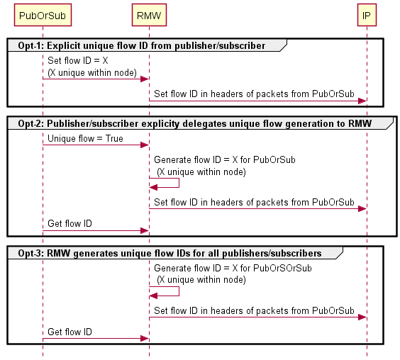

{:toc}

# {{ page.title }}

<div class="abstract" markdown="1">
{{ page.abstract }}
</div>

Original Author: {{ page.author }}

# Unique Network Flow Identifiers

For performance, ROS2 applications require careful selection of QoS for publishers and subscribers. Although networks offer various QoS options, ROS2 publishers and subscribers are unable to use them due to non-unique flow identifiers. As a result, ROS2 publishers and subscribers can only hope to obtain undifferentiated QoS from networks. This ultimately degrades the performance potential of ROS2 applications and wastes networking infrastructure investments.

We propose unique network flow identifiers for ROS2 publishers and subscribers. Our proposal is easy to use, convenient to implement, and minimal. Plus, it respects network-agnostic and non-DDS-middleware-friendly concerns in ROS2.

In this document, we first describe essential background concepts. After that we precisely state the problem and propose a solution to the problem. Existing solutions are compared in the end.

## Background

IP networking [1] is the pre-dominant inter-networking technology used today. Ethernet, WiFi, 4G/5G telecommunication all rely on IP networking.

Streams of IP packets from a given source to destination are called *packet flows* or simply *flows*. Applications can uniquely identify certain flows and explicitly specify what QoS is required from the network for those flows.

### Flow Identifers

The *5-tuple* is a traditional unique identifier for flows. The 5-tuple consists of five parameters: source IP address, source  port, destination IP address, destination port, and the transport protocol (example, TCP/UDP).

IPv6 specifies a *3-tuple* for uniquely identifying flows. The IPv6 3-tuple consists of the source IP address, destination IP address, and the Flow Label. The Flow Label [2] is a 20-bit field in the IPv6 header. It is typically set by the source of the flow. The default Flow Label is zero.

If the 5-tuple is not sufficient, then custom 6-tuples can be created by combining the 5-tuple with the IP Options field or the IP Differentiated Services Code Point sub-field. Such custom 6-tuples are typically used as workarounds for technical difficulties.

### Explicit QoS Specification

We briefly discuss two relevant explicit QoS specification methods for applications -- Differentiated Services and 5G network 5QI.

- Differentiated Services (DS) [3] is a widely-used QoS architecture for IP networks. The required DS-based QoS is set by the application in the 6-bit DS Code Point (DSCP) sub-field of the 8-bit DS field in the IP packet header. For example, DSCP set to 0x2E specifies expedited forwarding as the required QoS. Expedited forwarding is typically used for real-time data such as voice and video.

   ROS2 lacks an API to specify DS-based QoS for publishers and subscribers. The DSCP value in their flows is therefore set to 0x00. This specifies default forwarding as the required QoS from the network. However, DDS provides the Transport Priority QoS policy to specify DS-based QoS.

   A frustrating problem with DS-based QoS is that intermediate routers can reset or alter the DSCP value within flows. One workaround is to carefully configure intermediate routers such that they retain DSCP markings from incoming to outgoing flows.

- 5G network 5QI: The Network Exposure Function (NEF) [4] in the 5G core network provides robust and secure API for QoS specification. This API enables applications to programmatically (HTTP-JSON) specify required QoS by associating 5G QoS Identifiers (5QIs) to flow identifers, as shown in the figure next. 
  
  
  
  Twenty-six standard 5QIs are identified in the latest release-16 by 3GPP [4:Table 5.7.4-1]. We exemplify a few of them in the table below. The variation in service characteristics of the example 5QIs emphasizes the importance of careful 5QI selection.

  The 5G network also has the ability to sensibly infer 5QI QoS from DS-based QoS markings in flows.


| 5QI         | Resource                                   | Priority | Packet Delay Budget (ms) | Packet Error Rate | Example Services                                                                                                        |
| ----------- | ------------------------------------------ | -------- | ------------------------ | ----------------- | ------------------------------------------------------------------------------------------------------------------------|
| 3           | Guaranteed bitrate (GBR)                   | 30       | 50                       | 10^-3             | Real Time Gaming; V2X messages; Electricity distribution – medium voltage; Process automation monitoring                |
| 4           | GBR                                        | 50       | 300                      | 10^-6             | Non-Conversational Video (Buffered Streaming)                                                                           |
| 7           | Non GBR (NGBR)                             | 70       | 100                      | 10^-3             | Voice Video (Live Streaming); Interactive Gaming                                                                        |
| 9 (default) | NGBR                                       | 90       | 300                      | 10^-6             | Video (Buffered Streaming); TCP-based traffic (e.g., www, e-mail, chat, ftp, p2p file sharing, progressive video, etc.) |
| 82          | Delay critical guaranteed bitrate (DC GBR) | 19       | 10                       | 10^-4             | Discrete Automation                                                                                                     |
| 85          | DC GBR                                     | 21       | 5                        | 10^-5             | Electricity distribution - high voltage; V2X messages (Remote Driving)                                                  |

## Problem

All publishers and subscribers in communicating nodes have the same flow identifers (5-tuple or 3-tuple). This disables explicit network QoS differentiation for publishers and subscribers in communicating nodes. In other words, publishers and subscribers in communicating nodes can only be assigned the same network QoS.

We believe the problem occurs by design. For performance reasons, RMW implementations are likely to associate IP address, port, and transport protocol to nodes and not to individual publishers/subscribers. This is true for all the tier-1 RMW implementations today (Foxy Fitzroy at the time of writing). None of the tier-1 RMW implementations set the IPv6 flow label to differentiate flows of publisher/subscribers.

### Example

We use the following example to highlight the problem.

Consider a distributed robotics application with communicating nodes N1 and N2. N1 is active on device D1 and N2 on device D2. D1 and D2 are connected by an IP network, say a 5G network.

N1 contains publishers P1 and P2. P1 publishes video data whereas P2 publishes battery status data.

N2 contains subscribers S1 and S2. S1 receives video from P1 and performs real-time object detection. S2 receives battery data from P2 and performs non-real-time battery management.

The link P1-S1 requires low-latency QoS from the 5G network, say a maximum delay of 5ms. P2-S2 requires default latency QoS i.e., 300ms. Then, by construction, since the flow identifiers of P1-S1 and P2-S2 links are the same, they cannot be assigned the required QoS by the network. Both P1-S1 and P2-S2 can either be assigned QoS with 5ms delay or with 300ms delay. The former case represents a waste of network resources, the latter case degrades performance.

## Proposed Solution

Our proposal to solve the problem is to make the flow identifiers of publishers and subscribers in communicating nodes unique using existing IP header fields.

We believe there are at least three architectural options to implement unique network flows. These are shown in the figure below.



### Option 1: Unique flow ID from publisher/subscriber

We construct a publisher and subscriber creation-time option called `unique_network_flow` as a candidate structure to enable unique identification of flows.

In one variant, `unique_network_flow` is a 32-bit unsigned integer whose default value is zero.

Each publisher or subscriber that requires a specific QoS from the network is required to set `unique_network_flow`  to a value unique within the node. This unique value can be computed internally in the node using simple UID generation schemes (atomic integer counters or random integer sampling without duplicates) or supplied by an external component.

The example C++ snippet below shows a node creating three subscriptions. Subscriptions `sub_1_` and `sub_2_` are created using subscription options with node-unique `unique_network_flow` values. Subscription `sub_3_` is created with default subscription options (`unique_network_flow` = 0).

```cpp
// Enable unique network flow via subscription options
auto options_1 = rclcpp::SubscriptionOptions();
options_1.unique_network_flow = 0xf4688c52;

sub_1_ = this->create_subscription<std_msgs::msg::String>(
  "topic_1", 10, std::bind(
    &MyNode::topic_1_callback, this,
    _1), options_1);

// Enable unique network flow via subscription options
auto options_2 = rclcpp::SubscriptionOptions();
options_2.unique_network_flow = 0x88181c45;

sub_2_ = this->create_subscription<std_msgs::msg::String>(
  "topic_2", 10, std::bind(
    &MyNode::topic_2_callback, this,
    _1), options_2);

// Unique network flows are disabled by default
auto options_3 = rclcpp::SubscriptionOptions();
sub_3_ = this->create_subscription<std_msgs::msg::String>(
  "topic_3", 10, std::bind(
    &MyNode::topic_3_callback, this,
    _1), options_3);
```

The RMW implementation has several alternatives to convert the `unique_network_flow` argument to a unique flow identifier visible in packet headers. We list few candidate alternatives next.

If the node is communicating using IPv6, then the lower 20-bits of `unique_network_flow` can be transferred to the Flow Label field. This creates a unique 3-tuple.

Else, if the node is communicating via IPv4, then there are two alternatives. One is to copy the `unique_network_flow` argument to the Options field. Another is to copy the lower 6-bits of the `unique_network_flow` argument to the DSCP field. Both alternatives enable the network to infer a custom 6-tuple (traditional 5-tuple plus Options/DSCP) that uniquely identifies flows.

Yet another alternative is to use the `unique_network_flow` argument as a key that maps to unique identifiers maintained by the RMW implementation. These mapped unique identifiers are written to appropriate locations in packet headers, including transport protocol port fields.

Both DDS and non-DDS RMW implementations can trivially set fields in IP or transport protocol headers using native socket API on all ROS2 platforms (Linux, Windows, MacOS).


### Option 2: Publisher/subscriber delegates unique flow ID generation to RMW

This is a programmer-friendly alternative that modifies the `unique_network_flow` option to a boolean parameter. Setting it to `true` instructs the RMW implementation to generate a unique flow identifier for the associated publisher/subscriber. By default, `unique_network_flow` is set to `false`.

For those publishers/subscribers with `unique_network_flow` set to `true`, the RMW implementation generates an unique flow identifier internally first before writing it to an appropriate field in packet headers, similar to Option-1.

Generating the unique flow identifier internally is a matter of implementing a simple hashing functions parameterized by existing unique identifiers for publishers/subscribers within a node (for example, the RTPS entity ID).

A suitable interface should be created for publishers/subscribers to obtain unique flow IDs created by the RMW. We prefer to use community help to create this interface.

### Option 3: RMW generates unique flow IDs for all publishers/subscribers

This is the most programmer-friendly option. The RMW indiscriminately generates unique flow IDs for all publishers/subscribers. Everything else is similar to Option-2.

### Advantages

Our proposal has the following advantages:

- Easy to use: Application developers are only required to decide if unique flow identifiers for publishers/subscribers are necessary. If yes, they can easily generate the unique identifiers themselves, or obtain it from external components, or delegate unique identifier generation to the RMW implementation, or choose an RMW implementation that indiscriminately generates unique flow IDs for publishers/subscribers.
- Light-weight implementation: Both non-DDS and DDS RMW can implement the required support conveniently using native socket API with negligible impact on performance.
- Network-agnostic: No particular network is preferred, respecting ROS2 design preferences.
- Minimum change: Introducing the *choice* of unique flow identifiers into the application layer is the minimum framework change required to obtain bespoke QoS from QoS-centric machine-machine network technologies such as 5G.

### Limitations

If the RMW implementation decides to create a custom 6-tuple using the IPv4 DSCP field, the flows of only up to 64 (2^6) publishers and subscribers within a node can be uniquely identified. In addition, network administration processes should be notified that the DSCP field is re-purposed as an identifier to prevent misinterpretation.

## Alternative Solutions

We list a few alternative solutions to the problem that are limited and dissatisfactory.

1. Dedicated nodes: Publishers and subscribers that require special network QoS can be isolated to dedicated nodes. Such isolation indeed makes their 5-tuple flow identifier unique. However, this breaks the functionality-based node architecture of the application and degrades performance since nodes are heavy-weight structures. In the worst case, a dedicated node per publisher or subscriber is required.

2. Custom 6-tuple using side-loaded DDS Transport Priority QoS policies: Conceptually, the custom 6-tuple can be constructed by side-loading `unique_network_flow` values into the Transport Priority QoS policy of the DDS RMW implementation. In practice, however, this is difficult to implement for several reasons. First, it expects  DDS RMW side-loading competence from application programmers which is inconvenient. Second, re-purposing DSCP values as identifiers is limited to 64 identifiers and requires careful network administration as mentioned before. Third, side-loading support varies across DDS RMW implementations. To the best of our knowledge, none of the tier-1 DDS implementations for ROS2 today (Foxy) support side-loading Transport Priority QoS policies for *select few* publishers and subscribers in a node due to lack of fine-grained interfaces. A glaring limitation is that this alternative ignores non-DDS RMW.

3. DS-based QoS using side-loaded DDS Transport Priority QoS policies: This gets ahead of the problem by directly specifying the required DS-based QoS through side-loaded Transport Priority QoS policies. However, this suffers from similar impracticalities as the previous alternative. It ignores non-DDS RMW, expects DS competence from programmers, and is not supported by tier-1 RMW implementations.

## References

[1] [Internet Protocol (IETF RFC-791)](https://tools.ietf.org/html/rfc791)

[2] [IPv6 Flow Label Specification (IETF RFC-6437)](https://tools.ietf.org/html/rfc6437)

[3] [Differentiated Services (IETF RFC-2474)](https://tools.ietf.org/html/rfc2474)

[4] [5G System Architecture Specification (3GPP TS 23.501)](https://portal.3gpp.org/desktopmodules/Specifications/SpecificationDetails.aspx?specificationId=3144)

