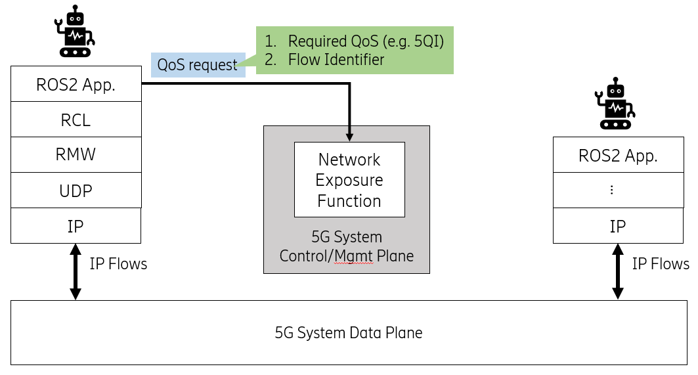

{:toc}

# {{ page.title }}

<div class="abstract" markdown="1">
{{ page.abstract }}
</div>

Original Author: {{ page.author }}

# Unique Network Flows

For performance, ROS2 applications require careful selection of QoS for publishers and subscriptions. Although networks offer various QoS options, ROS2 publishers and subscriptions are unable to use them due to non-unique flows. As a result, ROS2 publishers and subscriptions can only hope to obtain undifferentiated QoS from networks. This ultimately degrades the performance potential of ROS2 applications and wastes networking infrastructure investments.

We propose unique network flows for ROS2 publishers and subscriptions. Our proposal is easy to use, convenient to implement, and minimal. Plus, it respects non-DDS-middleware-friendly concerns in ROS2.

In this document, we first describe essential background concepts. After that we precisely state the problem and propose a solution to the problem. Existing solutions are compared in the end.

## Background

IP networking [1] is the pre-dominant inter-networking technology used today. Ethernet, WiFi, 4G/5G telecommunication all rely on IP networking.

Streams of IP packets from a given source to destination are called *packet flows* or simply *flows*. Applications can uniquely identify certain flows and explicitly specify what QoS is required from the network for those flows.

### Flow Identifers

The *5-tuple* is a traditional unique identifier for flows. The 5-tuple consists of five parameters: source IP address, source  port, destination IP address, destination port, and the transport protocol (example, TCP/UDP).

IPv6 specifies a *3-tuple* for uniquely identifying flows. The IPv6 3-tuple consists of the source IP address, destination IP address, and the Flow Label. The Flow Label [2] is a 20-bit field in the IPv6 header. It is typically set by the source of the flow. The default Flow Label is zero.

If the 5-tuple is not sufficient, then custom 6-tuples can be created by combining the 5-tuple with the IP Options field or the IP Differentiated Services Code Point sub-field. Such custom 6-tuples are typically used as workarounds for technical difficulties.

### Explicit QoS Specification

We briefly discuss two relevant explicit QoS specification methods for applications -- Differentiated Services and 5G network 5QI.

- Differentiated Services (DS) [3] is a widely-used QoS architecture for IP networks. The required DS-based QoS is set by the application in the 6-bit DS Code Point (DSCP) sub-field of the 8-bit DS field in the IP packet header. For example, DSCP set to 0x2E specifies expedited forwarding as the required QoS. Expedited forwarding is typically used for real-time data such as voice and video.

   ROS2 lacks an API to specify DS-based QoS for publishers and subscriptions. The DSCP value in their flows is therefore set to 0x00. This specifies default forwarding as the required QoS from the network. However, DDS provides the Transport Priority QoS policy to specify DS-based QoS.

   A frustrating problem with DS-based QoS is that intermediate routers can reset or alter the DSCP value within flows. One workaround is to carefully configure intermediate routers such that they retain DSCP markings from incoming to outgoing flows.

- 5G network 5QI: The Network Exposure Function (NEF) [4] in the 5G core network provides robust and secure API for QoS specification. This API enables applications to programmatically (HTTP-JSON) specify required QoS by associating 5G QoS Identifiers (5QIs) to flow identifers, as shown in the figure next. 
  
  
  
  Twenty-six standard 5QIs are identified in the latest release-16 by 3GPP [4:Table 5.7.4-1]. We exemplify a few of them in the table below. The variation in service characteristics of the example 5QIs emphasizes the importance of careful 5QI selection.

  The 5G network also has the ability to sensibly infer 5QI QoS from DS-based QoS markings in flows.


| 5QI         | Resource                                   | Priority | Packet Delay Budget (ms) | Packet Error Rate | Example Services                                                                                                        |
| ----------- | ------------------------------------------ | -------- | ------------------------ | ----------------- | ------------------------------------------------------------------------------------------------------------------------|
| 3           | Guaranteed bitrate (GBR)                   | 30       | 50                       | 10^-3             | Real Time Gaming; V2X messages; Electricity distribution – medium voltage; Process automation monitoring                |
| 4           | GBR                                        | 50       | 300                      | 10^-6             | Non-Conversational Video (Buffered Streaming)                                                                           |
| 7           | Non GBR (NGBR)                             | 70       | 100                      | 10^-3             | Voice Video (Live Streaming); Interactive Gaming                                                                        |
| 9 (default) | NGBR                                       | 90       | 300                      | 10^-6             | Video (Buffered Streaming); TCP-based traffic (e.g., www, e-mail, chat, ftp, p2p file sharing, progressive video, etc.) |
| 82          | Delay critical guaranteed bitrate (DC GBR) | 19       | 10                       | 10^-4             | Discrete Automation                                                                                                     |
| 85          | DC GBR                                     | 21       | 5                        | 10^-5             | Electricity distribution - high voltage; V2X messages (Remote Driving)                                                  |

## Problem

All publishers and subscriptions in communicating nodes have the same flow identifers (5-tuple or 3-tuple). This disables explicit network QoS differentiation for publishers and subscriptions in communicating nodes. In other words, publishers and subscriptions in communicating nodes can only be assigned the same network QoS.

We believe the problem occurs by design. For performance reasons, RMW implementations are likely to associate IP address, port, and transport protocol to nodes and not to individual publishers/subscriptions. This is true for all the tier-1 RMW implementations today (Foxy Fitzroy at the time of writing). None of the tier-1 RMW implementations set the IPv6 flow label to differentiate flows of publisher/subscriptions.

### Example

We use the following example to highlight the problem.

Consider a distributed robotics application with communicating nodes N1 and N2. N1 is active on device D1 and N2 on device D2. D1 and D2 are connected by an IP network, say a 5G network.

N1 contains publishers P1 and P2. P1 publishes video data whereas P2 publishes battery status data.

N2 contains subscriptions S1 and S2. S1 receives video from P1 and performs real-time object detection. S2 receives battery data from P2 and performs non-real-time battery management.

The link P1-S1 requires low-latency QoS from the 5G network, say a maximum delay of 5ms. P2-S2 requires default latency QoS i.e., 300ms. Then, by construction, since the flow identifiers of P1-S1 and P2-S2 links are the same, they cannot be assigned the required QoS by the network. Both P1-S1 and P2-S2 can either be assigned QoS with 5ms delay or with 300ms delay. The former case represents a waste of network resources, the latter case degrades performance.

## Proposed Solution

Our proposal to solve the problem is to make the flows of publishers and subscriptions in communicating nodes unique.

### Definitions

- *Network flow*: A tuple of networking resources selected by a RMW implementation for transmission of messages from a publisher to a subscription. The networking resources considered are:
  - transport protocol UDP or TCP (publisher and subscription)
  - transport port (publisher and subscription)
  - internet protocol IPv4 or IPv6 (publisher and subscription)
  - internet address (publisher and subscription)
  - DSCP (publisher only)
  - Flow label (publisher only)

  Network flows are defined for UDP/TCP and IP-based RMW implementations only. It is not a limiting definition since these are the majority protocols used today. The definition can be later extended to include relevant non-IP networks such as deterministic ethernet.

- *Network Flow Endpoint (NFE)*: The portion of a network flow specific to the publisher or the subscription. In other words, each network flow has two NFEs; one for the publisher and the other for the subscription.

- *Dissimilar NFE pair*: Two NFEs are dissimilar if one or more of their networking resources are different.

- *Unique NFE*: A NFE is unique if it is dissimilar to all other NFEs.

- *Strongly and weakly unique network flow*: A network flow is strongly unique if both publisher and subscription NFEs are unique. A weakly unique network flow either has a publisher NFE or a subscriber NFE that is unique.

### Unique Network Flow Endpoints

We construct a publisher/subscription creation-time option called `require_unique_network_flow_endpoints` as a candidate structure to enable unique identification of network flows. This option takes a value from the enumeration shown below.

```cpp
enum unique_network_flow_endpoints_requirement_t
{
  UNIQUE_NETWORK_FLOW_ENDPOINTS_NOT_REQUIRED = 0,
  UNIQUE_NETWORK_FLOW_ENDPOINTS_STRICTLY_REQUIRED,
  UNIQUE_NETWORK_FLOW_ENDPOINTS_OPTIONALLY_REQUIRED,
  UNIQUE_NETWORK_FLOW_ENDPOINTS_SYSTEM_DEFAULT
}
```

Upon receiving the publisher/subscription creation request, the RMW implementation assigns unique NFEs according to the `require_unique_network_flow_endpoints` option value.  

The default value of the option is `UNIQUE_NETWORK_FLOW_ENDPOINTS_NOT_REQUIRED` which indicates to the RMW implementation that unique NFEs are not required.

The value `UNIQUE_NETWORK_FLOW_ENDPOINTS_STRICTLY_REQUIRED` indicates to the RMW implementation that unique NFEs are strictly required. If not feasible, the RMW implementation must flag an error and not create the associated publisher/subscription.

The value `UNIQUE_NETWORK_FLOW_ENDPOINTS_OPTIONALLY_REQUIRED` enables the RMW implementation to create unique NFEs if feasible. If not feasible, it can continue to create the associated publisher/subscription and not flag an error.

The value `UNIQUE_NETWORK_FLOW_ENDPOINTS_SYSTEM_DEFAULT` delegates the decision to create unique NFEs fully to the RMW implementation. The RMW implementation can decide internally on its own or be coerced through side-loading mechanisms to create unique NFEs for the associated publisher/subscription.

The example C++ snippet below shows a node creating two subscriptions and a publisher. Subscription `sub_x_` strictly requires unique NFEs whereas `sub_y_` is indifferent. Publisher `pub_z_`  optionally requires a unique NFE.

```cpp
// Unique network flow endpoints strictly required
auto options_x = rclcpp::SubscriptionOptions();
options_x.require_unique_network_flow_endpoints = UNIQUE_NETWORK_FLOW_ENDPOINTS_STRICTLY_REQUIRED;

sub_x_ = this->create_subscription<std_msgs::msg::String>(
  "topic_x", 10, std::bind(
    &MyNode::topic_x_callback, this,
    _1), options_x);

// Unique network flow endpoints not required, relying on default
auto options_2 = rclcpp::SubscriptionOptions();

sub_y_ = this->create_subscription<std_msgs::msg::String>(
  "topic_y", 10, std::bind(
    &MyNode::topic_y_callback, this,
    _1), options_y);

// Unique network flow endpoints optionally required
auto options_z = rclcpp::PublisherOptions();
options_z.require_unique_network_flow_endpoints = RMW_UNIQUE_NETWORK_FLOW_ENDPOINTS_OPTIONALLY_REQUIRED;

pub_z_ = this->create_publisher<std_msgs::msg::String>("topic_z", 10, options_z);
```

A weakly unique network flow is created by making either the publisher or the subscription NFE unique. This is sufficient to enable network QoS differentiation for the common case where nodes have a single publisher/subscription per topic. RMW implementations can therefore decide to support either the publisher or subscription option to enable unique NFEs.

A strongly unique network flow is created by making both publisher and subscription NFEs unique. This enables network QoS differentiation in the rather odd case of a node having multiple publishers/subscriptions for the same topic. RMW implementations can decide not to support such odd cases i.e., not support both publisher and subscription option for unique NFEs.

We list few candidate alternatives next for RMW implementations to implement the `require_unique_network_flow_endpoint` option.

- A simple option that works for both IPv6 and IPv4 is to select a unique transport port (UDP/TCP) and accordingly update the port field in the transport protocol header.
- If the node is communicating using IPv6, then the RMW implementation can write a unique value (such as a suitable derivative of the RTPS entity ID) in the Flow Label field.
- If the node is communicating via IPv4, then the RMW implementation can write a unique value in the DSCP field. This option should only be considered as a last resort since re-purposing the DSCP as an identifier is prone to misinterpretation, is limited to 64 entries, and requires careful configuration of intermediate routers.

Both DDS and non-DDS RMW implementations can trivially set fields in IP or transport protocol headers using native socket API on all ROS2 platforms (Linux, Windows, MacOS).

### Get Network Flow Endpoints

To enable applications to discern NFEs created by the RMW implementation, we propose a simple getter interface. Continuing from the previous code snippet,

```cpp
// Get network flows
auto a_nfe_x = sub_x_->get_network_flow_endpoints();
auto a_nfe_y = sub_y_->get_network_flow_endpoints();

// Ensure sub_x_ has unique network flow endpoints
if (a_nfe_x.size() > 0 && a_nfe_y.size() > 0) {
  for (auto nfe_x : a_nfe_x) {
    for (auto nfe_y  : a_nfe_y) {
      if (nfe_x == nfe_y) {
        std::runtime_error("Network flow endpoints are not unique!");
      }
    }
  }
```

The proposed method `get_network_flow_endpoints()` requires RMW implementations to return NFEs of the associated publisher/subscription. The data structure of the NFE is specified concretely by the `rmw` layer.

To reiterate, the NFEs returned by `get_network_flow_endpoints()` for a publisher represents the NFEs created on the publisher-side only (local). It does not contain information about NFEs of matched subscriptions. Similarly, the NFEs returned by `get_network_flow_endpoints()` for a subscription are localized with no information about matched publishers.

DDS-based RMW implementations can obtain required information using the DDS-standard `Locator_t` structure when `get_network_flow_endpoints()` is called.

### Advantages

Our proposal has the following advantages:

- Easy to use: Application developers are only required to decide if unique flow identifiers for publishers/subscriptions are necessary.
- Light-weight implementation: Both non-DDS and DDS RMW can implement the required support conveniently using native socket API with negligible impact on performance.
- RMW-agnostic: No particular network is preferred, respecting ROS2 design preferences.
- Minimal change: The application layer is responsible for automating network QoS configuration. This represents minimal disruption to the ROS framework.

### Limitations

- If the RMW implementation decides to create a NFE using the IPv4 DSCP field, then only up to 64 (2^6) publishers and subscriptions can be uniquely identified assuming all other resources in the NFE remain constant. In addition, network administration processes should be notified that the DSCP field is re-purposed as an identifier to prevent misinterpretation and erasure.

## Alternative Solutions

We list a few alternative solutions to the problem that are limited and dissatisfactory.

1. Dedicated nodes: Publishers and subscriptions that require special network QoS can be isolated to dedicated nodes. Such isolation indeed makes their 5-tuple flow identifier unique. However, this breaks the functionality-based node architecture of the application and degrades performance since nodes are heavy-weight structures. In the worst case, a dedicated node per publisher or subscription is required.

2. Custom 6-tuple using side-loaded DDS Transport Priority QoS policies: Conceptually, a custom 6-tuple can be constructed by side-loading unique values into the Transport Priority QoS policy of the DDS RMW implementation. In practice, however, this is difficult to implement for several reasons. First, it expects  DDS RMW side-loading competence from application programmers which is inconvenient. Second, re-purposing DSCP values as unique identifiers is limited to 64 identifiers and requires careful network administration as mentioned before. Third, side-loading support varies across DDS RMW implementations. To the best of our knowledge, none of the tier-1 DDS implementations for ROS2 today (Foxy) support side-loading Transport Priority QoS policies for *select few* publishers and subscriptions in a node due to lack of fine-grained interfaces. A glaring limitation is that this alternative ignores non-DDS RMW.

3. DS-based QoS using side-loaded DDS Transport Priority QoS policies: This gets ahead of the problem by directly specifying the required DS-based QoS through side-loaded Transport Priority QoS policies. However, this suffers from similar impracticalities as the previous alternative. It ignores non-DDS RMW, expects DS competence from programmers, and is not supported by tier-1 RMW implementations.

## References

[1] [Internet Protocol (IETF RFC-791)](https://tools.ietf.org/html/rfc791)

[2] [IPv6 Flow Label Specification (IETF RFC-6437)](https://tools.ietf.org/html/rfc6437)

[3] [Differentiated Services (IETF RFC-2474)](https://tools.ietf.org/html/rfc2474)

[4] [5G System Architecture Specification (3GPP TS 23.501)](https://portal.3gpp.org/desktopmodules/Specifications/SpecificationDetails.aspx?specificationId=3144)
